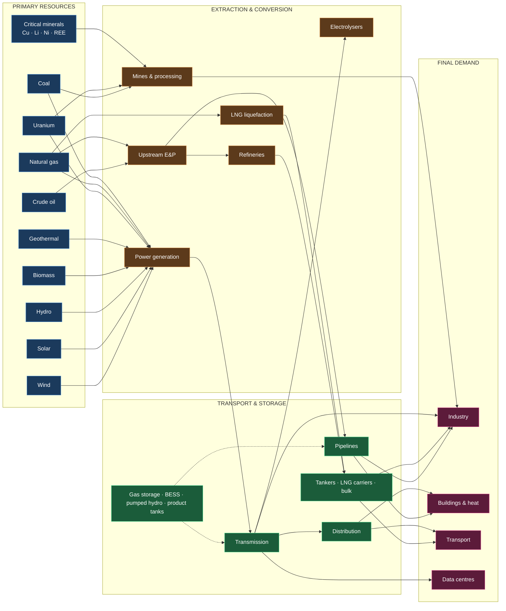
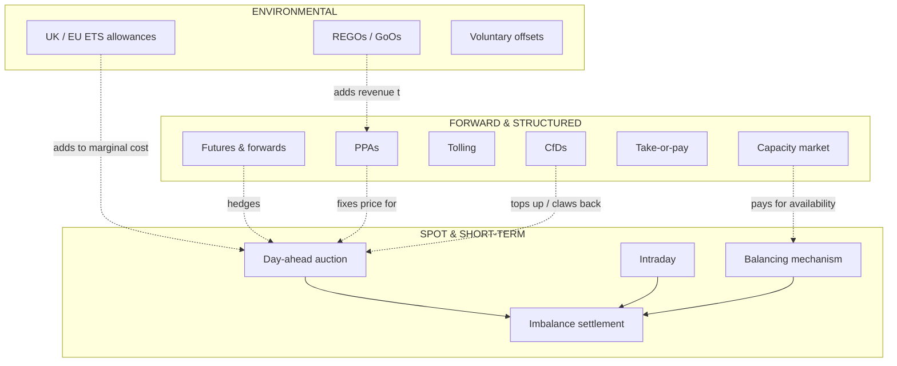
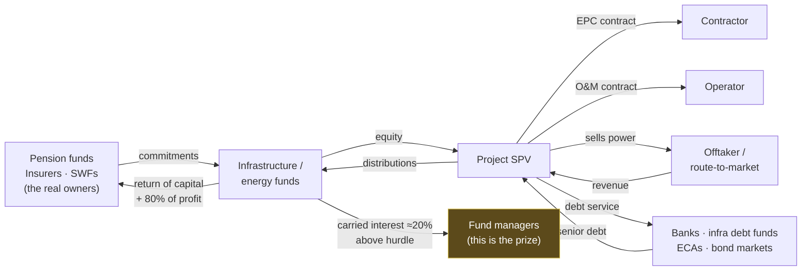
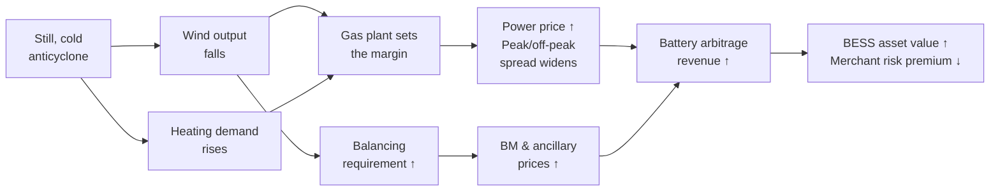

# Part 1 — Map of the Global Energy System

The purpose of this map is not to list the parts. It is to make one idea unavoidable:
**every physical event in the energy system has a price consequence, and every price
consequence has an investment consequence.** People who can trace that path in both
directions get paid. People who can only do the physics do not.

Read this map in five layers. Learn them in this order.

---

## Layer 1 — The physical system

**What this shows:** energy and materials flowing left to right, losing exergy at every
conversion. **What to take from it:** the system has a small number of *chokepoints* — LNG
liquefaction trains, transmission corridors, refinery cracking capacity, grid connection
capacity, and a handful of mineral processing facilities. **Value concentrates at
chokepoints, not at the resource.** Wind is free; a grid connection in a constrained region
is not. This is the single most important commercial idea in energy.

---

## Layer 2 — The commercial layer

Every physical arrow above is governed by a contract. The contract determines who bears
which risk, and *risk allocation determines value*.

**Interpretation:** a generator's revenue is almost never "the power price". It is a *stack*:
wholesale ± CfD difference + capacity payment + REGO + ancillary services − imbalance cost.
Modelling only the wholesale price is the most common and most expensive error engineers
make when they first build revenue models.

---

## Layer 3 — The money layer

**Interpretation and why this diagram matters more than any other in the programme:**
follow the money to the right-hand side. Limited partners supply the capital and take
roughly 80% of the profit above a hurdle. The general partner — the fund management team —
supplies judgement and takes roughly 20% (**carried interest**), on capital that is mostly
not theirs.

That asymmetry is the entire economic reason to move from consulting into investment. A
consultant sells hours at a margin. A fund professional owns a share of an outcome on
capital they did not provide. Everything in Part 5 of this programme is, at bottom, an
argument about which route gets you onto the right-hand side of this diagram fastest,
at what risk.

**Where the risk sits (learn this alongside the money):** the SPV is a legal box designed so
that if the project fails, the lenders take the project and *not* the sponsor's other
assets. That is what "non-recourse" means, and it is why project finance exists as a
distinct discipline.

---

## Layer 4 — The regulatory layer (GB focus)

| Body | What it actually controls | Why you care |
|---|---|---|
| **DESNZ** | Policy, CfD allocation rounds, budgets | Sets whether a technology is investable at all |
| **Ofgem** | Licences, network price controls (RIIO), code changes | Sets network operators' allowed returns and use-of-system charges |
| **NESO** | System operation, balancing, connections queue, future energy scenarios | Controls the grid connection queue — the binding constraint on GB development |
| **Elexon** | Balancing & Settlement Code, imbalance settlement, BMRS data | Your free data source; the settlement rules that determine imbalance exposure |
| **Low Carbon Contracts Company** | CfD counterparty | Pays/claws back the CfD difference |
| **National Gas / TOs / DNOs** | Physical networks, connection offers | Where your project physically attaches |

**Current state [FACT, accessed 25 Aug 2026]:**

- **Zonal pricing was rejected.** DESNZ's REMA Summer Update (10 July 2025) confirmed GB
  retains a single national wholesale price, moving to "reformed national pricing" instead
  of zonal. Cited reasons: complexity, investor uncertainty, distributional effects, and an
  estimated seven-year implementation.
  ([Norton Rose Fulbright](https://www.nortonrosefulbright.com/en/knowledge/publications/4399413b/rema-summer-update-no-to-zonal-pricing-yes-to-reformed-national-pricing),
  [HSF Kramer](https://www.hsfkramer.com/notes/energy/2025-posts/clean-powerp2030-rema-update-gb-zonal-pricing-rejected))
  **Commercial consequence:** locational value in GB is now expressed through *constraint
  costs, curtailment and network charges* rather than through the energy price. Location
  still drives value; it just does so less visibly. This makes grid and constraint analysis
  — your existing skill — *more* commercially valuable, not less.
- **Connections reform (TMO4+)** was approved by Ofgem on 15 April 2025, replacing
  first-come-first-served with a "ready and needed" ordered queue. Gate 2 offers are being
  issued through 2026: protected transmission projects connecting 2026–27 by end-Jan 2026;
  Phase 1 (to 2030) by end-Q2 2026; Phase 2 (2031–35) by end-Q3 2026.
  ([Burges Salmon](https://www.burges-salmon.com/articles/102k9bq/grid-connection-queue-reform-tmo4-approval-key-points-to-be-aware-of/),
  [Norton Rose Fulbright](https://www.nortonrosefulbright.com/en/knowledge/publications/0101e3b9/tmo4-connection-reform-proposals-receive-stamp-of-approval))
  **Commercial consequence:** a Gate 2 offer is now a *valuable, scarce asset*. Diligencing
  Gate 2 status is live, chargeable transaction work — and it is squarely in your existing
  skill set. This is your fastest bridge into deal work.

---

## Layer 5 — Causal chains: physics → price → returns

This is the skill the programme exists to build. Seven worked chains.

### Chain 1 — Weather → renewables → power prices → battery revenue

**Evidence this is real, not theoretical [FACT]:** GB battery revenues moved from
£54k/MW/yr (Jan 2026) to £41k/MW/yr (Feb, −23%) to £70k/MW/yr (Mar, +69%) — a 71% swing
inside one quarter, driven by wholesale and balancing conditions. Two-hour GB BESS averaged
£73,145/MW/yr over the twelve months to April 2026, with wholesale + BM around 60% of the
stack. ([Modo Energy, Feb 2026](https://modoenergy.com/research/en/me-bess-gb-revenues-february-2026-wholesale-battery-energy-storage-balancing-mechanism),
[Mar 2026](https://modoenergy.com/research/en/me-bess-gb-revenues-rise-march-2026-balancing-mechanism-record-gas-prices-))

**Investment consequence:** that volatility is precisely why merchant BESS is hard to
finance with debt. Lenders size to a downside case; a revenue line that halves quarter on
quarter forces either very low leverage or a tolling contract. **This is why tolls exist.**

### Chain 2 — Refinery outage → crude → products → crack spread

Outage removes cracking capacity → **crude demand falls** (bearish crude) while **product
supply falls** (bullish diesel/gasoline) → the *spread between them* — the crack — widens.
A refiner's margin is the crack, not the oil price. **Lesson: in energy, the spread is
usually the trade, not the outright price.** Repeats everywhere: spark spread (power−gas),
dark spread (power−coal), LNG netback (destination−origin−freight), location spread,
calendar spread.

### Chain 3 — LNG shipping constraint → TTF / NBP / JKM / Henry Hub

Freight rates rise or a canal restricts transits → delivered cost to Asia rises →
**JKM–TTF spread must widen** to justify the voyage → below that threshold cargoes divert to
Europe → European storage fills → TTF falls → NBP follows TTF via interconnection → Henry
Hub decouples, being set by US domestic fundamentals plus liquefaction offtake.

**Live values [FACT, ~21 Aug 2026]:** TTF day-ahead €63.40/MWh (20 Aug); JKM front month
$22.61/MMBtu; TTF spot $22.41; Brent ~$91.62/bbl (~20 Aug); EUA Dec-26 €82.45; UK ETS Dec-26
£58.97. ([Global LNG Hub, 17 Aug 2026](https://globallnghub.com/natural-gas-prices-weekly-update-jkm-ttf-and-henry-hub-17-august-2026/),
[Catalyst Commercial, 21 Aug 2026](https://www.catalyst-commercial.co.uk/works/uk-energy-market-report-21-august-2026/))
Note JKM ≈ TTF in $/MMBtu terms here — a **narrow** JKM–TTF spread, which mechanically
discourages Atlantic-to-Pacific diversion. You will rebuild this calculation properly in
Module Group H and Project 5.

### Chain 4 — Grid congestion → curtailment → capture price → asset value

Constrained boundary → NESO pays generators to turn down (constraint cost) → the wind farm's
**capture price** (volume-weighted price achieved) falls below baseload → revenue falls more
than volume does, because curtailment is correlated with high-wind, low-price hours →
**cannibalisation** deepens as more wind connects → merchant tail value falls → acquisition
price falls. With zonal pricing rejected, this is expressed via constraints and charges
rather than nodal prices — **which makes it harder to see and therefore more mispriced.**
That is an opportunity for someone with your geospatial and grid background.

### Chain 5 — Data-centre growth → demand → capacity prices → generation investment

IEA projects data-centre electricity consumption roughly doubling from ~415 TWh in 2024
(~1.5% of global demand) to ~945–950 TWh by 2030 (~3%), with the US at 45% of 2024 consumption
([FACT] — [IEA, *Energy and AI*, April 2025](https://www.iea.org/reports/energy-and-ai/energy-demand-from-ai)).

Consequence in the most exposed market: **PJM's 2027/28 Base Residual Auction cleared at the
FERC-approved cap of $333.44/MW-day (UCAP) across the entire footprint**, procuring 134,479 MW,
and still fell **6,623 MW short** of the reliability requirement; total cleared value $16.4bn
([FACT] — [PJM Inside Lines](https://insidelines.pjm.com/pjm-auction-procures-134479-mw-of-generation-resources/),
[PJM 2027/28 BRA Report, 17 Dec 2025](https://www.pjm.com/-/media/DotCom/markets-ops/rpm/rpm-auction-info/2027-2028/2027-2028-bra-report.pdf)).

Contrast GB: the T-4 auction for 2029/30 cleared at **£27.10/kW/yr**, down ~55% year on year,
with 44 GW chasing a 39.4 GW target ([FACT] — [Modo Energy](https://modoenergy.com/research/en/gb-capacity-market-t4-2029-30-battery-energy-storage-march-2026)).

**Read those two facts together — this is the exercise.** Same technology, same decade,
opposite capacity scarcity signals. A market at its price cap *and short* is telling you
new capacity is worth building. A market clearing at £27/kW/yr with 12% oversupply is telling
you it is not. **If you spend time in the US north-east, you will be sitting inside the most
capacity-scarce large power market in the developed world.** Plan accordingly.

### Chain 6 — Interest rates → WACC → valuation → acquisition prices

Infrastructure assets are long-duration, highly-levered bond-like cash flows, so their value
is unusually rate-sensitive. Rates ↑ → debt cost ↑ *and* equity discount rate ↑ → WACC ↑ →
NPV of a 25-year cash flow falls sharply → **plus** debt sizing tightens because DSCR is
computed after higher interest, so less debt is available, so the equity cheque rises, so
bid prices fall.

**[CALC] Worked, so you can audit it.** 25-year level real cash flow of £10m/yr:
- At 6.0%: annuity factor = (1 − 1.06⁻²⁵)/0.06 = 12.783 → **£127.8m**
- At 8.0%: annuity factor = (1 − 1.08⁻²⁵)/0.08 = 10.675 → **£106.7m**

A 200 bp move destroys **16.5%** of gross asset value before any change in the energy
outlook. Excel: `=PV(rate,25,-10)`. **This is why rate moves reprice infrastructure faster
than energy-market news does**, and why 2022–24 was brutal for renewables valuations despite
strong power prices.

### Chain 7 — Oil price → upstream cash flow → drilling → services → states

Brent ↓ → producer cash flow ↓ (heavily geared to price, since lifting costs are largely
fixed) → capex cut with a 6–18 month lag → rig counts and service company revenue fall →
service pricing deflates → costs fall → breakevens fall → supply eventually responds →
price recovers. Meanwhile fiscal-breakeven-dependent states cut spending or borrow, feeding
back into OPEC+ policy. **The lag is the trade.** Learn the lag structure, not the level.

---

## Glossary — units, benchmarks and commercial terms

### Energy and power
| Term | Meaning | Watch out for |
|---|---|---|
| W / kW / MW / GW | Power — a *rate* | Never say "MW of electricity produced" |
| kWh / MWh / GWh / TWh | Energy — power × time | 1 MW for 1 h = 1 MWh |
| MWh vs MWth vs MWe | Electrical vs thermal | CHP quotes both; confusing them wrecks a model |
| Therm | 29.3071 kWh | GB gas retail |
| MMBtu | 10⁶ Btu ≈ 293.07 kWh | LNG global benchmark unit |
| toe / boe | Tonne / barrel oil equivalent | 1 toe ≈ 11.63 MWh; 1 boe ≈ 1.7 MWh |
| bcm / mtpa | Billion m³; million tonnes p.a. | 1 mtpa LNG ≈ 1.36 bcm ≈ 48.7 bcf |
| HHV / LHV | Higher / lower heating value | HHV includes latent heat of vaporised water. **US uses HHV, Europe often LHV — efficiencies differ by ~10% for gas on this basis alone** |
| Heat rate | Fuel in / electricity out (Btu/kWh or kJ/kWh) | Inverse of efficiency; US convention |
| Capacity factor | Actual output / (rated × hours) | Not the same as availability |
| Availability | Fraction of time capable of operating | A contractual term with a definition — read it |

### Price benchmarks
| Benchmark | Commodity | Region | Unit |
|---|---|---|---|
| Brent / WTI / Dubai | Crude | Global / US / Asia | $/bbl |
| Henry Hub | Gas | US | $/MMBtu |
| TTF | Gas | NW Europe | €/MWh |
| NBP | Gas | GB | p/therm |
| JKM | LNG | NE Asia | $/MMBtu |
| N2EX / EPEX | Power | GB | £/MWh |
| UKA / EUA | Carbon | UK / EU | £ or €/tCO₂e |
| API2 / API4 | Coal | ARA / RB | $/t |

### Commercial and financial
**Spark spread** power − (gas ÷ efficiency) · **Clean spark spread** less carbon cost ·
**Dark spread** the coal equivalent · **Crack spread** product − crude · **Netback** delivered
price less all costs back to source · **Contango / backwardation** forward above / below spot ·
**Capture price** volume-weighted price achieved by a specific asset · **Cannibalisation**
correlated output depressing prices when you generate · **Basis risk** hedge and exposure
priced at different points · **Shape / profile risk** exposure to *when* you generate ·
**DSCR** CFADS ÷ debt service · **LLCR** PV of CFADS over loan life ÷ debt outstanding ·
**CFADS** cash flow available for debt service · **WACC** blended cost of capital ·
**MOIC** multiple on invested capital · **Carry** the GP's ~20% share above a hurdle ·
**Locked box** price fixed at a historic balance-sheet date · **Take-or-pay** pay whether or
not you lift · **Tolling** counterparty supplies fuel/energy and pays for conversion.

---

**Next:** [`02-curriculum-index.md`](02-curriculum-index.md) — the module map and sequence.
