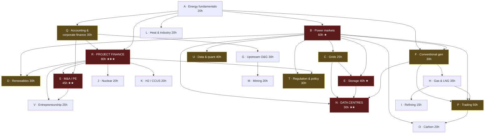

# Part 3 — Master Curriculum Index, Dependencies and Sequence

## The 22 module groups

**Depth:** A = awareness · W = working knowledge · D = deep expertise
**Hours** = my estimate of study time to reach the stated depth, including practicals.
**Priority:** ① critical path · ② important · ③ opportunistic

| Group | Title | Depth | Hrs | Pri | Prerequisites | Portfolio output |
|---|---|:---:|--:|:---:|---|---|
| **A** | Energy & engineering fundamentals | W | 20 | ① | — | Unit-conversion + LCOE tool |
| **B** | Electricity systems & power markets | **D** | 60 | ① | A | **Project 1** — GB dashboard |
| **C** | Grids & network infrastructure | W | 25 | ② | A, B | Constraint/curtailment note |
| **D** | Renewable generation | **D** | 30 | ② | A, B | **Project 2** — wind/solar model |
| **E** | Battery storage & flexibility | **D** | 40 | ① | A, B, C | **Project 3** — BESS model |
| **F** | Conventional generation | W | 30 | ① | A, B | **Project 4** — CCGT model |
| **G** | Oil & gas upstream | W | 30 | ② | A, Q | **Project 6** — field economics |
| **H** | Gas, LNG & gas infrastructure | W | 35 | ② | A, F, P | **Project 5** — LNG netback |
| **I** | Refining & products | A→W | 15 | ③ | H | Crack-spread note |
| **J** | Nuclear & uranium | A→W | 20 | ③ | B, R | **Project 7** — nuclear case |
| **K** | Hydrogen, ammonia, e-fuels, CCUS | A→W | 20 | ③ | A, B, R | Critical appraisal memo |
| **L** | Heat, buildings, industry, transport | W | 20 | ③ | A | Industrial decarb case |
| **M** | Mining & critical minerals | A→W | 20 | ③ | G, Q | Mine NPV model |
| **N** | Data centres & energy infrastructure | **D** | 30 | ① | B, C, E, F | **Project 8** — DC strategy |
| **O** | Carbon & environmental commodities | W | 20 | ② | B, F, P | Carbon exposure model |
| **P** | Commodity & energy trading | W→D | 50 | ② | A, B, F, H | **Project 10** — paper book |
| **Q** | Accounting & corporate finance | W | 35 | ① | — | Energy company teardown |
| **R** | **Project finance & infrastructure investment** | **D** | 80 | ① | A, Q | **Project 2** — full PF model |
| **S** | M&A, private equity, banking | **D** | 45 | ① | Q, R | **Project 9** — IC memo |
| **T** | Regulation, policy, contracts, geopolitics | **D** | 30 | ② | B, R | Policy impact note |
| **U** | Data, software, quant & AI | W→D | 40 | ② | A, B | Reusable toolkit |
| **V** | Entrepreneurship & asset ownership | W | 25 | ③ | R, S, T | Business model appraisal |

**Total: ~720 hours to stated depth.** At 10 hrs/week that is ~72 weeks of pure study —
call it **two years including slippage, holidays and life**. At 5 hrs/week, four years.
At 15 hrs/week, roughly 14 months but with real burnout risk alongside consultancy
deadlines.

**[OPINION]** Do not aim for all 720. The critical path (① modules only) is **~340 hours**
and delivers roughly 80% of the employability. Groups I, J, K, L, M, V are legitimate to
defer indefinitely unless a specific opportunity makes them relevant.

---

## Dependency graph

**Read the graph this way.** Two chains carry almost all the value:

1. **A → Q → R → S** — the *financial* spine. Fundamentals, then accounting, then project
   finance, then transactions. This is what converts you from adviser to principal.
2. **A → B → {C, E, F} → N** — the *market* spine. Fundamentals, then how power prices
   form, then the flexible and thermal assets that set them, converging on data centres —
   where your mechanical, electrical, renewable and commercial skills all pay at once.

Everything else hangs off those two. **If you only ever do R and B, you will still be
substantially more employable than you are today.**

---

## Recommended sequence

Ordered to maximise employability per hour, not logical tidiness. Note that **R (project
finance) starts early and runs long** — it is the highest-return module and benefits from
spaced repetition rather than a single block.

| Phase | Weeks | Modules | Why here | Milestone |
|---|---|---|---|---|
| **1. Foundations** | 1–6 | A, then B (start) | Everything depends on units and price formation | Diagnostic passed |
| **2. Market fluency** | 4–14 | B (complete), U (start) | Project 1 needs live data handling | **Project 1 shipped** |
| **3. Financial spine** | 10–22 | Q, then R (start) | Accounting before project finance, always | Three-statement teardown |
| **4. First full model** | 18–30 | R (core), D | The model *is* the learning | **Project 2 shipped** |
| **5. Flexibility** | 26–36 | C, E | Builds on your existing BESS work | **Project 3 shipped** |
| **6. Thermal & spreads** | 32–42 | F, O | Spark spreads open trading and thermal M&A | **Project 4 shipped** |
| **7. Transactions** | 38–50 | S, T | Needs R complete to be meaningful | **Project 9 shipped** |
| **8. The wedge** | 44–56 | N | Your differentiator; needs B, C, E, F | **Project 8 shipped** |
| **9. Commodities** | 52–68 | H, P, I | Only now, and only if trading appeals | **Projects 5, 10** |
| **10. Optional** | 60+ | G, J, K, L, M, V | Opportunistic, driven by live deals | **Projects 6, 7** |

**Capstones** after every four modules, per Part 12 — see `07-roadmap.md`.

### Why this order and not the obvious one

- **Q before R.** You cannot sculpt debt against cash flow if you do not know what CFADS is
  or how it differs from EBITDA. Engineers routinely skip accounting and then build project
  models with the tax line wrong. Do not.
- **B before everything commercial.** Every revenue assumption in every energy model traces
  back to how the power price forms. Get this wrong and every downstream model is decorated
  nonsense.
- **N late but not last.** Data centres are the highest-value intersection for you
  specifically, but the module is only credible once you can discuss capacity markets,
  connection constraints, backup generation and PPAs — so it needs B, C, E and F first.
- **P (trading) late and conditional.** 50 hours to working knowledge is worth it for
  general commercial fluency. The 200+ hours to specialist depth is only worth it if
  `03-career-routes.md` convinces you to pursue trading. Decide at week 50, not now.
- **G, I, M genuinely optional.** Included in the master prompt, and worth awareness, but
  they compete for the same hours as R and S. **[OPINION]** Deep upstream oil and gas
  knowledge is the lowest-return large investment available to you, given a Scotland base
  and a renewables track record.

---

## Standard module format

Every taught module in `modules/` follows the 30-section structure specified in the master
prompt, plus the visual requirements:

The 30 sections (click to expand)

1. What the subject is · 2. Why it matters · 3. Connection to the wider system ·
4. What transfers from your background · 5. Prerequisites · 6. Essential concepts ·
7. Intermediate · 8. Advanced · 9. Terminology · 10. Core calculations · 11. Units and
conversions · 12. Contracts and market structures · 13. Participants and counterparties ·
14. Key risks · 15. Regulatory considerations · 16. Current debates · 17. Authoritative
sources · 18. Books · 19. Courses · 20. Reports · 21. Excel exercise · 22. Python exercise ·
23. Case study · 24. Portfolio deliverable · 25. Ten test questions · 26. Applied decision
case · 27. Competence criteria · 28. Study time · 29. Career relevance · 30. What not to
learn deeply

Plus, per module: at least one system diagram, one worked visual calculation, one chart from
real data, one sensitivity/scenario visual, one interactive or reproducible element, one
practical model, a one-page visual summary, and a concept map.

**Module A1 is written in full** as the template: [`modules/A1-energy-power-and-units.md`](modules/A1-energy-power-and-units.md).

---

## On qualifications — credential vs. knowledge

Asked for explicitly in the master prompt. **[OPINION], stated bluntly:**

| Credential | Credential value | Knowledge value | Verdict |
|---|---|---|---|
| **CFA Level I–III** | Moderate — recognised, signals seriousness, genuinely helps a lateral mover with no finance stamp | High for Q, moderate for R | **Worth it for you.** Level I alone is a useful signal; the full charter is ~900 hrs and only worth it if you commit to investing |
| **Project finance modelling course** (e.g. Corality/Mazars, F1F9, Financial Edge) | Low as a badge | **Very high** | **Do it early.** Nobody hires you for the certificate; everybody tests the skill |
| **CQF / quant masters** | High *if* quant trading | High | Only for the quant route |
| **MBA** | High at top-5 European/US schools, ~zero elsewhere | Moderate | £100k+ and two years' income forgone. **[OPINION]** Poor value vs. building a track record in your existing sector |
| **ACA / ACCA** | High in accounting | Excess for you | **No.** You need to read accounts, not prepare them |
| **Chartered Engineer (IMechE/IET)** | Moderate — real in TDD/LTA work, where signing off requires standing | Low incremental | **Yes, if not already done.** Cheap, and it makes you a *signing* technical adviser, which is the bridge role |
| **Energy Institute / EI qualifications** | Low–moderate | Moderate | Optional |
| **PRINCE2/PMP** | Low for your goals | Low | No |

The pattern: **for finance, buy the knowledge and skip the badge; for engineering
credibility, buy the badge because it is cheap and it credentials you as a signing adviser.**
CEng is the exception where the badge itself unlocks fee-earning transaction work.

---

**Next:** [`03-career-routes.md`](03-career-routes.md) — where this knowledge is worth money.
