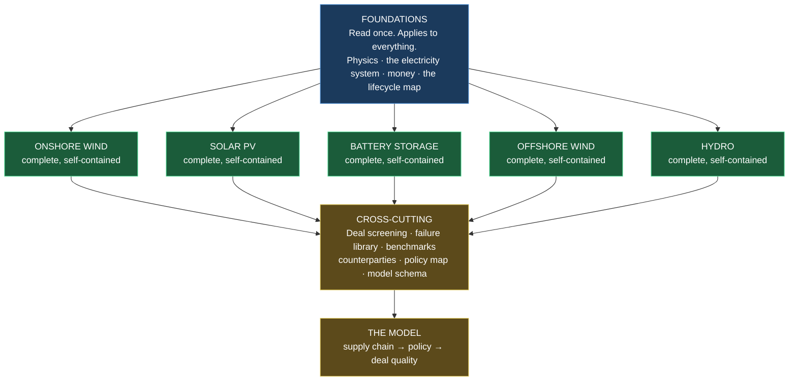

# The Renewable Energy Investor's Handbook

**A complete body of knowledge: from the physics of the resource to the signature on the
share purchase agreement.**

---

## What this is

A reference work, built to make one person capable of answering essentially any question
about a renewable energy project — technical, legal, commercial or financial — and of
forming a defensible judgement about whether a given deal is worth doing.

It is written for someone who intends to become a principal: to originate, assess, finance,
build, own and trade these assets, and to understand the industrial and political system
they sit inside.

## The rules this handbook is written to

1. **Every abbreviation is written out in full the first time it appears in each chapter.**
   Not once per volume. Not once per book. Each chapter stands alone.
2. **Every financial and legal term is explained in plain English where it is used.** No
   assumed knowledge. "Supports more debt", "locked box", "servitude", "sculpting" — all
   explained at the point of use.
3. **Repetition is deliberate.** If land agreements matter to both solar and wind, both
   handbooks cover them in full. You should never have to leave a handbook to finish a
   thought.
4. **Every number is sourced and dated, or explicitly labelled as an estimate.** Nothing is
   invented. Where a figure is commercially confidential and unavailable, that is stated,
   with guidance on how to triangulate it.
5. **Scale is treated as a first-class variable.** A 500 kilowatt rooftop array and a
   400 megawatt offshore wind farm share physics and almost nothing else. Consenting regime,
   grid route, contract structure and financing all change with size, and each is addressed
   by size band.
6. **Diagrams where they show mechanism**, tables where they enable comparison, worked
   arithmetic where a number needs auditing.

### Claim tagging

| Tag | Meaning |
|---|---|
| **[FACT]** | Verifiable from the cited source, with date of access |
| **[CALC]** | Arithmetic from stated inputs — reproducible by you |
| **[ASSUMPTION]** | An input chosen for illustration |
| **[ESTIMATE]** | Quantified judgement from partial evidence |
| **[OPINION]** | My judgement — argue with it |
| **[VERIFY]** | Something you must check against a primary source before relying on it |

---

## Architecture

---

## Contents

### Part F — Foundations
*Read once. Everything else assumes it.*

| # | Chapter | Status |
|---|---|---|
| **F1** | [Energy, Power and the Units That Govern Everything](foundations/F1-energy-physics-and-units.md) | **Written** |
| **F2** | [From Resource to Socket: How Electricity Physically Reaches a Consumer](foundations/F2-generation-to-consumer.md) | **Written** |
| F3 | Money From Absolute Zero: What Finance Actually Is | Planned |
| F4 | The Project Lifecycle Map | Planned |

### Part W — Onshore Wind
*Complete and self-contained.*

| # | Chapter | Status |
|---|---|---|
| **W1** | [How a Wind Turbine Works](wind-onshore/W1-how-wind-turbines-work.md) | **Written** |
| **W2** | [Materials, Manufacturing and the Global Supply Chain](wind-onshore/W2-materials-and-supply-chain.md) | **Written** |
| W3 | Site Origination and Prospecting | Next |
| W4 | Land Rights: Options, Leases, Servitudes and Easements | Next |
| W5 | Wind Resource Assessment and Energy Yield | Next |
| W6 | Planning Law and Consent | Next |
| W7 | Environmental and Ecological Assessment | Planned |
| W8 | Grid Connection | Planned |
| W9 | Design, Procurement and Contracts | Planned |
| W10 | Construction, Safety Law and Delivery | Planned |
| W11 | Commissioning, Testing and Handover | Planned |
| W12 | Revenue and Route to Market | Planned |
| W13 | Project Finance | Planned |
| W14 | Operations, Asset Management and Warranty | Planned |
| W15 | Life Extension, Repowering and Decommissioning | Planned |
| W16 | Valuation, Transactions and Exit | Planned |

### Part S — Solar PV · Part B — Battery Storage · Part O — Offshore Wind · Part H — Hydro
*Same 16-chapter structure each. Planned.*

### Part X — Cross-cutting

| # | Chapter |
|---|---|
| X1 | Deal Screening: How to Know in Ten Minutes |
| X2 | The Failure Library: Projects That Went Wrong and Why |
| X3 | Numbers to Know by Heart |
| X4 | The Counterparty Map: Who Actually Does What |
| X5 | Policy and Regulation: The Complete Map |
| X6 | Data Schema for the Integrated Model |

---

## The chapter template

Every technology chapter follows the same structure, so you always know where to look.

1. **What this chapter covers, and why it decides money**
2. **Terms used in this chapter, written out in full**
3. **First principles** — the physics or the legal foundation
4. **The detail**, worked through with examples
5. **How it changes with project size** — explicit bands
6. **Jurisdictional variants** — England, Scotland, Wales, Northern Ireland
7. **The numbers** — benchmarks, with sources and dates
8. **Worked calculations** you can audit and reproduce
9. **What a lender, an investor and a buyer each care about**
10. **Red flags** — what makes you walk away
11. **Common errors** — including the ones professionals make
12. **Where the value is** — where money is created or destroyed
13. **Primary sources** — legislation, standards, datasets
14. **Test yourself** — questions with model answers

---

## Size bands used throughout

Because almost every rule changes with scale, these bands are used consistently:

| Band | Capacity | Typical character |
|---|---|---|
| **Micro** | < 50 kW | Domestic, single turbine or rooftop |
| **Small** | 50 kW – 1 MW | Farm-scale, permitted development possible |
| **Medium** | 1 – 5 MW | Single or few turbines; local planning authority |
| **Large** | 5 – 50 MW | Commercial scale; full planning application, distribution connection |
| **Major** | 50 – 100 MW | Transmission connection likely; Section 36 in Scotland |
| **Strategic** | > 100 MW | Nationally Significant Infrastructure Project in England |

**[FACT]** These bands map to real legal thresholds. In England, onshore wind and solar
above **100 megawatts** are consented as Nationally Significant Infrastructure Projects under
the Planning Act 2008, following amendments in force from **31 December 2025**
([The Infrastructure Planning (Onshore Wind and Solar Generation) Order 2025](https://www.legislation.gov.uk/uksi/2025/694/pdfs/uksiem_20250694_en_001.pdf)).
In Scotland the threshold is **50 megawatts**, consented by Scottish Ministers under
**Section 36 of the Electricity Act 1989** through the Energy Consents Unit
([gov.scot](https://www.gov.scot/publications/good-practice-guidance-applications-under-sections-36-37-electricity-act-1989/pages/1/)).
Chapter W6 covers this in full.

---

## Maintenance

Figures decay. This handbook marks its own perishable content.

| Category | Refresh | Source |
|---|---|---|
| Subsidy strike prices | Per auction round | DESNZ |
| Renewables Obligation buy-out price | Annually, each April | Ofgem |
| Network charges (transmission and balancing) | Annually | NESO |
| Capacity Market clearing prices | Per auction | DESNZ / NESO |
| Commodity and materials prices | Quarterly | Exchange data, trade press |
| Turbine and module prices | Annually | Manufacturer reporting, trade press |
| Planning thresholds and policy | On change | legislation.gov.uk |
| Grid connection process | On change | NESO |

---

**Begin at [F1 — Energy, Power and the Units That Govern Everything](foundations/F1-energy-physics-and-units.md).**
