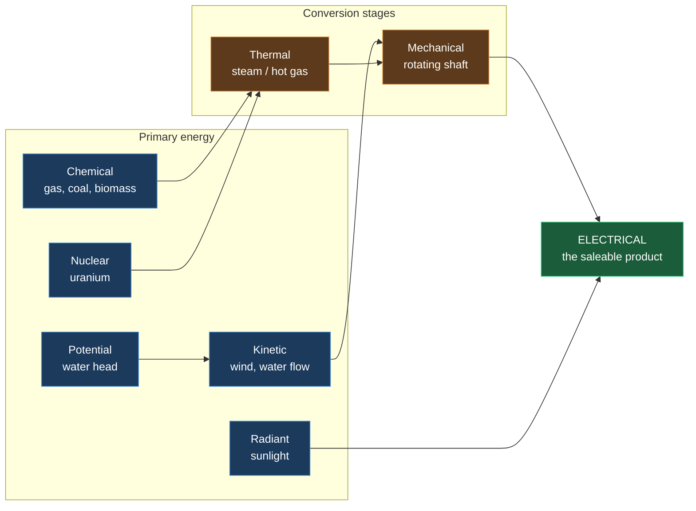
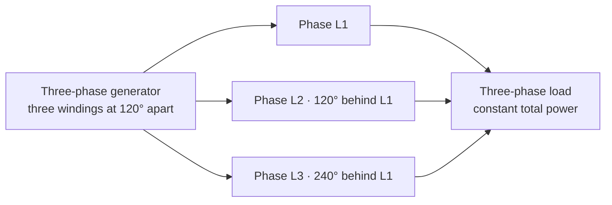
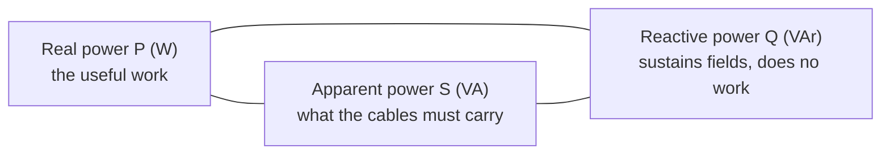

# F1 — Energy, Power and the Units That Govern Everything

> **Abbreviations used in this chapter, written out in full:** J (joule) · W (watt) ·
> kW (kilowatt) · MW (megawatt) · GW (gigawatt) · TW (terawatt) · kWh (kilowatt-hour) ·
> MWh (megawatt-hour) · GWh (gigawatt-hour) · TWh (terawatt-hour) · V (volt) · A (ampere) ·
> Ω (ohm) · Hz (hertz) · VA (volt-ampere) · VAr (volt-ampere reactive) · AC (alternating
> current) · DC (direct current) · RMS (root mean square) · HHV (higher heating value) ·
> LHV (lower heating value) · Btu (British thermal unit) · MMBtu (million British thermal
> units) · toe (tonne of oil equivalent) · boe (barrel of oil equivalent) · SI (Système
> International, the international system of units) · COP (coefficient of performance) ·
> HV (high voltage) · LV (low voltage) · IEC (International Electrotechnical Commission).

---

## 1. Why this chapter decides money

Every commercial argument in energy eventually reduces to a quantity with a unit attached,
multiplied by a price. If the quantity is wrong, or the unit is misunderstood, the price is
irrelevant and the conclusion is worthless.

Unit errors are the most expensive routine mistake in this industry **because they are
invisible**. A model with a wrong discount rate looks wrong to a reviewer. A model that has
confused thermal megawatts with electrical megawatts, or higher heating value with lower
heating value, or a kilowatt with a kilowatt-hour, produces numbers that look entirely
plausible, pass review, and misprice a transaction by tens of percent.

**[OPINION]** As an engineer you will be tempted to skim this chapter. Do not. The *physics*
here is trivial for you. What is not trivial, and what is not taught in engineering degrees,
is the set of **commercial conventions** — which unit each industry uses, which heating value
each continent quotes, why traders use heat rate instead of efficiency, and why capacity
factor and availability are contractually different animals. Those conventions are where the
money is lost.

---

## 2. What energy actually is

**Energy is the capacity to do work.** Work, in physics, means moving something against a
force. Lifting a mass, pushing current through a wire, compressing a gas, heating a room.

The **SI unit** (Système International — the international system of units) of energy is the
**joule (J)**. One joule is the work done when a force of one newton moves an object one
metre.

Energy cannot be created or destroyed, only converted between forms. This is the **First Law
of Thermodynamics**. Every energy project is therefore a **conversion** business: it takes
energy in one form and turns it into another, more useful, form — and loses some as heat on
the way.

### The forms energy takes

| Form | What it is | Where you meet it in this industry |
|---|---|---|
| **Kinetic** | Energy of motion. ½ × mass × velocity² | Wind in the air; water in a river |
| **Potential (gravitational)** | Energy of height. mass × gravity × height | Water behind a dam; pumped storage |
| **Chemical** | Energy in molecular bonds | Coal, gas, oil, hydrogen, biomass |
| **Nuclear** | Energy binding atomic nuclei | Uranium fission; fusion |
| **Thermal (heat)** | Random motion of molecules | Steam in a turbine; heat networks |
| **Electrical** | Energy of moving charge | The product you sell |
| **Electrochemical** | Chemical energy stored in a cell | Batteries |
| **Radiant (solar)** | Electromagnetic radiation | Sunlight on a photovoltaic panel |

**Every generation technology in this handbook is a machine for converting one of these into
electrical energy.** Wind: kinetic → mechanical → electrical. Solar photovoltaic: radiant →
electrical directly. Hydro: potential → kinetic → mechanical → electrical. Gas: chemical →
thermal → mechanical → electrical. Battery: electrical → electrochemical → electrical.

**Read this diagram commercially, not just physically.** Every arrow is a conversion, and
every conversion has an efficiency below 100%. Technologies with *fewer arrows* have
inherently fewer places to lose energy — which is why solar photovoltaic (one arrow) and wind
(two arrows) have no fuel cost and few moving parts, while gas (three arrows) burns money at
every stage. But fewer arrows also means less **controllability**: you cannot turn the sun up.
**The whole economics of the electricity system is a trade between conversion efficiency and
controllability.**

---

## 3. Power versus energy — the distinction everything rests on

This is the single most common confusion in the entire industry, including among people who
should know better.

**Power is a rate. Energy is a quantity.**

- **Power** = how fast energy flows. Measured in **watts (W)**. One watt = one joule per
  second.
- **Energy** = how much flowed in total. Measured in **watt-hours (Wh)** or joules.

**Energy = Power × Time**

**E = P × t**

### The analogy that fixes it permanently

A tap and a bucket.

- **Power** is the *flow rate* out of the tap — litres per second. It describes how hard the
  tap is running at this instant.
- **Energy** is the *volume in the bucket* — litres. It describes how much has actually come
  out.

A tap running at 2 litres per second for 3 seconds delivers 6 litres. A generator running at
2 megawatts for 3 hours delivers 6 megawatt-hours.

**You cannot sell power. You sell energy.** A wind farm's *rating* is in megawatts; its
*product* is megawatt-hours. Its revenue is megawatt-hours × price per megawatt-hour.

### [CALC] Worked examples

**a)** A 100 MW wind farm runs at full output for 3 hours.
Energy = 100 MW × 3 h = **300 MWh**.
It did *not* "produce 100 MW".

**b)** A 3 kW domestic solar array produces energy for an average of 950 full-output-equivalent
hours a year.
Energy = 3 kW × 950 h = **2,850 kWh/year**.

**c)** A 50 MW battery with 2 hours of storage.
Its **power rating** is 50 MW — how fast it can charge or discharge.
Its **energy capacity** is 50 MW × 2 h = **100 MWh** — how much it can hold.
**Both numbers are needed to describe a battery.** Quoting only one is meaningless, and this
is why batteries are always described as "50 MW / 100 MWh" or "50 MW, 2-hour".

### The errors this causes in the wild

| Wrong statement | Why it is wrong |
|---|---|
| "The wind farm generated 100 MW last year" | Megawatts are a rate. It generated some number of megawatt-hours |
| "We need 10 GWh of capacity" | Capacity is power (GW). Gigawatt-hours are stored energy |
| "A 2 MW battery" | Incomplete. For how long? 2 MW for 15 minutes and 2 MW for 8 hours are utterly different assets |
| "500 MW of storage will power 300,000 homes" | For how long? Ten minutes? A day? |

**[Rule] Whenever you meet a number, ask: is this a rate or a quantity?** If it has "per hour"
or "-hour" in it, it is a quantity. If not, it is a rate.

---

## 4. The units, completely

### 4.1 The SI ladder

Each step is a factor of 1,000.

| Prefix | Symbol | Multiplier | Power | Scale reference |
|---|---|---|---|---|
| kilo | k | 1,000 | 10³ | A kettle draws ~3 kW |
| mega | M | 1,000,000 | 10⁶ | A large wind turbine is ~6 MW |
| giga | G | 1,000,000,000 | 10⁹ | A large power station is ~2 GW |
| tera | T | 10¹² | 10¹² | Great Britain uses ~300 TWh a year |
| peta | P | 10¹⁵ | 10¹⁵ | Global primary energy is ~600 EJ |
| exa | E | 10¹⁸ | 10¹⁸ | (exajoule, used in global statistics) |

**Watch the capitalisation.** Lower-case **m** means *milli* (one thousandth). Upper-case **M**
means *mega* (one million). A "mW" is a milliwatt — a billionth of a megawatt. In written
industry material this is a frequent and embarrassing error.

### 4.2 The core conversions you must know without looking up

| From | To | Multiply by | Note |
|---|---|---|---|
| **kWh** | **MJ** | **3.6** | 1 W = 1 J/s, and 3,600 seconds in an hour |
| MWh | GJ | 3.6 | Same relationship, scaled |
| **therm** | **kWh** | **29.3071** | The British gas retail unit |
| **MMBtu** | **kWh** | **293.071** | = 10 therms. The global gas and liquefied natural gas unit |
| MMBtu | GJ | 1.05506 | |
| Btu | J | 1,055.06 | |
| **toe** (tonne of oil equivalent) | **MWh** | **11.63** | Used in international statistics |
| **boe** (barrel of oil equivalent) | **MWh** | **~1.7** | Used in oil and gas reporting |
| barrel of crude | GJ | ~6.1 | Varies with crude quality |
| tonne of coal | GJ | 24–30 | Varies enormously with coal rank |
| **1 mtpa liquefied natural gas** | **TWh** | **~52–54** | mtpa = million tonnes per annum |
| 1 billion m³ natural gas | TWh | ~10.55 | Varies with gas composition |
| **kg of hydrogen** | **kWh (LHV)** | **33.33** | Higher heating value: 39.4 |
| calorie | J | 4.184 | |
| horsepower | W | 745.7 | |

**Memorise the bold rows.** The numbers 3.6, 29.3071 and 293.071 appear constantly.

**[CALC] Why 1 kWh = 3.6 MJ, derived so you never forget it**

1 kW = 1,000 joules per second.
1 hour = 3,600 seconds.
1 kWh = 1,000 J/s × 3,600 s = 3,600,000 J = **3.6 MJ**.

### 4.3 Electrical versus thermal — the MWe / MWth trap

Some plants produce both electricity and useful heat. Their outputs are distinguished by a
subscript:

- **MWe** — megawatts **electrical**. Electricity out.
- **MWth** — megawatts **thermal**. Heat out.

A combined heat and power plant might be described as "10 MWe / 15 MWth". Those are different
products with different prices sold to different customers.

**The trap:** a document says "a 10 MW combined heat and power unit". **Ten megawatts of
what?** Electricity, heat, or fuel input? All three are plausible readings and they differ by
a factor of two or three. **Always ask.** Chapter W1 and the equivalent chapters in each
technology handbook state which convention that technology uses.

### 4.4 Higher and lower heating value — the convention that differs by continent

When a hydrocarbon fuel burns, the hydrogen in it combines with oxygen to form water. That
water leaves as vapour, carrying away energy as **latent heat of vaporisation**.

- **HHV — higher heating value** (also called **gross calorific value**) counts the energy
  that *would* be recovered if that water vapour condensed back to liquid.
- **LHV — lower heating value** (also called **net calorific value**) does not.

**For natural gas, LHV ≈ 0.90 × HHV.** For hydrogen, LHV ÷ HHV = 33.33 ÷ 39.4 = **0.846**.

**The commercial trap, stated precisely.** The **United States quotes gas and power plant
efficiencies on a higher heating value basis. Continental Europe frequently quotes on a lower
heating value basis.**

So a combined cycle gas turbine described as "60% efficient" in Europe (lower heating value)
is about **54% efficient** on the American higher heating value basis. Same machine, same
physics, six percentage points of apparent difference purely from convention.

**[CALC] Why this destroys a model.** Take a European lower-heating-value efficiency of 55%
and apply it to an American gas price quoted on a higher heating value basis:

- Correct: fuel cost = gas price ÷ (0.55 × 0.90) = gas price ÷ 0.495
- Wrong: fuel cost = gas price ÷ 0.55

The wrong answer understates fuel cost by **10%**. For a plant whose margin is the difference
between the power price and the fuel cost, a 10% fuel error can be the entire profit.

**[Rule] Never accept an efficiency figure without asking "higher or lower heating value?"**
If nobody knows, infer from the geography of the source and **state the assumption explicitly
in your model.**

---

## 5. Efficiency, and the two laws that constrain it

### 5.1 First-law efficiency

**Efficiency (η, the Greek letter eta) = useful energy out ÷ total energy in**

Always a fraction between 0 and 1, or a percentage. The energy that does not come out
usefully has not vanished — it has become low-grade heat.

**[CALC]** A gas turbine burns fuel containing 100 MJ and produces 38 MJ of electricity.
η = 38 ÷ 100 = **38%**. The other 62 MJ leaves as hot exhaust.

### 5.2 The Second Law, and why efficiency has a ceiling

The **Second Law of Thermodynamics** says heat flows spontaneously from hot to cold, and that
you cannot convert heat entirely into work. Any engine that turns heat into motion must
**reject** some heat to a cold reservoir.

The theoretical maximum is the **Carnot efficiency**:

**η_Carnot = 1 − (T_cold ÷ T_hot)**

where temperatures are in **kelvin** (K) — degrees Celsius plus 273.15.

**[CALC]** A gas turbine with combustion at 1,500 °C rejecting heat at 40 °C:
- T_hot = 1,773 K, T_cold = 313 K
- η_Carnot = 1 − (313 ÷ 1,773) = **82.3%**

Real turbines achieve nothing like this — around 40% for a simple cycle — because of material
limits, friction, incomplete combustion and pressure losses. But the Carnot limit explains the
single most important design principle in thermal power: **to raise efficiency, raise the hot
temperature or lower the cold one.** That is precisely what a combined cycle gas turbine does
— it uses the hot exhaust of a gas turbine to raise steam for a second, steam turbine,
capturing energy that would otherwise be rejected, and reaching around 55–62% on a lower
heating value basis.

### 5.3 Why wind, solar and hydro escape the Carnot limit

**They are not heat engines.** They convert kinetic, radiant or potential energy directly into
mechanical or electrical energy without passing through a thermal stage. The Second Law
ceiling does not apply to them.

They have their *own* limits instead:
- **Wind** is limited by the **Betz limit** — a maximum of **59.3%** of the kinetic energy in
  the wind can be extracted by any rotor. Chapter W1 derives this in full.
- **Solar photovoltaic** is limited by the **Shockley–Queisser limit** — about **33%** for a
  single-junction silicon cell, because photons below the bandgap energy pass straight through
  and photons above it waste their excess as heat.
- **Hydro** approaches 90%+ because the conversion is almost purely mechanical.

**[OPINION] This is worth internalising because it explains a persistent public
misunderstanding.** People compare a 20% efficient solar panel unfavourably with a 55%
efficient gas turbine and conclude solar is worse. But the gas turbine's input is a *fuel you
paid for*, and the solar panel's input is *free and otherwise wasted*. **Efficiency only
matters commercially when the input has a cost.** For wind and solar, the meaningful metric is
cost per megawatt-hour delivered, not efficiency. For gas, efficiency *is* the cost.

### 5.4 Coefficient of performance — where "efficiency" exceeds 100%

A **heat pump** moves heat rather than creating it. Its performance is measured as the
**COP — coefficient of performance**:

**COP = useful heat delivered ÷ electrical energy consumed**

A COP of 3.5 means 3.5 kilowatt-hours of heat for every 1 kilowatt-hour of electricity. This
does **not** violate the First Law: the extra energy was already in the outside air or ground
and has merely been *moved*, not created. The electricity powers the pump, not the heating.

---

## 6. Energy density and power density

Two different concepts, constantly confused.

**Energy density** = energy stored per unit mass (MJ/kg or Wh/kg) or per unit volume
(MJ/litre). It determines **how far something goes** on a tankful.

**Power density** = power produced per unit land area (W/m²). It determines **how much land a
technology needs**.

### 6.1 Energy density by fuel [FACT, standard reference values]

| Fuel | MJ/kg (lower heating value) | kWh/kg |
|---|---:|---:|
| Hydrogen | 120 | 33.3 |
| Natural gas (methane) | 50 | 13.9 |
| Diesel | 43 | 11.9 |
| Petrol | 44 | 12.2 |
| Coal (bituminous) | 24–30 | 6.7–8.3 |
| Wood (dry) | 16 | 4.4 |
| **Lithium-ion battery** | **0.5–0.9** | **0.14–0.25** |

**Read that last row against the one above it.** A lithium-ion battery stores roughly
**1/50th** the energy per kilogram of diesel. This single fact explains why battery-electric
aviation and long-haul shipping remain hard, why grid batteries are built for hours rather
than days, and why liquid fuels persist in transport. **It is not a matter of engineering
effort; it is a matter of chemistry.**

Hydrogen has superb energy *per kilogram* and dreadful energy *per litre* — it is extremely
light. That asymmetry is the entire hydrogen storage and transport problem.

### 6.2 Power density by technology

Roughly, watts of average output per square metre of land occupied.

| Technology | Approximate W/m² **[ESTIMATE, order of magnitude]** |
|---|---:|
| Nuclear | 500–1,000 |
| Natural gas plant | 300–1,000 |
| Solar photovoltaic (UK) | 4–6 |
| **Onshore wind (per unit of land within the site boundary)** | **2–3** |
| Biomass (energy crops) | 0.1–0.5 |

**The commercial and political consequence.** Low power density means large land areas, which
means more landowners, more planning objections, more visual impact and more grid to build.
**Land use is the central political constraint on renewables**, and it is a direct consequence
of physics, not of policy.

**An important nuance for wind that is routinely misused in public debate:** while a wind farm
*site* occupies a large area, the turbines and tracks physically use only around **1–3%** of
it. The rest continues in agricultural use. Comparing wind's land *footprint* with a gas
plant's is misleading; comparing the *site boundary* is misleading in the opposite direction.
Be precise about which you mean.

---

## 7. Electrical fundamentals

Everything above concerned energy in general. The product you sell is specifically
**electrical** energy, and its behaviour has commercial consequences that non-electrical
engineers routinely miss.

### 7.1 The four basic quantities

| Quantity | Symbol | Unit | Physical meaning | Water analogy |
|---|---|---|---|---|
| **Charge** | Q | coulomb (C) | Quantity of electricity | Amount of water |
| **Current** | I | ampere (A) | Rate of charge flow | Flow rate |
| **Voltage** | V | volt (V) | Electrical "pressure" driving current | Pressure |
| **Resistance** | R | ohm (Ω) | Opposition to flow | Pipe narrowness |

**Ohm's Law: V = I × R**

**Electrical power: P = V × I**

Combining them: **P = I²R** and **P = V²/R**

### 7.2 Why transmission uses very high voltage — the single most important equation in the grid

Power lost as heat in a conductor is:

**P_loss = I² × R**

Note it depends on the **square** of the current. Double the current, quadruple the losses.

But the power you are *delivering* is P = V × I. So to deliver a given amount of power, you
can choose: high voltage and low current, or low voltage and high current.

**Since losses scale with current squared, you want the current as low as possible — which
means the voltage as high as possible.**

**[CALC] Worked, to make it concrete**

Deliver 100 MW along a line with resistance 5 Ω.

*At 33,000 volts (a distribution voltage):*
- Current I = P ÷ V = 100,000,000 ÷ 33,000 = 3,030 A
- Loss = I²R = 3,030² × 5 = 45,900,000 W = **45.9 MW lost — 46% of the power**

*At 400,000 volts (the transmission supergrid):*
- Current I = 100,000,000 ÷ 400,000 = 250 A
- Loss = 250² × 5 = 312,500 W = **0.31 MW lost — 0.3% of the power**

**A 12-fold increase in voltage reduced losses by a factor of 147.** This is why the grid
exists in the form it does: transformers step voltage up for transport and down for use. It is
also why long-distance transmission is expensive — high-voltage equipment, insulation
clearances and land take all scale with voltage.

### 7.3 Great Britain's voltage levels [FACT]

| Level | Voltage | Where |
|---|---|---|
| **Transmission** | 400 kV, 275 kV | The supergrid; 132 kV also transmission in Scotland |
| **Sub-transmission / distribution** | 132 kV, 66 kV, 33 kV | Regional networks |
| **Medium voltage distribution** | 11 kV, 6.6 kV | Local networks, larger sites |
| **Low voltage** | 400 V three-phase, 230 V single-phase | Homes and small businesses |

**Note the Scottish difference:** 132 kV is classed as *transmission* in Scotland but
*distribution* in England and Wales. This is not trivia — it determines which company you
connect to, which charging regime applies, and which regulatory process you follow. Chapter W8
covers the consequences.

### 7.4 Direct current and alternating current

**DC — direct current.** Charge flows continuously in one direction. Batteries and solar
photovoltaic panels produce direct current.

**AC — alternating current.** The direction reverses periodically, following a sine wave.
Rotating generators produce alternating current naturally, and it is what the grid uses.

**Why the grid uses alternating current:** because voltage can be changed easily and
efficiently with a **transformer**, which works only on alternating current. Given §7.2, the
ability to change voltage cheaply is decisive.

**Frequency** is how many times per second the current completes a full cycle, measured in
**hertz (Hz)**. **Great Britain operates at 50 Hz.** North America uses 60 Hz.

**Why frequency matters commercially — and this is a genuinely important idea.** In an
alternating current system, generation and consumption must match **instantaneously**.
Electricity is not stored in the wires. If demand exceeds generation, the spinning generators
are dragged down and **frequency falls**. If generation exceeds demand, frequency rises.

**Frequency is therefore a real-time measure of whether supply equals demand across the entire
country.** Great Britain's system operator must hold it within **50 Hz ± 1%** (49.5–50.5 Hz)
under its licence, and normally targets a much tighter band.

This creates an entire market. Assets that can respond in under a second to correct frequency
are paid for it, and those payments — frequency response services — were the original business
case for grid batteries. **A physical constraint became a revenue line.** The battery handbook
covers those markets in full.

### 7.5 Root mean square — why "230 volts" is not the peak

An alternating voltage is constantly changing, so quoting a single number requires a
convention. The convention is **RMS — root mean square**: the equivalent steady direct-current
value that would deliver the same heating power.

For a sine wave: **V_RMS = V_peak ÷ √2 = V_peak × 0.7071**

So a "230 V" supply actually peaks at 230 × √2 = **325 V**. Insulation must be rated for the
peak, not the quoted value. **All grid voltages are quoted as root mean square unless stated
otherwise.**

### 7.6 Three-phase power

Large generation and industrial equipment use **three-phase** alternating current: three
separate voltage waveforms, each offset from the next by 120 degrees.

**Why three phases rather than one:**
1. **Constant power delivery.** In a single-phase system, instantaneous power pulses to zero
   twice per cycle. With three phases offset by 120°, the total is *constant* — which means
   smooth torque in motors and generators, and far less vibration.
2. **Less conductor for the same power.** Three-phase transmits more power per kilogram of
   copper or aluminium than single-phase.
3. **Rotating magnetic field.** Three-phase windings create a naturally rotating field, which
   is what makes induction motors possible at all.

**Three-phase power calculation:**

**P = √3 × V_line × I_line × cos φ**

where √3 ≈ 1.732, V_line is the line-to-line voltage, and cos φ (phi) is the **power factor**.

**[CALC]** A three-phase load at 400 V drawing 100 A at a power factor of 0.95:
P = 1.732 × 400 × 100 × 0.95 = **65,816 W = 65.8 kW**

### 7.7 Real, reactive and apparent power — and why you can be billed for power you never used

This concept has no equivalent in mechanical engineering and it costs money.

In an alternating current circuit, voltage and current are both sine waves. If the load is
purely resistive (a heater), they rise and fall together — **in phase**. If the load contains
inductance (motors, transformers) or capacitance (cables, capacitor banks), the current wave
is **shifted** relative to the voltage wave.

That shift means some of the current flowing does **no useful work**. It sloshes back and
forth between the source and the load's magnetic or electric fields.

| Quantity | Symbol | Unit | What it is |
|---|---|---|---|
| **Real power** | P | **W** (watt) | Does actual work. What you are billed for as energy |
| **Reactive power** | Q | **VAr** (volt-ampere reactive) | Sustains magnetic and electric fields. Does no net work |
| **Apparent power** | S | **VA** (volt-ampere) | The total the equipment must physically carry |

They relate by the **power triangle**:

**S² = P² + Q²**   and   **power factor = cos φ = P ÷ S**

**[CALC]** A load draws 800 kW of real power at a power factor of 0.8.
- Apparent power S = P ÷ cos φ = 800 ÷ 0.8 = **1,000 kVA**
- Reactive power Q = √(S² − P²) = √(1,000,000 − 640,000) = **600 kVAr**

**The cables, transformer and switchgear must all be sized for 1,000 kVA even though only
800 kW does useful work.** Twenty-five per cent of the equipment capacity is carrying current
that achieves nothing.

**Why this is commercial, not academic:**

1. **Network operators charge for poor power factor**, or require correction equipment,
   because reactive current consumes network capacity and causes real losses.
2. **Generators are required to supply or absorb reactive power** as a grid connection
   condition. A wind farm's connection agreement specifies a power factor range it must
   operate within — typically 0.95 leading to 0.95 lagging. Meeting it may require capacitor
   banks or a static compensator, which is **capital expenditure driven purely by a grid code
   requirement**, and it is routinely missed in early-stage cost estimates.
3. **Reactive power support is itself a traded ancillary service.** Some assets are paid to
   provide voltage support.
4. **Transformer ratings are quoted in kVA or MVA, not kW or MW** — because the transformer
   cares about total current, not useful work. Sizing a transformer in megawatts is an error.

**[Rule]** When you read a connection offer and see a power factor requirement, that is a
**cost**. Ask what equipment is needed to meet it.

---

## 8. Describing how hard an asset works

Four related measures, contractually distinct, routinely conflated.

### 8.1 Capacity factor

**Capacity factor = actual energy produced ÷ (rated power × hours in the period)**

**CF = E_actual ÷ (P_rated × 8,760)** for a full year.

It is the fraction of theoretical maximum output actually achieved.

**[CALC]** A 40 MW wind farm produces 112,128 MWh in a year.
CF = 112,128 ÷ (40 × 8,760) = 112,128 ÷ 350,400 = **32.0%**

**[FACT] Indicative Great Britain annual capacity factors** — for plausibility checking only;
look up the current year's values in the Department for Energy Security and Net Zero's
*Digest of United Kingdom Energy Statistics* rather than relying on this list:

| Technology | Typical range |
|---|---|
| Onshore wind | 26–32% |
| Offshore wind | 40–50% |
| Solar photovoltaic | 10–11% |
| Combined cycle gas turbine | 30–45% (depends on dispatch, not capability) |
| Nuclear | 70–85% |
| Hydro (run of river) | 35–45% |

**Note the gas row carefully.** A gas plant's low capacity factor does **not** mean it is
unreliable. It means it *chose* not to run, because prices were below its operating cost.
**Capacity factor conflates capability with economics**, and for dispatchable plant it
measures the latter.

### 8.2 Availability

**Availability = fraction of the period the asset was *capable* of operating**

A wind farm with 97% availability was ready to generate 97% of the time. Whether it *did*
depends on the wind.

**This distinction is contractual and it matters enormously.** The operations and maintenance
contractor warrants **availability**, because that is what they control. They do not and
cannot warrant production, because they do not control the weather.

**[Rule] A 100% available wind farm in a calm year still defaults on its debt.** Confusing
availability with capacity factor is how risk gets mis-allocated in contracts — and it is a
mistake that gets made in real transactions.

Availability itself has multiple contractual definitions — time-based, energy-based, contractual
availability excluding grid outages and force majeure. **Read the definition in the specific
contract.** Chapter W14 works through the variants.

### 8.3 Load factor

Often used interchangeably with capacity factor in Great Britain, but sometimes meaning output
divided by *available* capacity. **Always check the definition in the document you are
reading.** Government statistics generally mean capacity factor.

### 8.4 Full load hours

**Full load hours = annual energy ÷ rated power**

Equivalent to capacity factor × 8,760. A German and Scandinavian convention, useful because it
is intuitive: "this site delivers 2,800 full load hours."

**[CALC]** 112,128 MWh ÷ 40 MW = **2,803 full load hours**, which is 2,803 ÷ 8,760 = 32.0% —
the same information, expressed differently.

---

## 9. Heat rate — efficiency wearing commercial clothing

Thermal power stations rarely quote efficiency. They quote **heat rate**: fuel energy in
divided by electrical energy out.

**Heat rate (Btu/kWh) = 3,412.14 ÷ efficiency**

The number 3,412.14 is the number of British thermal units in a kilowatt-hour.

**[CALC]** A combined cycle gas turbine at 55% efficiency (lower heating value basis):
Heat rate = 3,412.14 ÷ 0.55 = **6,204 Btu/kWh (lower heating value)**

Converting to a higher heating value basis: efficiency becomes 0.55 × 0.90 = 0.495, so
heat rate = 3,412.14 ÷ 0.495 = **6,893 Btu/kWh (higher heating value)**.

**Why traders prefer heat rate to efficiency.** Because it multiplies directly by the gas
price:

**Fuel cost per MWh = heat rate × gas price**

At $4.00 per million British thermal units:
6,893 Btu/kWh × $4.00 ÷ 1,000,000 Btu × 1,000 kWh/MWh = **$27.57/MWh**

One multiplication. No division, no unit gymnastics, no mental arithmetic under pressure.
**That is the entire reason the convention exists** — it is optimised for a trading floor, not
a laboratory.

---

## 10. The commercial quantities, assembled

Bringing it together into the calculation that decides whether a thermal plant runs at all.

**Short-run marginal cost = (fuel price ÷ efficiency) + ((emission factor ÷ efficiency) ×
carbon price) + variable operating cost**

**[CALC]** A combined cycle gas turbine, 55% efficient (lower heating value), gas at
£25/MWh, carbon at **£58.97 per tonne of carbon dioxide equivalent** ([FACT] — UK Emissions
Trading Scheme December 2026 contract, 21 August 2026,
[Catalyst Commercial](https://www.catalyst-commercial.co.uk/works/uk-energy-market-report-21-august-2026/)),
gas emission factor 0.184 tonnes of carbon dioxide per thermal megawatt-hour, variable
operating cost £2/MWh:

- Fuel: 25.00 ÷ 0.55 = **£45.45/MWh**
- Carbon: (0.184 ÷ 0.55) × 58.97 = 0.3345 × 58.97 = **£19.73/MWh**
- Variable operating cost: **£2.00/MWh**
- **Short-run marginal cost = £67.18/MWh**

**The plant runs when the electricity price exceeds £67.18/MWh and shuts below it.**

### Sensitivity to efficiency — and why the relationship is a curve, not a line

| Efficiency | Fuel £/MWh | Carbon £/MWh | Total short-run marginal cost |
|---|---:|---:|---:|
| 45% | 55.56 | 24.11 | **£81.67** |
| 50% | 50.00 | 21.70 | **£73.70** |
| 55% | 45.45 | 19.73 | **£67.18** |
| 60% | 41.67 | 18.08 | **£61.75** |

Because cost is proportional to 1 ÷ efficiency, the relationship is a **hyperbola**. Going
from 45% to 50% saves £7.97/MWh; going from 55% to 60% saves only £5.43/MWh. **Efficiency
improvements are worth more to an inefficient plant** — which is why old plant retrofits can
be attractive and why the last few points of efficiency on a new machine are hard to justify.

**A 15-percentage-point efficiency spread moves marginal cost by £19.92/MWh**, which
determines the entire order in which plants are dispatched across the country.

---

## 11. Common errors, including ones professionals make

| Error | Consequence |
|---|---|
| Confusing power (MW) with energy (MWh) | Revenue wrong by a factor of hours |
| Confusing MWe with MWth | Output wrong by 2–3× |
| Mixing higher and lower heating value | Fuel cost wrong by ~10% |
| Using capacity factor where availability is meant | Risk allocated to the wrong party in a contract |
| Sizing a transformer in MW rather than MVA | Equipment undersized; power factor ignored |
| Forgetting reactive power obligations in a connection offer | Missing capital expenditure |
| Using 8,760 hours in a leap year | 8,784 hours; small but real in settlement |
| Treating GB settlement as hourly | It is **half-hourly** — 17,520 periods a year |
| Comparing efficiency across non-thermal technologies | Meaningless — the inputs have different costs |
| Quoting a battery in MW only | Says nothing about duration, hence nothing about value |

---

## 12. Test yourself

1. A 200 MW offshore wind farm produced 788,400 MWh last year. What is its capacity factor?
2. Convert 45 pence per therm into pounds per megawatt-hour.
3. An American combined cycle gas turbine quotes 7,200 Btu/kWh on a higher heating value
   basis. What is its efficiency on a lower heating value basis?
4. A three-phase load at 11 kV draws 60 A at a power factor of 0.92. What real power is it
   consuming, and what apparent power must the transformer be rated for?
5. Why does a wind farm require reactive power equipment, and who imposes that requirement?
6. Deliver 50 MW down a line of resistance 8 Ω, first at 33 kV and then at 132 kV. Calculate
   the losses in each case and express them as a percentage.
7. A battery is described as "25 MW". What is the single question you must ask?
8. Gas is £28/MWh, a plant is 52% efficient on a lower heating value basis, carbon is
   £59 per tonne, the emission factor is 0.184 tonnes per thermal megawatt-hour and variable
   operating cost is £2/MWh. What is the short-run marginal cost?
9. Explain why a heat pump with a coefficient of performance of 3.5 does not violate the First
   Law of Thermodynamics.
10. Why can a solar panel's 22% efficiency and a gas turbine's 55% efficiency not be compared
    directly as a measure of merit?

Model answers

**1.** 788,400 ÷ (200 × 8,760) = 788,400 ÷ 1,752,000 = **45.0%**. Typical for offshore wind.

**2.** 1 therm = 29.3071 kWh, so 1 MWh = 1,000 ÷ 29.3071 = 34.121 therms.
45p × 34.121 = 1,535p = **£15.35/MWh**.

**3.** Efficiency (higher heating value) = 3,412.14 ÷ 7,200 = 47.4%.
Lower heating value basis = 47.4% ÷ 0.90 = **52.7%**.

**4.** Real power P = √3 × 11,000 × 60 × 0.92 = 1.732 × 11,000 × 60 × 0.92 = **1,051 kW**.
Apparent power S = P ÷ 0.92 = **1,143 kVA**. The transformer must be rated at least 1,143 kVA
— note it is **not** 1,051.

**5.** Because the grid connection agreement and the Grid Code impose a power factor range the
generator must operate within, typically 0.95 leading to 0.95 lagging. Meeting it may require
capacitor banks or a static compensator. The requirement is imposed by the network operator —
the distribution network operator or the transmission owner — through the connection agreement.

**6.** At 33 kV: I = 50,000,000 ÷ 33,000 = 1,515 A. Loss = 1,515² × 8 = 18.36 MW = **36.7%**.
At 132 kV: I = 50,000,000 ÷ 132,000 = 379 A. Loss = 379² × 8 = 1.15 MW = **2.3%**.
A four-fold voltage increase cut losses sixteen-fold.

**7.** **For how long?** — its duration or energy capacity in megawatt-hours. Without it the
description is meaningless.

**8.** Fuel = 28 ÷ 0.52 = £53.85. Carbon = (0.184 ÷ 0.52) × 59 = 0.3538 × 59 = £20.88.
Plus £2.00. **Total = £76.73/MWh**.

**9.** The heat pump does not create energy; it *moves* existing heat from outside to inside.
The electricity powers the movement, not the heating. Total energy is conserved — the outside
air becomes marginally colder.

**10.** Because the inputs have entirely different costs. The gas turbine's input is purchased
fuel, so efficiency directly determines operating cost. The solar panel's input is free
sunlight that would otherwise be wasted, so its efficiency affects only how much land and
mounting structure are needed per megawatt — a capital cost question, not an operating one.
The correct comparison is cost per megawatt-hour delivered.

---

## 13. Primary sources

- **Department for Energy Security and Net Zero**, *Digest of United Kingdom Energy Statistics*
  — [gov.uk](https://www.gov.uk/government/collections/digest-of-uk-energy-statistics-dukes)
- **Department for Energy Security and Net Zero**, *Energy Trends* — quarterly capacity factors
- **International Energy Agency**, *Energy Statistics Manual* — units and conversion conventions
- **Energy Institute**, *Statistical Review of World Energy* — global data
- **UK Government greenhouse gas conversion factors** — updated annually; always cite the year
- **International Electrotechnical Commission** standards — electrical definitions
- Mackay, D., *Sustainable Energy — Without the Hot Air* — freely available, unmatched for
  developing unit intuition

---

**Next: [F2 — From Resource to Socket: How Electricity Physically Reaches a Consumer](F2-generation-to-consumer.md)**
