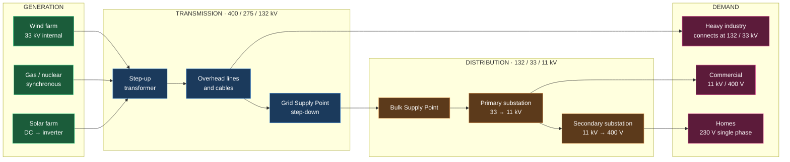
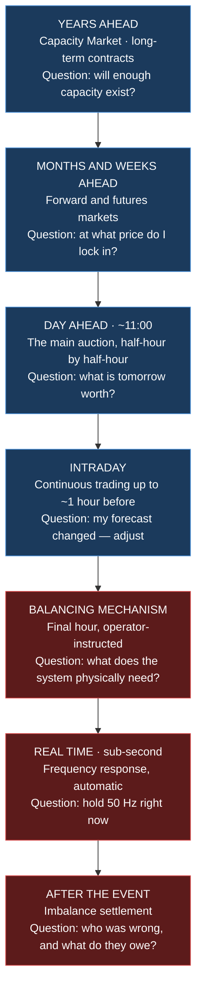
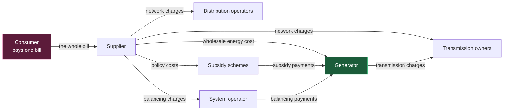

# F2 — From Resource to Socket: How Electricity Physically Reaches a Consumer

> **Abbreviations used in this chapter, written out in full:** AC (alternating current) ·
> DC (direct current) · kV (kilovolt) · MW (megawatt) · MVA (megavolt-ampere) · MWh
> (megawatt-hour) · Hz (hertz) · RPM (revolutions per minute) · NESO (National Energy System
> Operator) · TO (Transmission Owner) · DNO (Distribution Network Operator) · DSO
> (Distribution System Operator) · GSP (Grid Supply Point) · BSP (Bulk Supply Point) ·
> HVDC (high-voltage direct current) · SF₆ (sulphur hexafluoride) · GIS (gas-insulated
> switchgear) · AIS (air-insulated switchgear) · CT (current transformer) · VT (voltage
> transformer) · SCADA (Supervisory Control and Data Acquisition) · MPAN (Meter Point
> Administration Number) · BSC (Balancing and Settlement Code) · BM (Balancing Mechanism) ·
> ROCOF (rate of change of frequency) · IBR (inverter-based resource) · STATCOM (static
> synchronous compensator) · MITS (Main Interconnected Transmission System) · Ofgem (Office
> of Gas and Electricity Markets) · RIIO (Revenue = Incentives + Innovation + Outputs).

---

## 1. Why this chapter decides money

You are, ultimately, selling a physical product that must travel from a hillside in
Lanarkshire to a kettle in Leeds, through equipment owned by four or five different companies,
under a set of technical rules, with losses at every step, and it must arrive at the exact
instant it is consumed because it cannot be stored in the wire.

**Every one of those facts is a commercial constraint.**

- The equipment between you and the customer is owned by someone else, who charges you.
- The rules governing what you may inject are set by someone else, and compliance costs money.
- The losses are paid for by someone, and that someone is partly you.
- The instantaneous-matching requirement creates the balancing markets that determine whether
  your revenue forecast is right.
- And the *location* of your project within this network determines both your charges and
  whether you can connect at all.

**[OPINION]** Investors who do not understand the physical system consistently misprice two
things: curtailment risk and connection risk. Both are physical phenomena with financial
consequences, and both are invisible in a spreadsheet unless you know to look.

---

## 2. The whole chain, at a glance

**The key structural insight: voltage goes up, then down.** Generation happens at a modest
voltage, is stepped **up** for transport (to cut losses — see chapter F1, section 7.2), then
stepped **down** repeatedly as it approaches consumers. Every step-up and step-down is a
transformer, and every transformer is a substation with land, planning consent, protection
equipment and cost.

**Where you connect determines almost everything about your project's economics.** A 50 MW
wind farm connecting at 33 kV to a distribution network faces a different cost, a different
timescale, a different regulator and different charges than the same wind farm connecting at
132 kV to transmission.

---

## 3. Stage one: making alternating current

There are exactly two ways electricity gets onto the Great Britain grid, and the difference
between them has become one of the defining engineering and commercial issues of the decade.

### 3.1 Synchronous generation — the traditional way

A **synchronous generator** is a large rotating machine. A prime mover — a steam turbine, gas
turbine, hydro turbine or diesel engine — spins a **rotor** carrying a magnetic field inside a
**stator** carrying three sets of windings. The rotating field induces alternating voltage in
the windings, one per phase, naturally 120 degrees apart.

**"Synchronous" means the rotor turns in exact lockstep with the grid frequency.**

**Rotational speed = (120 × frequency) ÷ number of poles**

**[CALC]** A two-pole generator on a 50 Hz system:
Speed = (120 × 50) ÷ 2 = **3,000 RPM**. A four-pole machine runs at 1,500 RPM.

This is why large steam and gas turbine sets run at exactly 3,000 revolutions per minute in
Great Britain and 3,600 in North America. It is not a design choice; it is arithmetic.

### 3.2 Inertia — the property nobody valued until it disappeared

A synchronous generator's rotor is a very large spinning mass. Together, all the synchronous
machines on the system store an enormous amount of **rotational kinetic energy**.

When demand suddenly exceeds generation — a power station trips off — that stored energy is
released automatically, instantaneously, and without anyone instructing it. The rotors slow
slightly, giving up energy to the system. **Frequency falls, but slowly**, buying time for
control systems to respond.

This property is **inertia**, and it is measured in gigawatt-seconds (GW·s).

The rate at which frequency falls after a loss is the **ROCOF — rate of change of frequency**:

**ROCOF (Hz/s) = (frequency × power imbalance) ÷ (2 × system inertia)**

**[CALC]** A 1,000 MW generator trips on a system with 200 GW·s of inertia at 50 Hz:
ROCOF = (50 × 1,000) ÷ (2 × 200,000) = **0.125 Hz/s**

If system inertia halves to 100 GW·s, the same loss produces **0.25 Hz/s** — twice as fast.
Protection equipment and generators have ROCOF withstand limits; exceed them and plant
disconnects, making the problem worse in a cascade.

**Why this became a commercial issue.** Wind and solar do not provide inertia. As they
displace coal, gas and nuclear, system inertia falls. Great Britain's system operator now
**purchases inertia and fast frequency response as services** — creating markets that did not
exist a decade ago, and which are a genuine revenue line for batteries, synchronous
condensers and flywheels.

**[OPINION] This is a perfect illustration of a pattern you should learn to spot generally:
a physical property that was a free by-product of the old system becomes a purchased service
in the new one. Wherever that happens, a market appears — and early entrants earn
extraordinary returns until the requirement saturates.** The battery handbook shows exactly
this happening to frequency response, where revenues collapsed as the fleet grew.

### 3.3 Inverter-based resources — the new way

Solar photovoltaic panels produce **direct current**. Modern wind turbines produce alternating
current at variable frequency (because the rotor speed varies with wind speed), which is then
rectified to direct current. Batteries store and release direct current.

All of them therefore need an **inverter**: a power-electronic device that synthesises an
alternating-current waveform by switching direct current on and off thousands of times per
second, using **pulse-width modulation**, and filtering the result into a smooth sine wave.

Collectively these are **IBRs — inverter-based resources**.

**Grid-following inverters** measure the existing grid voltage and frequency, and inject
current in step with it. They *follow*. If the grid voltage disappears, they have nothing to
follow and they shut down. Almost all installed wind, solar and battery capacity works this
way.

**Grid-forming inverters** create and hold a voltage waveform themselves, behaving much more
like a synchronous machine. They can support a weak grid, provide synthetic inertia, and in
principle restart a dead network.

**Why the distinction is commercial, and increasingly so:**
- Grid codes progressively require grid-forming capability, which costs more.
- System operators pay for **stability services** that grid-forming inverters can supply.
- In areas of **weak grid** — low **short-circuit level** — there is a limit to how much
  grid-following capacity can connect at all before the system becomes unstable. That limit
  can block a project outright.

**[Rule for project screening]** If a connection offer references short-circuit level, system
strength, or grid-forming requirements, that is a **cost and a risk**, and it belongs in the
capital expenditure estimate before you bid for the land.

### 3.4 What each technology actually produces

| Technology | Generates | Grid interface | Provides inertia? |
|---|---|---|---|
| Gas, coal, nuclear, biomass | AC directly, synchronous | Direct, via transformer | **Yes** |
| Large hydro | AC directly, synchronous | Direct, via transformer | **Yes** |
| Modern wind turbine | AC at variable frequency | Full converter: AC→DC→AC | No (synthetic only) |
| Solar photovoltaic | **DC** | Inverter: DC→AC | No |
| Battery | **DC** | Inverter, bidirectional | No (synthetic only) |

---

## 4. Stage two: stepping up, and the substation

### 4.1 The transformer

A **transformer** changes voltage. Two coils wound on a shared iron core: alternating current
in the primary creates a changing magnetic field, which induces voltage in the secondary. The
ratio of turns sets the ratio of voltages.

**V_secondary ÷ V_primary = N_secondary ÷ N_primary**

Power is (nearly) conserved, so **if voltage goes up, current goes down** in the same
proportion. Modern large transformers achieve 99%+ efficiency.

**Transformers are rated in MVA — megavolt-amperes — not MW.** As chapter F1 section 7.7
explains, the transformer must carry the total current including the reactive component, so
its rating reflects apparent power, not real power. **Specifying a transformer in megawatts
is an error that leads to undersizing.**

**Commercially, transformers matter for three reasons:**
1. **Lead time.** Large power transformers have long manufacturing lead times, and the global
   order book is congested. A transformer delivery date can become the critical path of an
   entire project.
2. **Cost.** They are among the most expensive single items in a connection.
3. **Losses.** Load losses (in the windings, varying with current squared) and no-load losses
   (in the core, constant whenever energised) are both real and both paid for.

### 4.2 What is actually inside a substation

A substation is not just a transformer. It contains:

| Equipment | Function | Why an investor cares |
|---|---|---|
| **Power transformer** | Changes voltage | Long lead time; major cost |
| **Circuit breakers** | Interrupt fault current safely | Rated by fault-interrupting capacity |
| **Disconnectors (isolators)** | Provide a visible safe isolation | Required for maintenance access |
| **Busbars** | Common connection point | Configuration determines redundancy |
| **Protection relays** | Detect faults, trip breakers in milliseconds | Settings agreed with the network operator |
| **Current and voltage transformers** | Scale down for measurement | Feed both protection and metering |
| **Earthing system** | Safety, fault current return path | Ground conditions drive cost |
| **Reactive compensation** | Capacitors, reactors, static compensators | Required by grid code; often forgotten in budgets |
| **Metering** | Settlement-grade measurement | Determines what you are paid for |
| **SCADA and communications** | Remote monitoring and control | Mandatory for larger connections |
| **Auxiliary supplies and batteries** | Keep protection alive during outages | Small cost, absolute necessity |

**Air-insulated switchgear (AIS)** uses air as the insulator — cheap, but physically large.
**Gas-insulated switchgear (GIS)** uses **sulphur hexafluoride (SF₆)** at pressure — far more
compact, considerably more expensive. Sulphur hexafluoride is an extremely potent greenhouse
gas, and it is being progressively regulated and replaced with alternatives, which is
beginning to affect equipment availability and cost.

### 4.3 Fault level — the constraint that kills projects quietly

When a short circuit occurs, current surges to a value limited only by the impedance of the
network. That current is the **fault level**, measured in kiloamperes or in megavolt-amperes.

Every circuit breaker has a maximum fault current it can interrupt. **If connecting your
project pushes the local fault level above the rating of existing switchgear, the network
operator must replace that switchgear — at your cost — or refuse the connection.**

Synchronous generators *increase* fault level substantially. Inverter-based resources
contribute much less, typically limited to around 1.1–1.5 times their rated current.

**The double bind this creates:**
- In **urban, well-meshed networks**, fault levels are already near equipment limits, so
  adding generation may require expensive replacement.
- In **rural, weak networks**, fault levels are *too low*, so adding large amounts of
  inverter-based generation causes voltage instability and control interaction problems.

**[Rule] "Fault level headroom" in a connection offer is a number with a price attached.**
Chapter W8 covers how to read a connection offer in full.

---

## 5. Stage three: the transmission network

### 5.1 What it is and who owns it

The transmission system is the high-voltage backbone: **400 kV and 275 kV** across Great
Britain, plus **132 kV in Scotland** (where it is classed as transmission, unlike England and
Wales where 132 kV is distribution).

**[FACT] Ownership in Great Britain is split three ways:**

| Owner | Area |
|---|---|
| **National Grid Electricity Transmission** | England and Wales |
| **SP Transmission** (part of ScottishPower / Iberdrola) | Southern Scotland |
| **SSEN Transmission** (part of SSE) | Northern Scotland and the islands |

**Operation is separate from ownership.** The **National Energy System Operator (NESO)** — a
publicly owned body since 2024 — operates the system in real time, but owns none of the wires.
This separation matters: the transmission owners build and maintain the asset and earn a
regulated return set by **Ofgem** under the **RIIO** framework (Revenue = Incentives +
Innovation + Outputs), while NESO decides who generates, when.

### 5.2 Overhead lines versus underground cables

| | Overhead line | Underground cable |
|---|---|---|
| Cost | Baseline | **Typically several times more** |
| Installation | Fast | Slow, disruptive |
| Fault repair | Hours | Weeks to months |
| Visual impact | High — the main planning objection | None once buried |
| Capacity | Cooled by air; can be uprated with weather | Limited by soil thermal resistance |
| Charging current | Low | **High — limits practical AC cable length** |

**The technical reason long alternating-current cables do not work:** a cable behaves as a
distributed capacitor. It draws **charging current** along its whole length, and beyond roughly
50–80 km at transmission voltage that charging current consumes the entire capacity of the
cable. This is precisely why long subsea links and long offshore wind connections use
**HVDC — high-voltage direct current**, which has no charging current because nothing
alternates. HVDC converter stations are expensive, so there is a break-even distance below
which AC wins and above which DC wins.

### 5.3 Constraints, and why Scottish wind is curtailed

The network has finite capacity across any given cross-section. Where generation on one side
of a boundary exceeds the capacity of the lines crossing it, the boundary is **constrained**.

Great Britain's structural problem is straightforward: **a great deal of wind generation is
built in Scotland, where the wind is best and land is available, while most demand is in
England.** The transmission capacity across the Scotland–England boundary is finite.

When the constraint binds, NESO must **pay Scottish wind farms to reduce output** and **pay
English generation (usually gas) to increase output**. Both payments are constraint costs,
recovered from consumers through balancing charges.

**Commercial consequences for an investor, in order of importance:**
1. **Curtailment reduces your energy yield** — and it is *correlated with high wind*, so it
   removes output precisely in the hours you were counting on.
2. **Curtailment compensation depends entirely on your contract and connection type** —
   firm versus non-firm, and the specific arrangements. Never assume you are paid.
3. **Location within the network is a valuation input.** Two identical wind farms with
   identical wind resources can have materially different values because one sits behind a
   constrained boundary.
4. **Great Britain rejected zonal pricing** in July 2025, keeping one national price. So
   locational value is expressed through **constraint costs, curtailment and network charges**
   rather than through the electricity price — **which makes it harder to see, and therefore
   more often mispriced.** For an analyst with geospatial skill, that is an opportunity.

---

## 6. Stage four: distribution

### 6.1 The step down

At a **Grid Supply Point (GSP)**, transmission meets distribution: voltage is stepped from
400 or 275 kV down to 132 kV or 33 kV. Grid Supply Points are also the boundary at which
electricity is measured for settlement purposes.

Below that:

| Level | Typical voltage | Facility |
|---|---|---|
| Grid Supply Point | 400/275 kV → 132 kV | Transmission–distribution boundary |
| Bulk Supply Point | 132 kV → 33 kV | Regional |
| Primary substation | 33 kV → 11 kV | Town-scale |
| Secondary substation | 11 kV → 400 V | Street-scale; the small brick or pole-mounted units |
| Consumer | 400 V three-phase / 230 V single-phase | Homes and businesses |

### 6.2 Who owns it

**[FACT]** Great Britain's distribution networks are operated by six groups across fourteen
licence areas:

| Operator | Region |
|---|---|
| **Scottish and Southern Electricity Networks** | North Scotland; southern England |
| **SP Energy Networks** | Central and southern Scotland; Merseyside, Cheshire, North Wales |
| **Northern Powergrid** | North East England, Yorkshire, northern Lincolnshire |
| **Electricity North West** | North West England |
| **National Grid Electricity Distribution** | Midlands, South West England, South Wales |
| **UK Power Networks** | London, South East, East of England |

Northern Ireland is a separate system entirely, operated by **NIE Networks** with its own
regulator (the Utility Regulator) and its own market — the **Integrated Single Electricity
Market** shared with the Republic of Ireland. **Do not assume Great Britain rules apply in
Northern Ireland.** They frequently do not.

### 6.3 Distribution Network Operator versus Distribution System Operator

Historically a **DNO — Distribution Network Operator** was passive: it built and maintained
wires, and power flowed one way, from the grid to consumers.

Distributed generation broke that assumption. Power now flows *backwards* up the network on
sunny, windy days. Networks have had to become active managers, taking on a **DSO —
Distribution System Operator** role: forecasting flows, procuring flexibility from connected
assets, and actively curtailing generation when local limits bind.

**For an investor this creates both a risk and a revenue line.** The risk is
**Active Network Management** — an automated system that curtails your output when the local
network is at its limit, often as a condition of getting a cheaper and faster connection. The
revenue line is **local flexibility markets**, where networks pay assets to reduce demand or
generation instead of building reinforcement.

**[Rule]** A connection offer described as "non-firm" or "Active Network Management
constrained" is offering you speed and cost savings in exchange for **unquantified curtailment
risk**. Chapter W8 explains how to price that trade.

---

## 7. Losses: the electricity that never arrives

Energy is lost as heat at every stage, following the **I²R** relationship of chapter F1
section 7.2.

**[ESTIMATE] Indicative Great Britain loss levels — verify current values against Ofgem and
network operator reporting:**

| Stage | Typical loss |
|---|---|
| Generator transformer | ~0.5% |
| Transmission network | ~2% |
| Distribution network | ~5–6% |
| **Total generation to consumer** | **~7–8%** |

**Why this is commercial, not academic:**
1. **You are paid for what is metered at your connection point**, not for what the consumer
   receives. Losses downstream are somebody else's problem.
2. But **transmission loss factors** and **distribution loss adjustment factors** are applied
   in settlement, and they vary by location and time. Generation in a remote area far from
   demand can be adjusted *down* to reflect the losses it causes.
3. **Losses are a cost the networks recover**, feeding into the charges you pay.
4. **Embedded generation** — connected at distribution level, close to demand — causes fewer
   losses, which was historically rewarded through embedded benefits. Most of those benefits
   have now been removed by regulatory reform. Chapter W12 covers the history and why it still
   matters when diligencing older assets.

---

## 8. The instantaneous balance, and why it creates markets

### 8.1 The physical fact

**Electricity in an alternating-current network is not stored.** The energy in the system at
any instant is tiny — the rotational inertia discussed in section 3.2 and a small amount in
magnetic and electric fields. Generation must equal demand **continuously**.

When they diverge, **frequency moves** (chapter F1, section 7.4). Frequency is therefore a
single national signal indicating whether the country is generating too much or too little,
updating continuously.

### 8.2 The cascade of markets this creates

**This ladder is the single most useful mental model in power markets.** Each rung exists
because the rung above it cannot resolve the imbalance in time. The closer to real time, the
more physical and the less financial the market becomes — and generally the more volatile the
prices.

**Every renewable project touches at least four of these rungs**, and its revenue is the sum
across them minus the cost of being wrong at the bottom.

### 8.3 Imbalance — the cost of being wrong

Every party must tell the system in advance what it intends to do. The difference between the
declaration and reality is **imbalance**, settled at the **imbalance price**.

Great Britain uses a **single imbalance price**: being long and being short settle at the same
price, which can be extremely high or deeply negative.

**[CALC]** A 40 MW wind farm declares 30 MW for a half-hour period and delivers 18 MW.
- Shortfall = 12 MW × 0.5 h = **6 MWh short**
- At an imbalance price of £250/MWh: 6 × 250 = **£1,500 for one half-hour**

Repeat across a badly forecast day and it becomes serious money. **This is the risk a
route-to-market counterparty absorbs in exchange for the discount they charge**, and it is why
forecasting accuracy has direct financial value.

---

## 9. Metering and settlement: how you actually get paid

Physical delivery and financial settlement are separate systems, and the second is what pays
you.

| Element | What it is |
|---|---|
| **Settlement period** | The half-hour. 48 per day, 17,520 per year — the atomic unit of GB electricity |
| **MPAN — Meter Point Administration Number** | The unique 13-digit identifier for a connection point. Your project has one |
| **Settlement-grade metering** | Metering to the accuracy class required by the Balancing and Settlement Code. Not the same as a commercial meter |
| **Meter operator** | The appointed party responsible for installing and maintaining the meter |
| **Data collector / aggregator** | Retrieves readings and passes them into settlement |
| **BSC — Balancing and Settlement Code** | The rulebook governing all of this, administered by Elexon |
| **Elexon** | The body that runs settlement and publishes market data |
| **Initial and final settlement runs** | Settlement is reconciled repeatedly over months as better data arrives |

**Three practical consequences that catch new developers out:**
1. **You cannot participate in the market without compliant metering**, and arranging it takes
   time. It is a genuine item on the pre-commissioning critical path.
2. **Settlement is reconciled after the fact**, sometimes months later, so cash flow and
   accrued revenue diverge. Your model must handle the lag.
3. **Metering errors are expensive and slow to correct**, and disputes are governed by the
   Balancing and Settlement Code rather than by ordinary contract law.

---

## 10. The money flow, mapped against the physical flow

Electrons flow one way. Money flows in a considerably more complicated pattern.

**Note the two-way arrows on the generator.** A generator both **receives** money (wholesale,
subsidy, balancing) and **pays** money (transmission charges, balancing charges where
applicable, supplier fees). **Net revenue is what remains**, and models built by engineers
routinely capture the first set and forget the second.

**Roughly, a domestic bill divides into:** wholesale energy, network charges, policy and
social costs, supplier operating costs and margin, and value added tax. **[VERIFY]** The
proportions shift constantly — check Ofgem's current price cap breakdown for live figures
rather than relying on any remembered split.

---

## 11. How this differs by project size

| Band | Capacity | Connects at | Counterparty | Practical character |
|---|---|---|---|---|
| **Micro** | < 50 kW | 230/400 V | Distribution operator | Simple notification process |
| **Small** | 50 kW – 1 MW | 400 V / 11 kV | Distribution operator | Straightforward application |
| **Medium** | 1 – 5 MW | 11 kV | Distribution operator | Full application; possible reinforcement |
| **Large** | 5 – 50 MW | 33 kV | Distribution operator | Substantial connection works; Active Network Management likely |
| **Major** | 50 – 100 MW | 33 / 132 kV | Distribution or transmission | Transmission impact assessment required |
| **Strategic** | > 100 MW | 132 / 275 / 400 kV | Transmission owner via NESO | Full transmission process; multi-year |

**The step from distribution to transmission is the single biggest discontinuity in a
project's development.** It changes the counterparty, the timescale, the cost, the charging
regime and often the consenting regime simultaneously. **Projects sized just below a threshold
to stay in the easier regime are extremely common, and that sizing decision is commercial, not
technical.**

---

## 12. Red flags when reading any project's grid position

1. **"Grid connection: firm"** with no supporting document. Firm to what? Check the actual
   connection agreement.
2. **Non-firm or Active Network Management connection** with no curtailment analysis in the
   revenue model.
3. **No mention of reactive power compliance** in the capital cost estimate.
4. **Connection at a voltage requiring third-party land** with no easement or wayleave secured.
5. **Fault level headroom cited without a study** to support it.
6. **A project behind a known constrained boundary** with no curtailment assumption.
7. **Transformer or switchgear delivery** not shown on the construction programme, given
   current lead times.
8. **Metering arrangements** unaddressed within six months of commissioning.

---

## 13. Test yourself

1. Why does the grid step voltage up for transmission and back down for distribution?
2. A four-pole synchronous generator operates on the Great Britain system. At what speed does
   its rotor turn, and why exactly that speed?
3. A 1,200 MW generator trips. System inertia is 150 GW·s. What is the rate of change of
   frequency? What happens to that figure if inertia falls to 90 GW·s?
4. Explain, in terms an investment committee would understand, why a Scottish wind farm and an
   identical English one can have different values.
5. What is the difference between a grid-following and a grid-forming inverter, and why is a
   network operator willing to pay more for the latter?
6. Why is 132 kV treated differently in Scotland than in England, and what practical difference
   does that make to a developer?
7. Why do long subsea connections use direct current rather than alternating current?
8. A transformer is specified as "20 MW". What is wrong with that specification?
9. Name three costs a generator pays that an engineer's revenue model typically omits.
10. Why does adding inverter-based generation to a weak rural network cause different problems
    from adding it to a strong urban one?

Model answers

**1.** Losses in a conductor equal current squared times resistance. For a given power,
raising voltage proportionally lowers current, and because losses scale with the *square* of
current, the reduction is dramatic. Transport therefore happens at high voltage and low
current. Voltage is then reduced for safe use by consumers.

**2.** Speed = (120 × 50) ÷ 4 = **1,500 revolutions per minute**. That speed is fixed by the
requirement that the rotor turn in exact lockstep with the 50 Hz grid frequency, given four
poles.

**3.** ROCOF = (50 × 1,200) ÷ (2 × 150,000) = **0.20 Hz/s**. At 90 GW·s:
(50 × 1,200) ÷ (2 × 90,000) = **0.33 Hz/s** — 67% faster, potentially exceeding the withstand
limits of connected plant and triggering cascading disconnection.

**4.** Because Great Britain's transmission capacity between Scotland and England is finite,
and much more wind is built in Scotland than local demand needs. When the boundary is
constrained, Scottish wind is instructed to reduce output. That curtailment cuts energy yield
in precisely the high-wind hours the model relies on, and whether the generator is compensated
depends on its contract and connection type. Since Great Britain rejected zonal pricing, this
locational disadvantage shows up in curtailment and network charges rather than in the
electricity price — making it less visible and more frequently mispriced.

**5.** A grid-following inverter measures the existing grid waveform and injects current in
step with it; without a grid to follow it cannot operate. A grid-forming inverter establishes
and holds a voltage waveform itself, behaving like a synchronous machine. Operators pay more
because grid-forming units provide system strength, synthetic inertia and stability in weak
networks — services that are increasingly scarce as synchronous plant retires.

**6.** In Scotland 132 kV is classed as transmission; in England and Wales it is distribution.
The practical difference is that it determines which company you contract with, which charging
regime applies, which regulatory process governs the connection, and the likely timescale and
cost.

**7.** An alternating-current cable acts as a distributed capacitor and draws charging current
along its entire length. Beyond roughly 50–80 km at transmission voltage, that charging
current consumes the cable's whole capacity. Direct current has no alternating field and
therefore no charging current, so length is not limited in the same way — at the cost of
expensive converter stations at each end.

**8.** Transformers are rated in megavolt-amperes, not megawatts, because they must carry the
total current including the reactive component. Specifying in megawatts ignores reactive power
and leads to undersizing.

**9.** Transmission network use of system charges; balancing services charges; the
route-to-market or power purchase agreement discount. Also: imbalance costs, metering and data
services, and reactive compensation equipment.

**10.** A weak rural network has a low short-circuit level, so inverter-based resources — which
contribute little fault current — can cause voltage instability and adverse control
interactions, limiting how much can connect. A strong urban network has the opposite problem:
fault levels may already be near the interrupting rating of installed switchgear, so adding
generation can require expensive equipment replacement.

---

## 14. Primary sources

- **National Energy System Operator** — [neso.energy](https://www.neso.energy/) — system
  operation, Future Energy Scenarios, connections process, the Data Portal
- **Elexon** — [elexon.co.uk](https://www.elexon.co.uk/) — the Balancing and Settlement Code,
  and the Balancing Mechanism Reporting Service data
- **Ofgem** — [ofgem.gov.uk](https://www.ofgem.gov.uk/) — network price controls, licences,
  charging reviews
- **The Grid Code** and **the Distribution Code** — the binding technical rules for connection
  and operation
- **Connection and Use of System Code (CUSC)** — the contractual framework for transmission
  connection and charging
- **Engineering Recommendation G99** — the technical requirements for connecting generation

---

**Next: F3 — Money From Absolute Zero: What Finance Actually Is**
