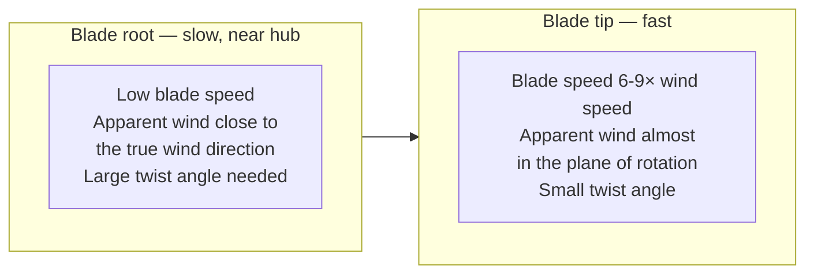
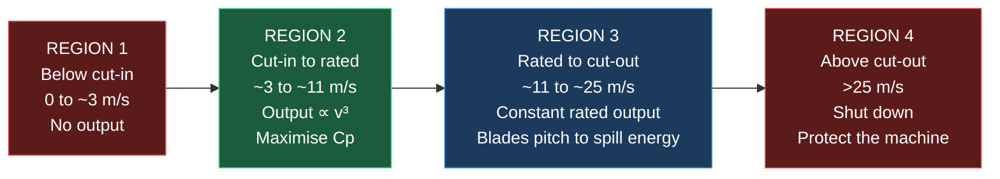
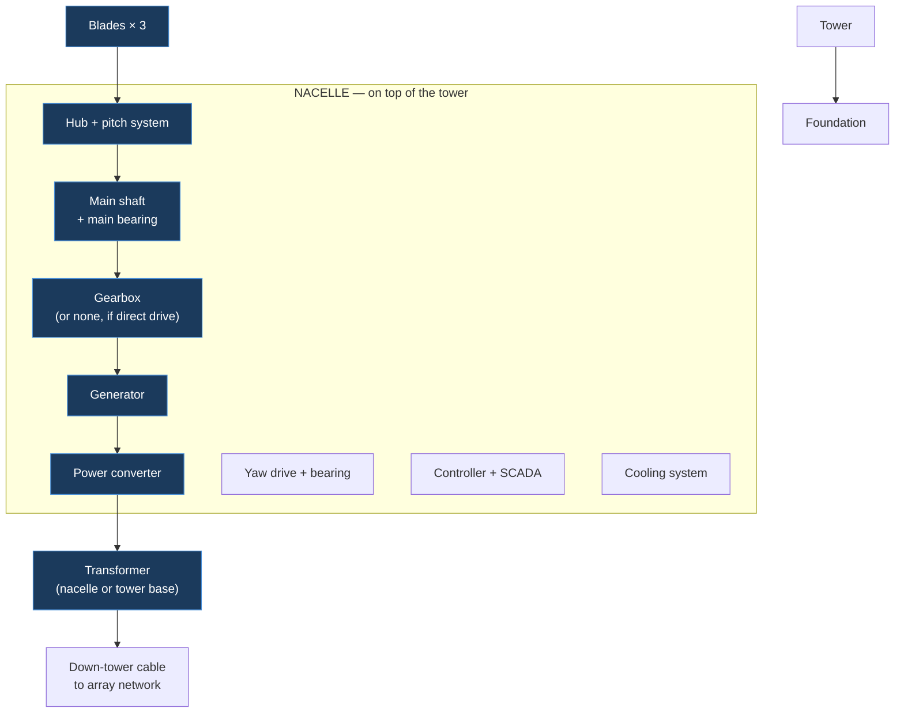

# W1 — How a Wind Turbine Works

> **Abbreviations used in this chapter, written out in full:** m/s (metres per second) ·
> kW (kilowatt) · MW (megawatt) · MWh (megawatt-hour) · GWh (gigawatt-hour) · rpm
> (revolutions per minute) · IEC (International Electrotechnical Commission) · TSR (tip speed
> ratio) · AoA (angle of attack) · DFIG (doubly-fed induction generator) · PMSG (permanent
> magnet synchronous generator) · EESG (electrically excited synchronous generator) · AC
> (alternating current) · DC (direct current) · LiDAR (Light Detection and Ranging) ·
> SCADA (Supervisory Control and Data Acquisition) · O&M (operations and maintenance) ·
> AEP (annual energy production) · P50 / P90 (production levels exceeded 50% and 90% of the
> time) · IEA (International Energy Agency) · OEM (original equipment manufacturer) ·
> LCOE (levelised cost of energy) · CAPEX (capital expenditure) · rho / ρ (air density) ·
> Cp (power coefficient) · Ct (thrust coefficient).

---

## 1. Why the engineering decides the money

A wind turbine is a machine for converting the kinetic energy of moving air into electricity.
Everything commercial about a wind farm — its revenue, its financeability, its value —
descends from a small number of physical relationships.

Three in particular:

1. **Power in the wind varies with the cube of wind speed.** A site with 10% more wind has
   roughly 33% more energy available. This is why site selection dominates everything else,
   and why measurement accuracy is worth paying for.
2. **Swept area varies with the square of rotor diameter.** Doubling the rotor quadruples
   the energy capture. This is why turbines have grown relentlessly, and why "megawatts" alone
   tells you almost nothing about a turbine's output.
3. **No rotor can extract more than 59.3% of the wind's kinetic energy.** The Betz limit is a
   hard physical ceiling, and modern turbines already operate close to it, which means future
   improvement must come from bigger rotors and taller towers rather than better aerodynamics.

**[OPINION]** If you understand only these three relationships and their consequences, you can
already sanity-check most wind farm claims you will encounter. Everything else in this chapter
is elaboration.

---

## 2. The physics of the resource

### 2.1 Power in the wind

Consider air of density ρ (rho) moving at speed v through a circular area A.

The mass flowing through per second is: **mass flow rate = ρ × A × v**

The kinetic energy per unit mass is: **½ v²**

So the power available is:

### **P = ½ × ρ × A × v³**

| Symbol | Meaning | Unit |
|---|---|---|
| P | Power available in the wind | watts (W) |
| ρ | Air density | kilograms per cubic metre (kg/m³) |
| A | Swept area of the rotor | square metres (m²) |
| v | Wind speed | metres per second (m/s) |

**Standard air density at sea level and 15 °C is 1.225 kg/m³.**

Swept area for a rotor of diameter D: **A = π × (D/2)² = πD²/4**

### 2.2 The cube law, and why it dominates everything

**[CALC] Worked example.** A turbine with a 150 m rotor diameter at 8 m/s:

- Swept area A = π × 150² ÷ 4 = π × 22,500 ÷ 4 = **17,671 m²**
- P = ½ × 1.225 × 17,671 × 8³
- P = 0.5 × 1.225 × 17,671 × 512
- P = **5,541,000 W = 5.54 MW available in the wind**

Now increase the wind speed by just 10%, to 8.8 m/s:

- P = 0.5 × 1.225 × 17,671 × 8.8³ = 0.5 × 1.225 × 17,671 × 681.5 = **7,376,000 W = 7.38 MW**

**A 10% increase in wind speed produced a 33.1% increase in available power.** Because
1.1³ = 1.331.

### The commercial consequences of the cube law — this is the heart of wind investment

**a) Site selection dominates everything.** A site with a mean wind speed of 8.0 m/s is worth
roughly a third more, in energy terms, than one at 7.3 m/s — for the same turbines, the same
capital cost, the same operating cost. **No amount of clever financing recovers a bad site.**

**b) Measurement uncertainty is expensive.** If your mean wind speed estimate is 3% too high,
your energy estimate is roughly 9% too high (1.03³ = 1.093). That error flows directly into
revenue, into debt sizing and into the price you paid for the project.

**[CALC]** For a 40 MW wind farm producing 112,000 MWh a year at a captured price of
£115/MWh, a 9% energy error is **£1.16 million of annual revenue** — and over a 25-year life,
discounted at 7%, roughly **£13.5 million of value**. That is why developers spend six figures
on measurement campaigns: the measurement is cheap relative to the error it prevents.

**c) Height matters, because wind speed increases with height.** See section 2.4.

**d) Air density matters, and is often forgotten.** Cold air is denser than warm air, and
low-altitude air is denser than high-altitude air. Power is *linear* in density, so a 5%
density difference is a 5% power difference.

**Air density from the ideal gas law: ρ = p ÷ (R × T)**

where p is pressure in pascals, R is the specific gas constant for dry air (287.05 J/kg·K),
and T is absolute temperature in kelvin.

**[CALC]** At sea level (101,325 Pa) and 5 °C (278.15 K):
ρ = 101,325 ÷ (287.05 × 278.15) = **1.269 kg/m³** — 3.6% denser than the 1.225 standard.

At 500 m altitude (about 95,500 Pa) and 15 °C (288.15 K):
ρ = 95,500 ÷ (287.05 × 288.15) = **1.155 kg/m³** — 5.7% *less* dense than standard.

**A Scottish upland site in winter and a Spanish plateau site in summer can differ by 10% in
air density alone**, which is 10% of energy, straight through to revenue. Energy yield
assessments must use site-specific density, and a report that uses 1.225 without justification
is a red flag.

### 2.3 The Betz limit — why you can never take it all

If a rotor extracted *all* the kinetic energy from the wind, the air would have to stop dead
behind it. But stationary air cannot get out of the way, so no more air could flow through.
The extraction would halt.

There is therefore an optimum: slow the air enough to take energy, but not so much that flow
stops. Albert Betz solved this in 1919.

**Define the axial induction factor a** as the fractional reduction in wind speed at the rotor:
- Wind speed at the rotor: v_rotor = v(1 − a)
- Wind speed far downstream: v_wake = v(1 − 2a)

The **power coefficient Cp** — the fraction of available power actually extracted — works out
as:

**Cp = 4a(1 − a)²**

Differentiating and setting to zero gives a maximum at **a = 1/3**:

**Cp_max = 4 × (1/3) × (2/3)² = 4/3 × 4/9 = 16/27 = 0.5926**

### **The Betz limit: Cp_max = 16/27 ≈ 59.3%**

No wind turbine of any design can exceed this. It is not an engineering limitation; it is a
consequence of conservation of mass and momentum.

**Real turbine power output:**

### **P = ½ × ρ × A × v³ × Cp × η_drivetrain**

**[FACT] Modern large turbines achieve peak Cp of roughly 0.45–0.50** — that is, 76–84% of the
theoretical Betz maximum. Drivetrain efficiency (gearbox, generator, converter) adds a further
loss of typically 5–10%.

**[CALC]** The same 150 m rotor at 8 m/s, with Cp = 0.47 and drivetrain efficiency 0.94:
P = 5,541,000 × 0.47 × 0.94 = **2,448,000 W ≈ 2.45 MW electrical output**

Out of 5.54 MW available in the wind, 2.45 MW reaches the grid — an overall conversion of 44%.

**[OPINION] Why this matters for forecasting technology improvement.** Because turbines already
capture 76–84% of a hard physical ceiling, **aerodynamic improvement has very little headroom
left**. Future gains must come from larger rotors, taller towers, better siting, higher
availability and lower cost — not from better blades. Anyone forecasting large step-changes in
turbine efficiency does not understand the Betz limit. This is a useful filter for
technology claims.

### 2.4 Wind shear — why towers keep getting taller

Wind speed increases with height above ground, because friction with the surface slows the air
near it. Two models are used.

**The power law** (simpler, used in most commercial work):

**v₂ = v₁ × (z₂ ÷ z₁)^α**

where α (alpha) is the **wind shear exponent**, typically 0.10–0.14 over water or very smooth
terrain, 0.14–0.20 over open farmland, and 0.20–0.35 over forest or complex terrain.

**The logarithmic law** (more physically grounded):

**v₂ = v₁ × [ln(z₂ ÷ z₀) ÷ ln(z₁ ÷ z₀)]**

where z₀ is the **roughness length** — a few millimetres over water, ~0.03 m over grassland,
~0.1 m over farmland with hedges, ~0.5–1.0 m over forest.

**[CALC] What an extra 30 m of tower is worth.** Measured wind speed 7.5 m/s at 80 m; shear
exponent 0.20. What is the wind speed at 110 m?

v = 7.5 × (110 ÷ 80)^0.20 = 7.5 × (1.375)^0.20 = 7.5 × 1.0655 = **7.99 m/s**

That is a **6.5% increase in wind speed**. By the cube law, energy rises by 1.0655³ = 1.210 —
**a 21% increase in energy from 30 metres of extra steel.**

**This single calculation explains the entire trend of the wind industry.** Taller towers cost
more — more steel, bigger foundations, larger cranes, harder transport — but the energy gain
is cubic in a quantity that rises with height. **Up to a point, height wins.** The limits are
planning consent (visual impact), crane availability, transport logistics and foundation cost.

**[Rule for screening]** When you see a proposed turbine tip height, ask what it was
constrained by. If the answer is "planning", there is value trapped in the site that a
different consent strategy might release. If the answer is "crane availability", the developer
may have optimised for cost rather than yield — check whether the trade was correctly valued.

### 2.5 Turbulence

**Turbulence intensity (TI)** is the standard deviation of wind speed divided by the mean, over
a ten-minute period:

**TI = σ_v ÷ v_mean**

Typical values: 0.06–0.10 offshore, 0.10–0.16 flat farmland, 0.16–0.30 complex terrain or
inside a wind farm wake.

**Turbulence matters for three commercial reasons:**
1. **It causes fatigue damage.** Turbines are certified to withstand a specified turbulence
   class over a 20-year design life. Exceed it and the warranty may be void, or the design life
   reduced.
2. **It slightly reduces energy capture**, because the power curve is non-linear and the
   turbine cannot track fast fluctuations.
3. **It constrains layout.** Turbines must be spaced far enough apart that wake turbulence on
   downstream machines stays within their certified class — a genuine constraint on how many
   turbines fit on a site, and therefore on project capacity.

---

## 3. From wind to rotation: how a blade actually works

### 3.1 Lift, not push

A common misconception is that wind *pushes* the blades round. It does not, in any modern
turbine. Blades are **aerofoils**, and they work by **lift**, exactly as an aircraft wing does.

Air passing over the curved upper surface travels faster and at lower pressure than air beneath.
The pressure difference generates a force perpendicular to the airflow — **lift** — and a much
smaller force parallel to it — **drag**. The lift component in the direction of rotation drives
the rotor.

Good aerofoils achieve lift-to-drag ratios above 100. This is why blades are slender aerofoils
rather than flat paddles: **a drag machine cannot exceed a Cp of about 0.2, whereas a lift
machine can approach the Betz limit.**

### 3.2 Apparent wind and twist

A rotating blade sees two flows: the oncoming wind, and the airflow created by its own motion.
Their vector sum is the **apparent wind**.

Blade speed increases with radius — the tip travels far faster than the root. So the apparent
wind angle changes continuously along the blade. To keep every section at its optimum **angle
of attack**, the blade must be **twisted**, typically by 10–20 degrees from root to tip, and
its chord (width) tapers too.

### 3.3 Tip speed ratio

**TSR (λ, lambda) = tip speed ÷ wind speed = (ω × R) ÷ v**

where ω is angular velocity in radians per second and R is rotor radius.

**Modern three-bladed turbines are designed for a tip speed ratio of about 7–9.**

- **Too low** and the blades do not intercept all the air passing through — energy slips past.
- **Too high** and drag losses and noise rise sharply.

**[CALC]** A 150 m rotor (R = 75 m) turning at 10 rpm in 8 m/s wind:
- ω = 10 × 2π ÷ 60 = 1.047 rad/s
- Tip speed = 1.047 × 75 = **78.5 m/s** (283 km/h)
- Tip speed ratio = 78.5 ÷ 8 = **9.8**

**Why tip speed is capped in practice, and why it is a commercial constraint:**
**aerodynamic noise scales roughly with the fifth to sixth power of tip speed.** Onshore
turbines are therefore usually limited to about 75–80 m/s tip speed to meet noise conditions
in planning consents. Offshore, where nobody is listening, tip speeds of 90–110 m/s are used —
which is one reason offshore turbines can be larger and more efficient.

**[Rule] Noise limits in a planning consent are, in effect, a cap on energy yield.** A consent
with tight noise conditions may force a noise-reduced operating mode, cutting output by
several per cent. **This must be modelled, and it frequently is not.** Chapter W6 covers noise
assessment in full.

### 3.4 Why three blades

| Blades | Characteristics |
|---|---|
| One | Highest theoretical efficiency per unit blade material, but severe imbalance and vibration; needs a counterweight |
| Two | Cheaper, but suffers a cyclic imbalance as the rotor passes the tower; noisier; visually "jerkier" |
| **Three** | **The commercial standard.** Balanced rotation, smooth torque, acceptable noise, good efficiency |
| Four or more | Marginal efficiency gain does not repay the extra cost and weight |

Three blades give a **polar moment of inertia that is constant regardless of rotor position**,
which eliminates a major vibration source that two-bladed machines suffer. There is also a
genuine aesthetic factor: three-bladed rotors appear to turn more calmly, which matters in
planning.

---

## 4. The power curve — the single most important commercial document about a turbine

A turbine's **power curve** relates steady wind speed at hub height to electrical power output.
It has four distinct regions.

### The four regions in detail

**Region 1 — below cut-in speed** (typically 3–4 m/s). There is not enough energy in the wind
to overcome friction and generate useful power. The turbine idles or is parked. It may draw a
small amount of power from the grid for control systems, heating and yaw — this is
**parasitic load** and appears as a small negative on the meter.

**Region 2 — between cut-in and rated speed.** The turbine maximises energy capture, holding
the power coefficient near its peak by varying rotor speed to keep tip speed ratio optimal.
Output rises with the cube of wind speed. **This region generates most of the annual energy at
a typical site**, because moderate wind speeds are the most common.

**Region 3 — between rated and cut-out speed.** The generator has reached its maximum rating.
Additional wind energy is available but cannot be converted, so it is deliberately **spilled**
by pitching the blades to reduce lift. Output is flat at the rated value.

**Region 4 — above cut-out speed** (typically 25 m/s). Loads become unacceptable and the
turbine shuts down, feathers its blades (rotating them edge-on to the wind) and applies the
brake. Many modern turbines use a **storm control** or **high-wind ride-through** mode that
gradually reduces output between about 22 and 30 m/s rather than stopping abruptly — which
avoids the sudden loss of an entire wind farm's output in a storm, a genuine system-operation
concern.

### 4.1 Specific power — the number that tells you what a turbine is really for

**Specific power (W/m²) = rated power ÷ swept area**

**[CALC]** Two turbines, both rated 5 MW:
- Turbine A: 130 m rotor. A = π × 130² ÷ 4 = 13,273 m². Specific power = 5,000,000 ÷ 13,273 =
  **377 W/m²**
- Turbine B: 170 m rotor. A = π × 170² ÷ 4 = 22,698 m². Specific power = 5,000,000 ÷ 22,698 =
  **220 W/m²**

**These are entirely different machines despite the identical megawatt rating.**

| | High specific power (A) | Low specific power (B) |
|---|---|---|
| Rotor relative to generator | Small | Large |
| Reaches rated output | At higher wind speed | At lower wind speed |
| Best suited to | Windy sites | Low and medium wind sites |
| Capacity factor | Lower | **Higher** |
| Output profile | Peakier | **Flatter, more hours at rated** |
| Cost per MW | Lower | Higher |

**[OPINION] The industry-wide drift toward lower specific power is one of the most important
commercial trends in wind, and it is widely misread.** Bigger rotors on the same generator
produce a **flatter output profile** with a **higher capacity factor**. That matters
enormously in a market where renewable output is cannibalising its own price: a flatter profile
generates more in low-wind hours, when prices are higher, and proportionally less in high-wind
hours when prices collapse. **A lower-specific-power turbine therefore achieves a better
capture price, not merely more energy.** Chapter W12 quantifies this.

**[Rule] Never compare two turbines by megawatt rating alone. Compare specific power, and
compare modelled energy at the specific site.**

### 4.2 Reading a manufacturer's power curve critically

A power curve is a **warranted commercial document**, and it comes with conditions.

| Check | Why |
|---|---|
| **Air density basis** | Usually quoted at 1.225 kg/m³. Your site will differ — correct it |
| **Turbulence intensity basis** | Usually stated for a specific turbulence class; higher turbulence degrades performance |
| **Measured or calculated?** | Warranted curves should be verified to IEC 61400-12-1 |
| **Which operating mode?** | Noise-reduced modes have different, lower curves |
| **Blade condition** | Assumes clean blades. Soiling, erosion and insects reduce output |
| **Tolerance and warranty terms** | What happens if the machine does not achieve it? |

**Air density correction:** for Region 2 (below rated), power scales linearly with density, so
the standard approach is to correct the *wind speed* before applying the curve:

**v_corrected = v_measured × (ρ_site ÷ 1.225)^(1/3)**

**[CALC]** A site with air density 1.269 kg/m³ (cold Scottish winter), measured wind 8.0 m/s:
v_corrected = 8.0 × (1.269 ÷ 1.225)^(1/3) = 8.0 × (1.0359)^0.3333 = 8.0 × 1.0118 =
**8.09 m/s** — which then feeds the standard power curve. A ~1.2% wind speed uplift, hence
about 3.6% more energy in that region.

---

## 5. Inside the machine: every component and why it matters commercially

### 5.1 Blades

**What they are.** Hollow composite aerofoils, typically 60–90 m long on modern onshore
machines. Two shells bonded together over internal **shear webs** and a load-carrying
**spar cap**.

**Materials:** glass fibre reinforced epoxy or polyester for the shells; **carbon fibre** in the
spar caps of longer blades where stiffness-to-weight becomes critical; **balsa wood** or
**PET/PVC structural foam** as sandwich core in panels; polyurethane leading-edge protection.
Chapter W2 covers the supply chain and its vulnerabilities.

**Commercial issues investors must understand:**
- **Leading-edge erosion.** Rain, hail and grit progressively roughen the leading edge,
  degrading the aerofoil and cutting output by a few per cent. It is a known, recurring
  maintenance cost, and it is worse in wet, exposed, high-tip-speed sites — that is, most of
  Scotland.
- **Serial defects.** Because blades are made in moulds in batches, a design or process fault
  affects an entire production run. **Serial defect events have caused nine-figure warranty
  claims and multi-year availability losses.** Chapter W14 covers serial defect clauses.
- **Transport constraints.** A 90 m blade is one of the largest objects routinely moved on
  public roads. Access route surveys are a real project constraint, not an afterthought.
- **Repair access.** Blade repairs need rope access technicians or a specialist platform, and
  are weather-limited.

### 5.2 Hub and pitch system

The **hub** carries the blades and transmits torque to the main shaft. Usually cast ductile
iron.

The **pitch system** rotates each blade about its long axis to control the angle of attack.
This is how the turbine regulates power in Region 3 and how it feathers in a storm.

**The pitch system is a safety-critical system.** Each blade normally has an independent pitch
drive with its own backup power — battery or hydraulic accumulator — so that any single blade
can be feathered to stop the rotor even in a total power failure. **Independent feathering of
one blade is an accepted primary braking method.** Understanding this matters when you read a
technical due diligence report discussing braking redundancy.

### 5.3 Drivetrain: geared or direct drive

The rotor turns slowly — 5–15 rpm on a large machine. Conventional generators want far higher
speeds. There are two solutions, and the choice has significant commercial consequences.

| | **Geared** | **Direct drive** |
|---|---|---|
| Gearbox | Yes, typically 1:80 to 1:150 ratio | None |
| Generator speed | 1,000–1,800 rpm | Same as rotor: 5–15 rpm |
| Generator size | Small, light | **Very large diameter, heavy** |
| Rare earth magnet content | Low or none | **High — 1–2 tonnes NdFeB per MW** |
| Nacelle mass | Lower | Higher |
| Known failure mode | **Gearbox failure — historically the largest single unplanned cost** | Fewer moving parts |
| Maintenance | Oil changes, filters, inspections | Less |
| Typical proponents | Vestas, Nordex, GE | Siemens Gamesa (offshore), Goldwind, Enercon |

**A third option, the "hybrid" or medium-speed drivetrain**, uses a single or two-stage gearbox
with a mid-speed permanent magnet generator, aiming to capture some of both benefits. It is now
common on large machines.

**[OPINION] Why this choice matters to an investor far more than it looks.**
Gearbox failure was historically the dominant unscheduled maintenance cost in wind, requiring a
large crane and causing weeks of lost production. Direct drive eliminates it — but substitutes
a heavy dependence on **rare earth permanent magnets**, whose supply is concentrated almost
entirely in China and now subject to export controls. **The engineering choice is therefore
also a geopolitical supply-chain exposure**, and Chapter W2 examines it in detail.

### 5.4 Generator types

| Type | Written out | How it connects | Notes |
|---|---|---|---|
| **DFIG** | Doubly-fed induction generator | Stator direct to grid; rotor via a partial converter (~30% of rating) | Long the industry workhorse. Cheaper converter, but slip rings and brushes wear, and it behaves poorly during grid faults |
| **PMSG** | Permanent magnet synchronous generator | **Full** power converter (100% of rating) | High efficiency, excellent grid fault behaviour and controllability. Requires rare earth magnets |
| **EESG** | Electrically excited synchronous generator | Full converter | Avoids rare earths by using wound field coils instead of magnets. Heavier and slightly less efficient. Enercon's traditional approach |

**Why full-converter machines are winning, and it is a grid-code story.** A full power converter
decouples the generator entirely from the grid, which lets the turbine ride through voltage
dips, control reactive power precisely, and meet increasingly demanding connection
requirements. **Grid codes have effectively driven a technology transition**, which is a good
example of regulation shaping engineering, and hence cost.

### 5.5 Yaw system

The **yaw system** rotates the whole nacelle to face the wind, driven by several electric
motors against a large toothed bearing, guided by wind vanes and increasingly by nacelle-mounted
LiDAR (Light Detection and Ranging).

**Yaw misalignment is a quiet, chronic energy thief.** Power lost varies roughly with the
cosine cubed of the misalignment angle:

**P_actual ≈ P_aligned × cos³(θ)**

**[CALC]** A persistent 8-degree misalignment:
cos³(8°) = 0.9903³ = **0.971** → a **2.9% energy loss**, permanently, invisibly, on that
turbine.

**[Rule for asset management]** Systematic yaw misalignment across a fleet is one of the
highest-return, lowest-cost fixes available in wind asset management, and it is routinely
present. Any operational due diligence should test for it in the SCADA (Supervisory Control and
Data Acquisition) data.

### 5.6 Tower

Usually **tubular steel**, in three to five bolted sections, tapering upward. **Concrete** and
**hybrid concrete-steel** towers are used above roughly 120 m hub height, because steel
sections become too wide to transport by road.

**Commercial points:**
- **Steel is the largest single material input by mass** — Chapter W2 quantifies it.
- **Transport constrains diameter.** Beyond about 4.3–4.5 m, road transport in the UK becomes
  severely restricted, driving the switch to concrete or segmented steel.
- **Tower height is usually planning-constrained, not engineering-constrained** — and, per
  section 2.4, height is worth a great deal of energy.
- Internal fit-out — ladder, service lift, cabling, platforms — is a real cost.

### 5.7 Foundation

For onshore turbines, almost always a **reinforced concrete gravity base**: a large buried
octagonal or circular slab, typically 15–22 m across and 3–4 m deep, containing several hundred
cubic metres of concrete and tens of tonnes of steel reinforcement.

Where ground conditions are poor, **piled foundations** transfer load to deeper competent
strata, at considerably higher cost.

**Foundation design is driven by overturning moment, not weight.** The dominant load case is
extreme wind thrust on the rotor acting through a long lever arm — the tower. That is why
foundations spread so wide.

**[Rule for site screening] Ground conditions are a first-order capital cost risk.** Peat, made
ground, running sand, high water table or shallow rock all materially change foundation cost.
**Peat is a particular issue in Scotland** — it is both a geotechnical problem and, because
disturbing peat releases stored carbon, a planning and carbon-balance problem. Chapter W6 and
W10 cover both dimensions.

### 5.8 Power converter, transformer and control

- **Power converter.** Converts variable-frequency generator output to grid-synchronised
  alternating current, via a direct current link. The heart of grid compliance.
- **Transformer.** Steps turbine output (typically 690 V) up to the array collection voltage
  (usually 33 kV in the UK). Located either in the nacelle or at the tower base.
- **Controller and SCADA.** Runs the machine and reports data. **SCADA data is a genuine asset**
  — it underpins performance analysis, warranty claims and valuation. Access to it is a
  negotiated point in operations and maintenance contracts, and buyers should insist on it.

---

## 6. The IEC turbine classes — matching machine to site

**[FACT]** The international standard **IEC 61400-1** classifies turbines by the wind
conditions they are certified to withstand over a 20-year design life.

| Class | Reference wind speed V_ref (m/s) | Annual mean wind speed (m/s) | Character |
|---|---:|---:|---|
| **I** | 50 | 10 | High wind |
| **II** | 42.5 | 8.5 | Medium wind |
| **III** | 37.5 | 7.5 | Low wind |
| **S** | Special | Designer-specified | Site-specific design |

Each is further subdivided by turbulence category: **A** (high, I_ref = 0.16), **B** (medium,
0.14), **C** (low, 0.12). So a turbine is described as, for example, **IEC IIA**.

**V_ref** is the reference 10-minute mean wind speed at hub height with a 50-year return period.
The turbine must survive a gust of **1.4 × V_ref**.

**Why this is commercially critical, not a technicality:**
1. **Installing a turbine on a site that exceeds its class voids the warranty and shortens
   design life.** A site suitability assessment is mandatory, and lenders require it.
2. **Class III turbines have larger rotors for the same rating** (low specific power), so on a
   medium-wind site the class III machine may produce more energy — but only if the site is
   genuinely within class III conditions.
3. **Turbulence class often binds before wind speed class does**, particularly in complex
   terrain or in the wake of other turbines. This directly constrains layout density.
4. **A "Class S" designation** means the manufacturer has designed for site-specific
   conditions. That is legitimate, but it merits scrutiny — it may indicate the site falls
   outside standard classes.

**[Rule]** In technical due diligence, the **site suitability assessment** — confirming that
measured or modelled wind and turbulence at every turbine position lie within the certified
class — is a document you should always ask for. Its absence is a red flag.

---

## 7. From gross to net: the loss chain

The gross energy from applying a power curve to a wind distribution is **not** what you sell.
A structured loss chain converts it to net energy at the point of sale. This is the backbone of
every energy yield assessment, and Chapter W5 covers the assessment methodology in full.

| Loss category | Typical magnitude **[ESTIMATE]** | What causes it |
|---|---:|---|
| **Wake losses** | 3–15% | Turbines stealing wind from one another |
| **Availability** | 2–5% | Downtime for maintenance and faults |
| **Electrical losses** | 1.5–3% | Cable and transformer losses to the meter |
| **Turbine performance** | 0–2% | Power curve shortfall, blade soiling, degradation |
| **Environmental** | 0.5–3% | Icing, blade fouling, high or low temperature shutdowns |
| **Curtailment** | 0–20%+ | Grid constraints, noise limits, shadow flicker, bat curtailment |
| **Other** | 0–1% | Site access, substation outages |

**[CALC] A full loss chain worked through.** Gross energy 130,000 MWh:

| Step | Loss | Factor | Cumulative energy (MWh) |
|---|---:|---:|---:|
| Gross | — | — | 130,000 |
| Wake | 8.0% | 0.920 | 119,600 |
| Availability | 3.0% | 0.970 | 116,012 |
| Electrical | 2.0% | 0.980 | 113,692 |
| Turbine performance | 1.0% | 0.990 | 112,555 |
| Environmental | 1.5% | 0.985 | 110,867 |
| Curtailment | 5.0% | 0.950 | **105,323** |

**Net P50 energy = 105,323 MWh.** The combined loss factor is 105,323 ÷ 130,000 = **81.0%** —
a 19% total loss.

**[Rule — a genuinely common professional error] Losses combine multiplicatively, not
additively.** Adding the percentages gives 20.5%; multiplying the factors gives 19.0%. On a
large project the difference is real money, and using the wrong method is a marker of an
inexperienced analyst.

### 7.1 Wake losses in more depth

When a turbine extracts energy, the air behind it is slower and more turbulent. A downstream
turbine in that **wake** sees less energy and more fatigue loading.

Wake deficit recovers with distance as ambient air mixes in. Rules of thumb for spacing:
- **5–9 rotor diameters** in the prevailing wind direction
- **3–5 rotor diameters** crosswind

**[CALC]** For a 150 m rotor, 7 diameters downwind = **1,050 m** between turbine rows.

**The commercial tension this creates is fundamental to wind farm design.** Tighter spacing
puts more capacity on the site — more megawatts, better use of the grid connection and the land
— but increases wake losses and turbulence loading. Looser spacing improves per-turbine yield
but installs less capacity. **The optimum is an economic calculation, not an engineering one**,
and it depends on the grid connection size, the land available, the consent conditions and the
revenue structure.

**Where wakes really bite:** neighbouring wind farms. A new development upwind of yours can
reduce your output, and there is generally **no legal right to wind** in the UK. Chapter W4
discusses whether anything can be done contractually, and Chapter W6 covers whether cumulative
effects can be raised in planning.

---

## 8. Capacity factor: what actually drives it

**Capacity factor = annual energy produced ÷ (rated power × 8,760 hours)**

**[CALC]** 105,323 MWh from a 40 MW wind farm:
CF = 105,323 ÷ (40 × 8,760) = 105,323 ÷ 350,400 = **30.1%**

**The drivers, in order of importance:**

| Driver | Effect | Controllable? |
|---|---|---|
| **Mean wind speed at hub height** | Dominant — cube law | Only through site selection |
| **Specific power (rotor vs generator)** | Very large — a lower-specific-power machine can add 5–10 percentage points | **Yes — turbine choice** |
| **Hub height** | Large, via shear | **Yes — subject to planning** |
| **Wake losses** | Moderate — layout dependent | **Yes — layout design** |
| **Availability** | Moderate | **Yes — operations and maintenance strategy** |
| **Curtailment** | Can be very large | Partly — connection type, consent conditions |
| **Air density** | Few per cent | No |

**[FACT] United Kingdom onshore wind capacity factors** typically sit in the **26–32%** range,
with the best Scottish sites higher and English lowland sites lower. Verify current-year figures
in the Department for Energy Security and Net Zero's *Energy Trends* rather than relying on a
remembered range.

**[Rule for screening] A claimed onshore capacity factor above about 40% in the United Kingdom
should be challenged immediately.** It is possible on an exceptional site with a very
low-specific-power machine, but it is far more often an error, an offshore figure misapplied, or
a gross rather than net number.

---

## 9. How the engineering changes with project size

| Band | Capacity | Typical turbines | Character |
|---|---|---|---|
| **Micro** | < 50 kW | Single small turbine, 10–20 m | Often direct drive, no pitch control, furling for storm protection |
| **Small** | 50 kW – 1 MW | One or two machines, 30–50 m tip | Simple, often refurbished machines; permitted development possible |
| **Medium** | 1 – 5 MW | 1–3 turbines, 80–130 m tip | Full commercial machines; local planning authority determines |
| **Large** | 5 – 50 MW | 3–15 turbines, 130–180 m tip | Full commercial development; 33 kV connection; substation on site |
| **Major** | 50 – 100 MW | 12–25 turbines, up to 200 m tip | Transmission-level considerations; Section 36 in Scotland |
| **Strategic** | > 100 MW | 20–50+ turbines | Nationally Significant Infrastructure Project in England |

**What changes with scale, technically:**
- **Turbine size** rises, which raises energy yield per machine but demands better roads, bigger
  cranes and stronger bridges.
- **Internal array network** appears above roughly 5 MW — a 33 kV underground cable network
  linking turbines to a site substation.
- **On-site substation** becomes necessary, with its own land, consent and construction.
- **Crane strategy** becomes a critical-path issue. The largest cranes are scarce, expensive and
  weather-limited; a main crane standing idle costs thousands per day.
- **Grid connection voltage** rises, changing the counterparty and the timescale.

**[OPINION] The most under-appreciated scaling effect is crane and logistics constraint.** Once
tip heights exceed roughly 180 m, the number of cranes in the country capable of the lift becomes
small, and their availability drives the construction programme. **A project's programme risk
can be dominated by a piece of plant nobody has thought about at feasibility stage.**

---

## 10. Red flags in any wind project's technical case

1. **Air density taken as 1.225 kg/m³** with no site correction.
2. **Turbine class not matched to a site suitability assessment**, or the assessment missing.
3. **Losses added rather than multiplied.**
4. **No curtailment assumption** on a site behind a known constrained grid boundary.
5. **Capacity factor above ~40%** onshore in the United Kingdom without exceptional justification.
6. **Noise-reduced operating modes** required by consent but not reflected in the yield.
7. **Power curve used without checking** the turbulence and density basis, or the operating mode.
8. **Wake model** not disclosed, or neighbouring wind farms omitted from the wake study.
9. **Blade leading-edge erosion** absent from the operating cost assumptions.
10. **Tip height constrained by planning** with no assessment of the yield forgone — value may
    be recoverable.
11. **Ground conditions** unassessed on a peat or made-ground site.
12. **Yaw alignment** never checked on an operating asset being acquired.

---

## 11. Test yourself

1. A turbine has a 162 m rotor. What is its swept area? At 9 m/s and standard air density, how
   much power is available in the wind?
2. Site A has a mean wind speed of 7.2 m/s; site B has 7.9 m/s. Approximately how much more
   energy does B contain, all else equal?
3. Explain the Betz limit in one sentence to a non-engineer, and state its value.
4. Wind measured at 7.8 m/s at 90 m, shear exponent 0.18. What is the speed at 130 m, and what
   is the approximate energy uplift?
5. Two 6 MW turbines have rotor diameters of 145 m and 180 m. Calculate both specific powers and
   explain which site each suits.
6. A turbine has a persistent 6-degree yaw misalignment. What is the approximate energy loss?
7. Gross energy is 200,000 MWh. Apply losses of 9% wake, 3.5% availability, 2% electrical, 1.5%
   environmental and 4% curtailment. What is net energy, and what is the total loss percentage?
8. Why does a direct-drive turbine expose an investor to Chinese export policy in a way a geared
   turbine largely does not?
9. Why are onshore tip speeds limited to roughly 75–80 m/s while offshore machines run faster,
   and what is the commercial consequence?
10. A site's air density is 1.185 kg/m³. Measured wind speed is 8.4 m/s. What corrected wind
    speed should be used with a standard power curve?

Model answers

**1.** A = π × 162² ÷ 4 = π × 26,244 ÷ 4 = **20,612 m²**.
P = 0.5 × 1.225 × 20,612 × 9³ = 0.5 × 1.225 × 20,612 × 729 = **9,202,000 W ≈ 9.20 MW**
available in the wind (not the electrical output — apply Cp and drivetrain efficiency for that).

**2.** (7.9 ÷ 7.2)³ = 1.0972³ = **1.321** — approximately **32% more energy**. This is the cube
law, and it is why site selection dominates wind economics.

**3.** No rotor can capture more than about 59.3% of the energy in the wind passing through it,
because taking more would require stopping the air completely, and stopped air cannot get out of
the way to let more through. **Cp_max = 16/27 = 59.26%**.

**4.** v = 7.8 × (130 ÷ 90)^0.18 = 7.8 × (1.4444)^0.18 = 7.8 × 1.0685 = **8.33 m/s**.
Energy uplift ≈ 1.0685³ = **1.220, or about 22%**.

**5.** 145 m: A = 16,513 m², specific power = 6,000,000 ÷ 16,513 = **363 W/m²** — suits a high
wind site. 180 m: A = 25,447 m², specific power = 6,000,000 ÷ 25,447 = **236 W/m²** — suits a
low-to-medium wind site, delivering a higher capacity factor and a flatter output profile.

**6.** cos³(6°) = 0.9945³ = 0.9836 → approximately **1.6% energy loss**, continuously and
invisibly.

**7.** Multiply the factors: 0.91 × 0.965 × 0.98 × 0.985 × 0.96 = 0.8140.
Net = 200,000 × 0.8140 = **162,800 MWh**. Total loss = **18.6%** — note this is less than the
20% you get by adding the percentages, because losses compound multiplicatively.

**8.** Direct-drive machines use permanent magnet generators requiring roughly 1–2 tonnes of
neodymium-iron-boron magnet material per megawatt, and the high-coercivity grades needed contain
dysprosium or terbium. China controls close to 100% of global production capacity for these
magnets and has imposed export licensing on heavy rare earth elements. A geared machine uses a
much smaller generator with far less magnet material, or none at all in electrically excited
designs. The engineering choice therefore carries a geopolitical supply exposure.

**9.** Because aerodynamic noise scales roughly with the fifth to sixth power of tip speed, and
onshore turbines must meet noise conditions imposed in planning consents. Offshore there are no
noise-sensitive receptors, so higher tip speeds are permitted. The commercial consequence is that
onshore machines are effectively capped in rotational speed, which limits energy capture, and
tight consent noise conditions can force noise-reduced operating modes that cut output by several
per cent — a yield reduction that must be modelled.

**10.** v_corrected = 8.4 × (1.185 ÷ 1.225)^(1/3) = 8.4 × (0.9673)^0.3333 = 8.4 × 0.9890 =
**8.31 m/s**.

---

## 12. Primary sources

- **IEC 61400-1** — Wind turbines, Part 1: design requirements (turbine classes)
- **IEC 61400-12-1** — Power performance measurement of electricity-producing wind turbines
- **IEC 61400-11** — Acoustic noise measurement techniques
- **Department for Energy Security and Net Zero**, *Energy Trends* — capacity factors by
  technology
- **Burton, Jenkins, Sharpe and Bossanyi**, *Wind Energy Handbook* — the standard technical
  reference
- **Manwell, McGowan and Rogers**, *Wind Energy Explained* — accessible and rigorous
- **International Energy Agency Wind Technology Collaboration Programme** — annual technical
  reports

---

**Next: [W2 — Materials, Manufacturing and the Global Supply Chain](W2-materials-and-supply-chain.md)**
