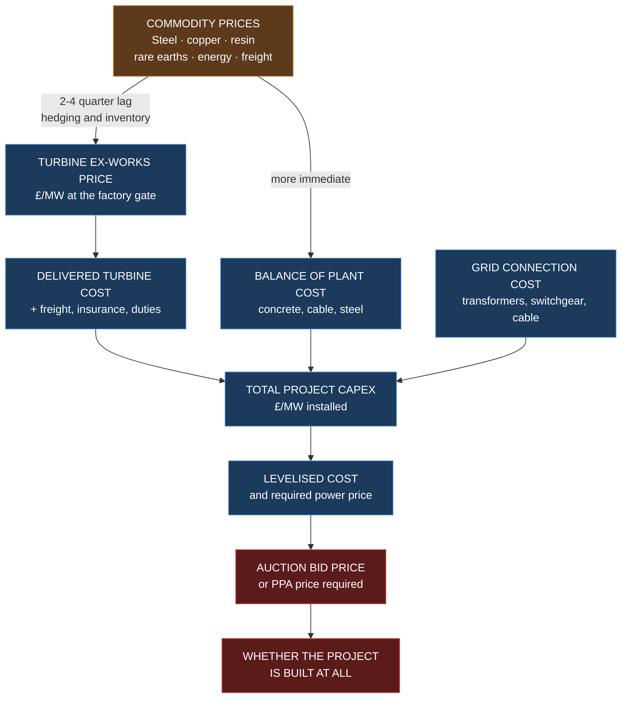

# W2 — Materials, Manufacturing and the Global Supply Chain

> **Abbreviations used in this chapter, written out in full:** MW (megawatt) · GW (gigawatt) ·
> t (tonne) · kg (kilogram) · NdFeB (neodymium-iron-boron, a permanent magnet alloy) ·
> SmCo (samarium-cobalt, another magnet alloy) · REE (rare earth element) · HREE (heavy rare
> earth element) · LREE (light rare earth element) · PMSG (permanent magnet synchronous
> generator) · DFIG (doubly-fed induction generator) · EESG (electrically excited synchronous
> generator) · OEM (original equipment manufacturer) · GFRP (glass fibre reinforced polymer) ·
> CFRP (carbon fibre reinforced polymer) · PET (polyethylene terephthalate) · PVC (polyvinyl
> chloride) · EPC (engineering, procurement and construction) · TSA (turbine supply agreement) ·
> CAPEX (capital expenditure) · IEA (International Energy Agency) · FOB (free on board, a
> shipping price basis) · EU (European Union) · US (United States) · UK (United Kingdom).

---

## 1. Why an investor must understand the supply chain

Most renewable energy investors treat the turbine as a black box with a price. That is a
mistake, for four reasons that each cost real money.

**First, materials are the cost.** A wind turbine is, in economic terms, a machine for
converting steel, copper, resin and rare earth magnets into a rotating asset. When commodity
prices move, turbine prices follow with a lag. **If you can see the input costs, you can
anticipate the output price**, which matters when you are timing a turbine order that will fix
40–70% of your project's capital cost.

**Second, supply chains create schedule risk.** A transformer, a blade mould slot or a
particular crane can be the binding constraint on when a project is built — and construction
delay destroys value in ways that are entirely invisible in a technical assessment.

**Third, concentration creates political risk.** A single country dominates several critical
steps. That is not a moral observation; it is a risk parameter that belongs in a downside case.

**Fourth — and this is the one that separates a good investor from an excellent one — supply
chain understanding is what allows you to form a view *before* the market does.** Export
controls, factory expansions, shipping rates and magnet prices are public information that
moves turbine prices six to eighteen months later. **[OPINION]** This is the single most
under-exploited edge available to a technically literate energy investor, and it is the
foundation of the integrated model you eventually want to build.

---

## 2. What a wind turbine is actually made of

### 2.1 Bill of materials by mass

**[ESTIMATE]** Approximate material intensity for a modern onshore wind turbine, per megawatt
of rated capacity, excluding the foundation. Figures vary substantially by turbine size,
drivetrain type and tower design — treat as an order-of-magnitude guide and verify against
specific manufacturer environmental product declarations for any real assessment.

| Material | Tonnes per MW | Share of turbine mass | Principally found in |
|---|---:|---:|---|
| **Steel** | 110–140 | ~70–80% | Tower, nacelle bedplate, main shaft, gearbox |
| **Cast iron** | 15–25 | ~10% | Hub, gearbox housing, bedplate |
| **Glass fibre reinforced polymer** | 8–12 | ~6% | Blades, nacelle cover, spinner |
| **Copper** | 1–4 | ~1–3% | Generator windings, cabling, transformer |
| **Aluminium** | 0.5–1.5 | <1% | Cooling, housings, some cabling |
| **Polymers, resins, adhesives** | 2–4 | ~2% | Blade matrix, bonding, coatings |
| **Balsa wood / structural foam** | 0.5–1.5 | <1% | Blade sandwich core |
| **Carbon fibre reinforced polymer** | 0–2 | 0–1.5% | Blade spar caps on longer blades |
| **Permanent magnet material (NdFeB)** | **0–2** | <1.5% | Direct-drive generators only |
| **Lubricants and fluids** | 0.3–0.8 | <1% | Gearbox oil, hydraulics, coolant |

**Plus the foundation**, which is usually excluded from turbine figures but is a very large
material item in its own right: **[ESTIMATE]** roughly **300–800 tonnes of concrete and 25–50
tonnes of reinforcing steel per turbine**, depending on turbine size and ground conditions.

**[CALC] Materialising a real project.** A 40 MW wind farm using eight 5 MW turbines:
- Steel in towers and nacelles: 40 MW × 125 t/MW ≈ **5,000 tonnes**
- Concrete in foundations: 8 × 550 t ≈ **4,400 tonnes**
- Copper: 40 × 2.5 ≈ **100 tonnes**
- Blade composite: 40 × 10 ≈ **400 tonnes**
- Permanent magnets, if direct drive: 40 × 1.5 ≈ **60 tonnes of NdFeB**

**Note the asymmetry that runs through this entire chapter.** By **mass**, a turbine is
overwhelmingly steel and concrete — commodity materials with deep, liquid, global markets and
many suppliers. By **supply risk**, it is dominated by the tiny rare earth magnet fraction and
a handful of specialised components. **Mass and risk are almost inversely correlated**, and
investors who look only at cost breakdowns miss this entirely.

### 2.2 Cost breakdown versus mass breakdown

**[ESTIMATE]** Approximate share of turbine *ex-works* cost — the price at the factory gate,
before transport and installation:

| Component | Share of turbine cost |
|---|---:|
| Blades (set of three) | 20–25% |
| Tower | 15–25% |
| Gearbox (geared machines) | 10–15% |
| Generator | 5–12% |
| Power converter and electrics | 5–10% |
| Nacelle structure, bearings, shaft | 10–15% |
| Pitch and yaw systems | 4–7% |
| Transformer | 3–5% |
| Control systems | 2–4% |
| Assembly, testing, overheads, margin | balance |

And within the total installed cost of an onshore wind project:

| Element | Share of total capital expenditure **[ESTIMATE]** |
|---|---:|
| **Turbines, delivered** | **55–70%** |
| Balance of plant — civils, foundations, roads, cabling | 15–25% |
| Grid connection | 5–15% |
| Development costs — land, planning, surveys, legal | 3–8% |
| Contingency | 5–10% |

**[Rule]** Because turbines are 55–70% of capital expenditure, **the turbine supply agreement
is the single most important commercial document in the construction phase**, and the timing of
signing it is a genuine investment decision, not an administrative step.

---

## 3. Steel: the backbone

### 3.1 What it does and where it goes

Steel is the tower, the bedplate, the main shaft, the gearbox internals, the fasteners and the
reinforcement in the foundation. Towers use structural plate steel, rolled into cans and welded
into sections. Gears and shafts use high-grade alloy steels, forged and case-hardened.

### 3.2 Supply structure

Steel is a **deep, global, liquid commodity** with a genuinely competitive supply base. This is
good news: it is the largest input by mass and the *least* concerning from a supply security
perspective.

**[FACT]** China produces roughly half of the world's crude steel; other significant producers
include India, Japan, the United States, Russia and South Korea. European production serves much
of the European wind tower market, though Chinese and Turkish towers are widely imported.

**Price formation.** Steel prices are driven by iron ore, coking coal (for blast furnace
production) or scrap and electricity (for electric arc furnace production), plus energy costs
and regional demand. **European steel is additionally exposed to carbon costs** through the
European Union Emissions Trading System, and to the Carbon Border Adjustment Mechanism, which
progressively prices the carbon content of imports.

**Investor takeaway.** Steel price movements flow into turbine prices with a lag of roughly two
to four quarters, because manufacturers hedge and hold inventory. **Watching hot-rolled coil
prices gives you a leading indicator of turbine price direction** — a genuinely usable signal.

### 3.3 Tower manufacturing

Tower production is relatively low-technology but capital-intensive and, crucially,
**logistics-bound**. Towers are enormous and expensive to move, so production tends to be
regional. A tower section over about 4.3–4.5 metres in diameter cannot practically travel by
road in the United Kingdom, which is the binding constraint driving concrete and hybrid towers
at greater heights.

**[Rule for project screening]** For a UK project, ask where the towers are coming from. Port
proximity and road access from that port are real constraints, and abnormal load routing
surveys are a genuine development task.

---

## 4. Copper: the conductor

### 4.1 What it does

Copper carries current: generator windings, the down-tower cable, the array collection network,
transformer windings and earthing. Aluminium substitutes in some cabling where weight or cost
matters, at the price of larger conductor cross-section for the same current.

**[ESTIMATE]** Onshore wind uses roughly **1–4 tonnes of copper per megawatt** including the
array cabling. Offshore is substantially higher — often 8–15 tonnes per megawatt — because of
long subsea export cables.

### 4.2 Supply structure and the structural story

**[FACT]** Copper mine production is concentrated in **Chile, Peru, the Democratic Republic of
the Congo, China, the United States, Indonesia and Australia**. Refining is more concentrated
still, with **China accounting for roughly half of global refined copper output**.

**The structural argument that matters to an energy investor:** copper demand is rising because
electrification is copper-intensive — electric vehicles, heat pumps, grid reinforcement,
renewable generation and data centres all consume it. Meanwhile, **new copper mines take
roughly 10–20 years from discovery to production**, ore grades at existing mines are declining,
and major deposits increasingly sit in jurisdictions with elevated political risk.

**[OPINION]** Copper is the material where the tension between energy transition demand and
supply response is most acute, and where a persistent structural deficit is most plausible. It
is the single commodity whose price most directly links "energy transition succeeds" to "input
costs rise". If you are building an integrated model, copper is one of the highest-value
variables in it — and it links your renewables exposure to the mining sector in a way worth
understanding.

**Investor takeaway.** Copper price movements affect balance-of-plant costs and cable costs
directly, and grid connection costs indirectly. A sustained copper price rise raises the capital
cost of every electrical project simultaneously — including the grid reinforcement your project
may be waiting for.

---

## 5. Blades: composites, and a genuinely fragile supply chain

### 5.1 The materials

| Material | Function | Notes |
|---|---|---|
| **Glass fibre** | Main reinforcement | E-glass standard; high-modulus grades for longer blades |
| **Carbon fibre** | Spar caps on long blades | Far stiffer per unit mass; considerably more expensive |
| **Epoxy or polyester resin** | Matrix binding the fibres | Epoxy for larger blades; better fatigue properties |
| **Balsa wood** | Sandwich core in panels | Light, stiff, strong in compression |
| **PET or PVC structural foam** | Alternative sandwich core | Substitutes for balsa; more consistent supply |
| **Polyurethane coatings and tapes** | Leading-edge protection | Consumable — replaced during operating life |
| **Adhesives** | Bonding the two shells and the webs | Structurally critical; a known failure origin |

### 5.2 The chokepoints — three of them, all real

**a) Balsa wood.** Commercial balsa is grown principally in **Ecuador**. It is an agricultural
product with a multi-year growth cycle, which means supply cannot respond quickly to demand.
The 2020–21 wind boom produced a severe balsa shortage and price spike, and accelerated
substitution toward PET foam. **This is a textbook example of an obscure input becoming a
binding constraint**, and worth remembering as a pattern rather than a fact.

**b) Carbon fibre.** Production is concentrated among a small number of Japanese, American and
increasingly Chinese producers. As blades lengthen, carbon fibre in spar caps shifts from
optional to necessary, because glass fibre becomes too heavy and too flexible. **Carbon fibre
demand also competes with aerospace**, which pays more and has priority relationships.

**c) Blade moulds and factory capacity.** Each blade model requires a purpose-built mould
costing millions, with a limited output of blades per year. Introducing a new blade design means
new moulds and a lead time measured in many months. **Blade factory capacity, not turbine
assembly capacity, is frequently the real constraint on how fast an original equipment
manufacturer can deliver.**

### 5.3 Why blades are also a quality risk

Blades are hand-laid or infused composite structures made in moulds. Process variation, resin
cure problems, bonding defects and inclusions are all possible, and a defect in a mould or a
process affects **an entire production batch**.

**[Rule] The commercial term you must know is "serial defect".** If a fault is common to a
production run, remediation can require inspecting and repairing hundreds of blades across many
projects, with crane costs, lost production and warranty disputes. **Serial defect events have
produced nine-figure losses for manufacturers and multi-year availability losses for owners.**

Chapter W9 covers how serial defect liability is allocated in a turbine supply agreement, and
Chapter W14 covers how it is managed in operation. For now, note that **the manufacturer's
balance sheet strength is a genuine investment consideration**: a warranty is only as good as
the company standing behind it.

---

## 6. Rare earth permanent magnets: the sharpest concentration risk in the industry

This is the most important section in this chapter.

### 6.1 What they are and where they are used

**NdFeB — neodymium-iron-boron** magnets are the strongest permanent magnets in commercial
production. In wind turbines they are used in **permanent magnet synchronous generators**,
which are standard in **direct-drive** and **medium-speed hybrid** machines.

**[FACT] Wind turbine generators require roughly 1–2 tonnes of neodymium-iron-boron magnet
material per megawatt of capacity**
([PatSnap](https://www.patsnap.com/resources/blog/articles/ndfeb-magnet-supply-chain-and-china-export-controls/)).

The magnets themselves are principally **neodymium** and **praseodymium** — both **light rare
earth elements** — alloyed with iron and boron. Critically, **dysprosium** and **terbium** —
both **heavy rare earth elements** — are added to raise **coercivity**, the magnet's resistance
to demagnetisation at elevated temperature. **Generator-grade magnets operate hot, so they need
high coercivity, so they need heavy rare earths.**

**Which turbines are exposed:**

| Drivetrain | Generator | Magnet content | Rare earth exposure |
|---|---|---|---|
| Geared, high speed | Doubly-fed induction generator | Little or none | **Low** |
| Geared, high speed | Electrically excited synchronous | None — uses wound coils | **None** |
| Medium-speed hybrid | Permanent magnet synchronous | Moderate | Medium |
| **Direct drive** | **Permanent magnet synchronous** | **1–2 t/MW** | **High** |

### 6.2 The concentration, quantified

**[FACT]** **China controls close to 100% of global production capacity for neodymium-iron-boron
magnets.** China produced an estimated **270,000 tonnes of rare earth oxides in 2024, against a
combined 60,000 tonnes from the rest of the world**
([DataDeep](https://datadeep.tech/ndfeb-permanent-magnet-supply-chain/),
[PatSnap](https://www.patsnap.com/resources/blog/articles/ndfeb-magnet-supply-chain-and-china-export-controls/)).

The concentration is **not primarily in mining** — rare earths are geologically common, and
deposits exist in the United States, Australia, Brazil, Vietnam and elsewhere. **The
concentration is in separation, refining and magnet manufacture** — the chemically difficult,
capital-intensive, environmentally burdensome middle of the chain.

**[OPINION] This distinction is the single most misunderstood point in the entire critical
minerals debate.** Opening a mine outside China does very little on its own, because the ore
still has to be separated and turned into magnets, and that capability barely exists elsewhere.
**When you assess any "rare earth independence" claim, ask which step of the chain it actually
addresses.** Most address mining, which is the easy part.

```mermaid
flowchart LR
  M["MINING<br/>Geologically common<br/>China, US, Australia,<br/>Myanmar, Brazil"] --> S["SEPARATION<br/>Chemically difficult<br/>Solvent extraction<br/><b>Overwhelmingly China</b>"]
  S --> R["METAL REFINING<br/>Oxide → metal<br/><b>Overwhelmingly China</b>"]
  R --> A["ALLOYING<br/>+ iron, boron,<br/>dysprosium, terbium<br/><b>Overwhelmingly China</b>"]
  A --> MG["MAGNET MANUFACTURE<br/>Sinter, machine,<br/>coat, magnetise<br/><b>~100% China capacity</b>"]
  MG --> G["WIND TURBINE<br/>GENERATOR"]
  classDef ok fill:#1b5c3a,stroke:#4ad990,color:#fff
  classDef risk fill:#5c1b1b,stroke:#d94a4a,color:#fff
  classDef end fill:#1b3a5c,stroke:#4a90d9,color:#fff
  class M ok
  class S,R,A,MG risk
  class G end
```

**Read the diagram as a risk map, not a process flow.** The green box is competitive; every red
box is a single-jurisdiction dependency. **A supply chain is only as secure as its narrowest
step**, and here four consecutive steps are narrow.

### 6.3 The export controls — current status

**[FACT] In April 2025, China introduced export controls on seven medium and heavy rare earth
elements — samarium, gadolinium, terbium, dysprosium, lutetium, scandium and yttrium — together
with all metals, oxides, alloys and downstream products containing them, including
samarium-cobalt magnets and any neodymium-iron-boron magnet containing terbium or dysprosium**
([PatSnap](https://www.patsnap.com/resources/blog/articles/ndfeb-magnet-supply-chain-and-china-export-controls/),
[Certivo](https://www.certivo.com/blog-details/china-rare-earth-export-controls-2026-what-new-licensing-rules-mean-for-manufacturers)).

**The mechanism is precisely targeted, and the precision is the point.** Magnets made purely
from light rare earths — neodymium, praseodymium, lanthanum, cerium — **remain freely
exportable**. Magnets containing terbium or dysprosium require an export licence.

**And high-coercivity grades used in wind turbine generators require heavy rare earth content.
They therefore fall squarely inside the licensing regime.**

**[FACT] Price effects.** As of March 2026, dysprosium oxide traded at approximately **$190 per
kilogram** domestically within China against **$317 per kilogram** free on board for export.
European import prices reached **up to six times Chinese domestic prices** following the April
2025 controls
([DataDeep](https://datadeep.tech/ndfeb-permanent-magnet-supply-chain/)).

**A two-tier global price for the same material is the defining signature of an effective export
control**, and it is worth recognising as a pattern — you will see it again in other materials
and other jurisdictions.

### 6.4 What this means for a wind investor, practically

**Direct consequences:**
1. **Turbine cost and availability risk concentrates on direct-drive machines.** If your
   preferred turbine is direct drive, you carry this exposure.
2. **Lead times can extend** if licences are delayed, and licensing is discretionary.
3. **Manufacturers are re-engineering around it** — using heavy-rare-earth-free magnet grades,
   grain boundary diffusion techniques that use far less dysprosium for the same coercivity, and
   in some cases returning to electrically excited or geared designs.
4. **It is a geopolitical lever, and levers get pulled.** Model it as a scenario, not a
   footnote.

**What to actually monitor** — these are public and freely available:
- Dysprosium and terbium oxide prices, and the gap between Chinese domestic and export prices
- Chinese export licence issuance rates and any policy changes
- Non-Chinese separation and magnet capacity actually reaching commercial production, as
  distinct from announced
- Manufacturer statements about drivetrain strategy and magnet sourcing
- European Union Critical Raw Materials Act and equivalent United States measures

**[Rule for due diligence]** For any project not yet having placed its turbine order, ask:
which drivetrain, which manufacturer, what is their magnet sourcing position, and what happens
to the programme if licences are delayed by six months? **That question is rarely asked and it
is entirely legitimate.**

---

## 7. The manufacturers: who actually builds turbines

### 7.1 The competitive landscape

**[FACT]** The top five turbine manufacturers — **Vestas, Goldwind, GE Vernova, Siemens Gamesa
and Envision** — accounted for roughly **80% of global shipments** in recent years
([BlackRidge Research](https://www.blackridgeresearch.com/blog/top-wind-turbine-manufacturers-makers-companies-suppliers)).

**Vestas** is the largest by installed base, with more than **203 GW installed** and over
**19% of the world market**, and a reported order backlog of **€76.1 billion**. **Siemens
Gamesa's** wind division reported a backlog of **32,717 MW valued at €36.3 billion** as of the
first quarter of 2026. **Goldwind** reported a **47.4 GW backlog**
([BlackRidge](https://www.blackridgeresearch.com/blog/top-wind-turbine-manufacturers-makers-companies-suppliers),
[EnkiAI](https://enkiai.com/wind-energy/siemens-wind-order-backlogs-2026-e36-3b-vs-goldwind/)).

**[FACT] Chinese manufacturers — Goldwind, Envision, Windey and others — dominate global order
volumes**, though largely in the Chinese domestic market, which is itself the world's largest.

### 7.2 The strategic shift you must understand

**[FACT] Western manufacturers — Vestas, Siemens Energy and GE Vernova — have shifted from
pursuing market share to disciplined, profitable growth: bidding more selectively and
prioritising margin over volume**
([BlackRidge](https://www.blackridgeresearch.com/blog/top-wind-turbine-manufacturers-makers-companies-suppliers)).

**Why this happened, and why it matters to you as a buyer.** Through the 2010s, manufacturers
competed on price and on ever-larger turbine platforms. The result was thin or negative margins,
warranty provisions that repeatedly exceeded expectations, and serial quality problems caused by
insufficiently mature designs being rushed to market. Several manufacturers recorded very large
losses.

**The consequences for a project developer are direct and immediate:**
1. **Turbine prices have risen** from the trough, and discounting is far less available.
2. **Manufacturers are more selective.** A small project, an unfamiliar developer, or a
   difficult site may struggle to get a competitive bid at all.
3. **Contract terms have tightened** — shorter warranties, tighter liability caps, more
   restrictive availability guarantees, more onerous payment profiles.
4. **Platform proliferation has slowed**, which is genuinely good news for reliability: fewer,
   more mature designs mean fewer serial defects.

**[Rule] For any project under roughly 50 MW, turbine procurement leverage is weak.** Expect
list-price-like terms, limited negotiation on warranty, and possible difficulty securing
delivery slots. Aggregating orders across multiple projects, or buying through a larger
partner, is a genuine commercial strategy — and one reason developers form platforms.

### 7.3 The Chinese question

Chinese turbines are typically materially cheaper and increasingly technically credible. Their
adoption outside China has been limited by:

- **Financeability.** Lenders and their technical advisers apply scrutiny to track record,
  warranty enforceability, and the practical realities of pursuing a claim across jurisdictions.
- **Service infrastructure.** Operations and maintenance response depends on local presence,
  spares availability and trained technicians.
- **Political and security considerations**, including scrutiny of remote monitoring and control
  systems connected to critical national infrastructure.
- **Trade measures** in some markets.

**[OPINION]** The financeability constraint is the binding one, and it is a genuine
chicken-and-egg problem: lenders want track record, and track record requires lenders. It is
softening gradually. **For an investor, the practical question is not whether Chinese turbines
are good — increasingly they are — but whether your specific lender and insurer will accept
them on your specific project.** Ask that question early, because discovering the answer late
destroys a procurement strategy.

---

## 8. How material costs flow into project costs



**This chain is the reason supply chain literacy is an investment edge.** Commodity and freight
prices are observable in real time. Turbine prices follow with a lag. Auction clearing prices
follow turbine prices with a further lag. **Someone who watches the left-hand side of this
diagram can anticipate the right-hand side by a year or more.**

**[FACT] The 2021–2023 episode is the case study to internalise.** Steel, resin, freight and
energy costs rose sharply and simultaneously. Turbine prices rose. Projects that had bid fixed
strike prices in earlier, cheaper auctions found their capital costs had risen but their revenue
was fixed. Several were delayed, renegotiated or abandoned worldwide. In the United Kingdom
specifically, the fifth Contracts for Difference allocation round secured **no offshore wind
bids at all**, because the administrative maximum price was set below the level developers could
accept given their new cost base.

**The lesson, which generalises well beyond wind:** **a fixed-price revenue contract combined
with an unfixed cost base is a dangerous structure.** The commercial defence is to align the
timing of the turbine supply agreement with the timing of the revenue contract — ideally signing
or firmly pricing the turbine order before bidding a fixed price. Chapter W9 covers how this is
done contractually and Chapter W13 covers how lenders view it.

---

## 9. Lead times: the schedule risk table

**[ESTIMATE] Indicative lead times — verify currently, as these move substantially with market
conditions:**

| Item | Typical lead time | Notes |
|---|---|---|
| **Large power transformer** | **Long — frequently the critical path** | Global order book congested |
| High-voltage switchgear | Long | Similar pressures |
| Turbines (delivery slot) | Many months to years | Depends on manufacturer backlog |
| Blades | Constrained by mould capacity | New designs need new moulds |
| Large crawler crane | Scarce for the largest lifts | Book early; weather-limited once on site |
| Array cable | Moderate | Copper price exposed |
| Tower sections | Moderate | Regional production; transport constrained |
| Grid connection works | **Years** | Governed by the network operator's programme |

**[Rule] The two most common causes of programme slippage in United Kingdom onshore wind are the
grid connection and the transformer**, and neither is within the developer's control. Both must
appear explicitly on the construction programme and in the risk register from the earliest stage.
**A programme that shows turbines arriving before the substation is energised is not a
programme; it is a wish.**

---

## 10. Recycling, circularity and end of life

Increasingly a genuine commercial and regulatory issue rather than a public-relations one.

| Component | Recyclability | Status |
|---|---|---|
| Steel tower and structure | **Excellent** | Established scrap value; genuinely offsets decommissioning cost |
| Cast iron | Excellent | Established |
| Copper | **Excellent** | High scrap value |
| Concrete foundation | Moderate | Crushable as aggregate; often partially left in place by agreement |
| **Blades** | **Poor** | Thermoset composites are difficult to recycle |
| Rare earth magnets | Technically possible, commercially immature | Recovery rates are currently low |
| Oils and fluids | Established | Handled under waste regulation |

**The blade problem, stated plainly.** Blades are thermoset composites — the resin cures
irreversibly and cannot simply be melted and reformed. Options are cement kiln co-processing
(the material substitutes for fuel and raw material in cement), mechanical grinding into filler,
pyrolysis or solvolysis to recover fibre, and structural reuse. **None is yet both cheap and
scalable.** Several manufacturers have committed to recyclable blade designs using new resin
chemistries, and these are entering the market.

**Why this belongs in an investment analysis, not a sustainability appendix:**
1. **Decommissioning cost is a real liability**, and planning consents and landowner leases
   commonly require a decommissioning bond or security. Chapter W4 covers the lease mechanics
   and Chapter W15 the cost estimation.
2. **Scrap value genuinely offsets it.** Steel and copper recovery can cover a substantial part
   of removal cost, which is why net decommissioning cost estimates are much lower than gross.
3. **Regulation is tightening**, and future landfill restrictions on composites are a plausible
   scenario that would raise costs.
4. **It is a valuation input.** A buyer will price the decommissioning liability, and a
   provision that looks generous today may look thin in twenty years.

---

## 11. What an investor should actually monitor

A concrete watchlist. All of it is public.

| Signal | Why it matters | Where to find it |
|---|---|---|
| **Hot-rolled coil steel prices** | Leading indicator of turbine price direction | Commodity price services, trade press |
| **Copper price** | Balance of plant, cabling, grid costs | London Metal Exchange |
| **Dysprosium and terbium prices, and the China domestic-versus-export spread** | Direct-drive turbine supply risk | Specialist rare earth price reporters |
| **Chinese rare earth export licence policy** | Step-change risk | Chinese ministry announcements, trade press |
| **Manufacturer order backlogs and margins** | Pricing power and delivery availability | Quarterly results of Vestas, Siemens Energy, GE Vernova, Goldwind |
| **Manufacturer warranty provisions** | Early warning of serial defect issues | Annual report notes — genuinely informative |
| **Container and breakbulk freight rates** | Delivered cost | Freight indices |
| **Transformer and switchgear lead times** | Programme risk | Direct enquiry; industry surveys |
| **Blade factory announcements** | Regional capacity | Manufacturer press releases |

**[OPINION] Reading manufacturers' quarterly results is one of the highest-return habits
available to a wind investor**, and almost nobody outside the manufacturers does it. Warranty
provisions, backlog quality commentary and average selling price disclosures tell you more about
where turbine prices and reliability are heading than any market report you can buy.

---

## 12. How supply chain exposure changes with project size

| Band | Capacity | Procurement position | Principal supply chain risk |
|---|---|---|---|
| **Micro** | < 50 kW | Off-the-shelf, retail | Manufacturer solvency; spares availability |
| **Small** | 50 kW – 1 MW | Standard products, often refurbished | Spares for discontinued models |
| **Medium** | 1 – 5 MW | Very weak leverage | Difficulty securing any competitive bid |
| **Large** | 5 – 50 MW | Weak to moderate | Delivery slot availability; transformer lead time |
| **Major** | 50 – 100 MW | Moderate | Slot availability; commodity exposure between bid and order |
| **Strategic** | > 100 MW | Strong; may secure reserved capacity | Commodity exposure over a long programme; serial defect concentration |

**[OPINION] A specific and under-appreciated risk at the largest scale: concentration.** A very
large project installing many identical turbines has all of its output exposed to a *single*
turbine model. If that model develops a serial defect, the entire portfolio is affected
simultaneously. A smaller, more diverse portfolio has natural resilience. **This is a genuine
argument for portfolio diversity that rarely appears in investment papers**, and it is worth
raising.

---

## 13. Red flags

1. **Turbine supply agreement not signed** but capital expenditure fixed in the financial model
   with no commodity contingency.
2. **Direct-drive turbine selected** with no discussion of magnet supply or export licensing.
3. **Transformer and switchgear** absent from the construction programme.
4. **Single manufacturer, single model** across a very large portfolio with no serial defect
   consideration.
5. **Manufacturer financial strength** unexamined where a long warranty is being relied upon.
6. **Chinese turbines proposed** without early confirmation that lenders and insurers will
   accept them.
7. **Decommissioning provision** with no basis, or assuming scrap value with no evidence.
8. **Abnormal load access route** unsurveyed for a site with large turbines.
9. **Blade transport and crane access** not reflected in the civils design or cost.
10. **Fixed-price revenue contract bid** before turbine pricing is firm.

---

## 14. Test yourself

1. A 60 MW wind farm uses ten 6 MW direct-drive turbines. Estimate the tonnage of steel,
   copper and permanent magnet material required.
2. Why is China's dominance of rare earths more a refining and magnet-manufacturing story than a
   mining story, and why does that distinction change the policy response?
3. Which turbine drivetrain choice minimises rare earth exposure, and what does that choice cost
   you in other respects?
4. Explain the commercial significance of a "serial defect" and why the manufacturer's balance
   sheet matters to a project owner.
5. Why did balsa wood become a binding constraint on the wind industry, and what general lesson
   does that carry?
6. What happened to projects that bid fixed strike prices before the 2021–23 cost inflation, and
   what is the contractual defence?
7. Give three publicly observable indicators that would lead you to expect turbine prices to rise
   over the following year.
8. Why might a 30 MW project struggle to obtain competitive turbine pricing, and what can a
   developer do about it?
9. Why is a very large single-model portfolio arguably riskier than a diverse one, despite the
   procurement advantages?
10. A dysprosium oxide price of $190 per kilogram inside China against $317 free on board for
    export tells you what, in one sentence?

<details>
<summary>Model answers</summary>

**1.** Steel: 60 × ~125 = **~7,500 tonnes**. Copper: 60 × ~2.5 = **~150 tonnes**. Permanent
magnet material: 60 × ~1.5 = **~90 tonnes of neodymium-iron-boron**. Plus foundations at roughly
550 tonnes of concrete each, so **~5,500 tonnes of concrete**.

**2.** Rare earth elements are geologically common and mined in several countries. The
concentration is in **separation, refining, alloying and magnet manufacture** — the chemically
difficult, capital-intensive, environmentally burdensome middle steps, where China holds close to
100% of magnet capacity. The distinction matters because opening a mine outside China achieves
little on its own: the ore must still be separated and converted into magnets. Policy that funds
mining without funding midstream processing does not reduce dependence.

**3.** An **electrically excited synchronous generator** uses wound field coils rather than
permanent magnets and contains essentially no rare earths; a conventional **geared doubly-fed
induction** machine uses very little. The cost is a heavier, slightly less efficient generator
in the electrically excited case, and in the geared case the retention of a gearbox — historically
the largest single source of unplanned maintenance cost and downtime.

**4.** A serial defect is a fault common to an entire production batch, arising because blades
and components are manufactured in moulds and production runs. It can require inspection and
repair of hundreds of units across many projects, with crane costs and extended lost production.
The manufacturer's balance sheet matters because the remedy depends entirely on the warranty
being honoured, and a warranty is only as good as the company behind it — several manufacturers
have taken very large warranty provisions.

**5.** Commercial balsa is grown principally in Ecuador and is an agricultural product with a
multi-year growth cycle, so supply cannot respond quickly to a demand surge. The 2020–21 boom
produced shortage and price spikes. **The general lesson is that supply chain risk is often
concentrated in obscure, low-value inputs with inelastic supply, rather than in the expensive
headline components** — and that identifying such inputs before the market does is genuinely
valuable.

**6.** Their capital costs rose while their revenue was contractually fixed, compressing or
eliminating returns; projects were delayed, renegotiated or abandoned, and one United Kingdom
allocation round attracted no offshore wind bids at all. The contractual defence is to **align
the timing of the turbine supply agreement with the revenue contract** — firmly pricing the
turbine order before bidding a fixed price — and to include commodity indexation or contingency
where that is not possible.

**7.** Rising hot-rolled coil steel prices; rising copper prices; rising manufacturer order
backlogs combined with commentary about selective bidding and margin discipline. Also: rising
freight rates, rising rare earth prices, and reduced discounting evident in disclosed average
selling prices.

**8.** Because manufacturers have shifted to margin discipline and bid selectively; a 30 MW
order is small, offers little strategic value, and may not justify a delivery slot. The developer
can aggregate orders across a portfolio, buy through a larger partner or platform, accept an
older or less popular turbine model, or approach manufacturers seeking to build presence in the
market.

**9.** Because all of its output is exposed to a single turbine model. A serial defect would
affect the entire portfolio simultaneously, whereas a diverse portfolio has natural resilience.
The procurement and maintenance advantages of standardisation are real but are traded against
this concentration.

**10.** That the export control is biting: a persistent two-tier price for the same material,
with foreign buyers paying a large premium, is the defining signature of an effective export
restriction rather than a general supply shortage.

</details>

---

## 15. Primary sources

- **International Energy Agency**, *Rare Earth Elements* analysis and *Critical Minerals*
  outlooks — [iea.org](https://www.iea.org/reports/rare-earth-elements/executive-summary)
- **United States Geological Survey**, *Mineral Commodity Summaries* — annual, authoritative,
  free
- **European Union Critical Raw Materials Act** — the European policy framework
- **Manufacturer annual reports and quarterly results** — Vestas, Siemens Energy, GE Vernova,
  Goldwind, Nordex. Warranty provisions and backlog commentary are especially informative
- **Manufacturer environmental product declarations** — published material intensity by turbine
  model, and the best source for a specific machine
- **London Metal Exchange** — copper, aluminium prices
- **WindEurope** and **Global Wind Energy Council** — supply chain and market reports

---

**Next: W3 — Site Origination and Prospecting**
