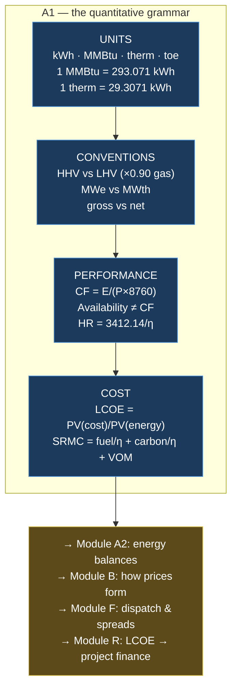

# Module A1 — Energy, Power, Units and the Commercial Quantities

> **Module number:** A1 (Group A, module 1 of 4)
> **Learning objectives:** convert fluently between any energy units used commercially;
> compute and correctly interpret capacity factor, availability, heat rate and LCOE;
> understand why HHV/LHV and MWh/MWth confusion destroys models; connect a physical
> quantity to a price and a valuation.
> **Prerequisites:** none. This is the programme's entry point.
> **Estimated study time:** 8–10 hours (4 reading, 4–6 practical).
> **Required reading:** IEA *Energy Statistics Manual* §2 (units and conversions);
> DESNZ *Digest of UK Energy Statistics* (DUKES) Chapter 5 conversion tables; Lazard
> *Levelized Cost of Energy+* — the methodology appendix, not the headline chart.
> **Practical deliverables:** a unit-conversion + LCOE tool in both Excel and Python,
> committed to `projects/`.

---

## 1. What the subject is

The quantitative grammar of the energy industry: the units in which energy, power, fuel and
emissions are measured, the conversions between them, and the four derived quantities —
capacity factor, availability, heat rate and levelised cost — that turn physical performance
into commercial performance.

## 2. Why it matters

**Because unit errors are the most common cause of catastrophic model failure in this
industry, and they are invisible.** A model with a wrong discount rate looks wrong to a
reviewer. A model that has confused HHV with LHV, or MWth with MWe, or a US therm with a UK
therm, produces plausible-looking numbers that are wrong by 10–100%, passes review, and
prices a transaction incorrectly.

**[OPINION]** You will be tempted to skip this module because you are an engineer and this
looks like first-year material. Do not. The *engineering* content is trivial for you; the
*commercial conventions* — LHV vs HHV by geography, heat rate as the US way of expressing
efficiency, why capacity factor and availability are different contractual animals — are
where the errors live, and they are not taught in engineering degrees.

## 3. How it connects to the wider energy system

Every arrow in the Layer 1 physical map (`01-energy-system-map.md`) is a quantity with a
unit. Every arrow in the Layer 2 commercial map is a *price per unit*. This module is the
bridge between them: it is where £/MWh meets MWh.


## 4. What you already know that transfers

Nearly all the physics, and specifically: capacity factor from yield assessment work
(you compute it constantly); P50/P90 (Module A3 formalises it); CAPEX/OPEX/NPV/IRR
(Module A4 and Group R build on it). **What is new is convention, not content** — the
industry-specific ways of expressing the same physics, which differ by fuel and by continent.

## 5. Prerequisites

None.

## 6. Essential concepts

### 6.1 Energy vs power — the distinction everything else rests on

**Power** is a rate: joules per second, measured in watts. **Energy** is power integrated
over time: watt-hours.

E = P × t

A 100 MW wind farm running at full output for 3 hours produces 300 MWh. It does not
"produce 100 MW". **[Common error]** Journalists and even developers write "a 50 MW solar
farm generating enough to power 15,000 homes" — mixing a power rating with an implied annual
energy. Always ask: *is this a rate or a quantity?*

### 6.2 The conversion set you must know without looking up

| From | To | Multiply by | Note |
|---|---|---|---|
| kWh | MJ | 3.6 | 1 W = 1 J/s, 3600 s/h |
| MWh | GJ | 3.6 | |
| **therm** | **kWh** | **29.3071** | GB gas retail |
| **MMBtu** | **kWh** | **293.071** | = 10 therms. LNG's global unit |
| MMBtu | GJ | 1.05506 | |
| toe | MWh | 11.63 | Tonne of oil equivalent |
| boe | MWh | ~1.7 | Barrel of oil equivalent |
| bbl crude | GJ | ~6.1 | Varies with crude quality |
| **1 mtpa LNG** | **bcm gas** | **~1.36** | ≈ 48.7 bcf; ≈ 52–54 TWh |
| bcm nat gas | TWh | ~10.55 | GCV basis, varies with composition |
| tonne coal | GJ | 24–30 | Depends heavily on rank |
| kg hydrogen | kWh (LHV) | 33.33 | HHV: 39.4 |

**Memorise the bold rows.** 29.3071, 293.071 and 1.36 come up in almost every gas or LNG
conversation.

### 6.3 HHV vs LHV — the convention trap

When a hydrocarbon burns, the hydrogen forms water. **Higher heating value (HHV, or gross
calorific value)** counts the latent heat released if that water condenses. **Lower heating
value (LHV, net)** does not.

For natural gas, **LHV ≈ 0.90 × HHV**. For hydrogen, LHV/HHV = 33.33/39.4 = **0.846**.

**The trap:** the **US quotes gas and power plant heat rates on HHV**; **continental Europe
frequently quotes efficiency on LHV**. So a CCGT described as "60% efficient" in Europe
(LHV) is about **54% efficient on HHV** — the same machine, a 6-percentage-point apparent
difference. If you take a European LHV efficiency into a US HHV gas price to compute a
spark spread, **your fuel cost is wrong by ~10%**, which for a marginal plant is the entire
margin.

**[Rule] Never accept an efficiency figure without asking "HHV or LHV?"** If the answer is
unavailable, infer from geography and state the assumption explicitly in your model.

### 6.4 Capacity factor vs availability vs load factor

These are routinely conflated and they are contractually different.

**Capacity factor** = actual energy produced ÷ (rated capacity × hours in period)

CF = E_actual / (P_rated × 8760)

**Availability** = fraction of period the plant was *capable* of operating, regardless of
whether it did.

**Load factor** — often used interchangeably with capacity factor in GB, but sometimes means
output ÷ *available* capacity. **Always check the definition in the document you are reading.**

**Why the difference is commercial, not pedantic:** a wind farm with 97% availability might
have a 38% capacity factor — the difference is the wind, not the machine. An O&M contractor
warrants **availability**, because that is what they control. A lender sizes debt against
**energy yield**, which depends on capacity factor. **A 100% available wind farm in a calm
year still defaults on its debt.** Confusing these is how you mis-allocate risk in a contract.

**[Sanity check for your models]** GB indicative annual capacity factors: onshore wind
~26–32%, offshore wind ~40–50%, solar PV ~10–11%, CCGT ~30–45% (dispatch-dependent), nuclear
~70–85%. Source: DESNZ *DUKES* Chapter 6 / *Energy Trends* Table 6.1 — **look up the current
year's values rather than trusting this list**, which is an indicative range for
plausibility-checking only.

### 6.5 Heat rate — efficiency, inverted, in commercial clothing

**Heat rate** = fuel energy in ÷ electrical energy out. It is the reciprocal of efficiency,
scaled by units. US convention: **Btu/kWh**. European: **kJ/kWh** or just efficiency %.

HR (Btu/kWh) = 3412.14 / η

**[CALC]** A CCGT at η = 55% (LHV):
HR = 3412.14 / 0.55 = **6,204 Btu/kWh (LHV)**

Converting to HHV: η_HHV = 0.55 × 0.90 = 0.495 → HR = 3412.14 / 0.495 = **6,893 Btu/kWh (HHV)**.

**Why traders use heat rate rather than efficiency:** because it multiplies directly by the
gas price. At $4.00/MMBtu:

Fuel cost = 6,893 Btu/kWh × $4.00/10⁶ Btu × 1000 kWh/MWh = **$27.57/MWh**

One multiplication, no division, no unit gymnastics. That is the entire reason the
convention exists.

## 7. Intermediate concepts

### 7.1 Levelised cost of energy — and its serious limitations

LCOE is the constant £/MWh price that makes a project's NPV zero.

**LCOE = Σₜ [(CAPEXₜ + OPEXₜ + FUELₜ) / (1+r)ᵗ] ÷ Σₜ [Eₜ / (1+r)ᵗ]**

**The discounting of the denominator is the part people get wrong.** Energy must be
discounted at the same rate as cost. Discounting cash but not energy inflates LCOE
substantially — a very common error in student and journalistic calculations.

**[CALC] Worked example — 50 MW onshore wind, [ASSUMPTION] throughout, illustrative only**

| Input | Value |
|---|---|
| Capacity | 50 MW |
| CAPEX | £1.3m/MW → £65m, all in year 0 |
| OPEX | £45k/MW/yr → £2.25m/yr, real |
| Capacity factor | 32% |
| Life | 25 years |
| Discount rate (real) | 7% |

Annual energy = 50 × 8760 × 0.32 = **140,160 MWh/yr**

Annuity factor, 25 yr @ 7% = (1 − 1.07⁻²⁵)/0.07 = **11.6536**

- PV(costs) = 65,000,000 + 2,250,000 × 11.6536 = 65,000,000 + 26,220,600 = **£91,220,600**
- PV(energy) = 140,160 × 11.6536 = **1,633,368 MWh**
- **LCOE = 91,220,600 / 1,633,368 = £55.85/MWh**

**Interpretation.** Compare against AR7's awarded offshore wind strike price of **£91/MWh**
(2024 prices) for 8.4 GW, announced 14 January 2026
([FACT](https://assets.publishing.service.gov.uk/media/6966861de8c04eb2919f773a/contracts-for-difference-allocation-round-7-results-.pdf);
RWE confirms **£91.20/MWh** for its 6.9 GW award
[here](https://www.rwe.com/en/press/rwe-ag/2026-01-14-rwe-secures-contracts-for-difference-for-6-9-gigawatts-of-offshore-wind-capacity/)).
Onshore wind's lower LCOE reflects lower CAPEX per MW, offset by a lower capacity factor.
Floating offshore in AR7 cleared at **£216.49/MWh** (2024 prices) — nearly 4× fixed-bottom,
which tells you precisely how immature that technology's cost base still is.

**Where LCOE misleads — and you must be able to say this in an interview:**

1. **It ignores *when* energy is produced.** Solar at £40/MWh LCOE that generates only when
   prices are low may be worth less than gas at £70/MWh that generates at peak. The correct
   comparison uses **capture price**, not baseload price. This is the single most important
   critique of LCOE.
2. **It ignores system costs** — balancing, network reinforcement, firming.
3. **It is hypersensitive to the discount rate**, which quietly encodes risk. Comparing a
   contracted asset at 6% with a merchant asset at 6% is not a like-for-like comparison.
4. **It says nothing about financeability.** A project with a good LCOE and unbankable
   revenue contracts does not get built.

**[Rule] Use LCOE for screening technology options within a comparable risk class. Never use
it to decide an investment.**

### 7.2 Marginal cost and the dispatch decision

Short-run marginal cost of a thermal plant:

**SRMC (£/MWh) = (Gas price ÷ η) + (Carbon intensity ÷ η) × Carbon price + Variable OPEX**

**[CALC]** CCGT, η = 55% (LHV), gas at £25/MWh, UK ETS at **£58.97/tCO₂e**
([FACT, Dec-26 contract, 21 Aug 2026](https://www.catalyst-commercial.co.uk/works/uk-energy-market-report-21-august-2026/)),
gas emission factor 0.184 tCO₂/MWh(th), VOM £2/MWh:

- Fuel: 25.00 / 0.55 = **£45.45/MWh**
- Carbon: (0.184 / 0.55) × 58.97 = 0.3345 × 58.97 = **£19.73/MWh**
- VOM: **£2.00/MWh**
- **SRMC = £67.18/MWh**

**Commercial meaning:** the plant dispatches when power > £67.18/MWh and shuts below it.
That threshold *is* the clean spark spread breakeven, and it is the single number a thermal
trader carries in their head. You have just done Module F's core calculation in Module A1 —
this is how tightly coupled the curriculum is.

**Sensitivity — note the non-linearity in efficiency:**

| η (LHV) | Fuel £/MWh | Carbon £/MWh | SRMC £/MWh |
|---|---|---|---|
| 45% | 55.56 | 24.11 | **81.67** |
| 50% | 50.00 | 21.70 | **73.70** |
| 55% | 45.45 | 19.73 | **67.18** |
| 60% | 41.67 | 18.08 | **61.75** |

A 15-percentage-point efficiency spread moves SRMC by **£19.92/MWh** — which decides which
plants in the merit order run at all. Because SRMC ∝ 1/η, the *relationship is a hyperbola,
not a line*: efficiency gains matter more at low efficiency. Plot it in the Python exercise.

## 8. Advanced concepts

- **Energy vs exergy.** 1 MWh of electricity and 1 MWh of 40°C hot water are not
  commercially equivalent — they differ in work potential. Underlies heat-network pricing
  and the case for heat pumps (COP > 1 does not violate thermodynamics because heat is
  *moved*, not created).
- **Marginal vs average performance.** Average heat rate ≠ marginal heat rate. Plants are
  less efficient at part load and incur start-up fuel. Dispatch on marginal cost;
  budget on average.
- **Primary / final / useful energy.** Renewables have no combustion loss, so the
  "substitution method" for counting primary energy makes fossil fuels look larger than they
  are on a useful-energy basis. Read IEA and BP/Energy Institute statistics knowing which
  convention applies.
- **EROI** — intellectually interesting, commercially near-useless. Awareness only.
- **Life-cycle emissions** — matters for carbon accounting and CFE matching (Module N/O).

## 9. Key terminology

Rate vs quantity · nameplate/rated capacity · derating · gross vs net output (auxiliary
load) · parasitic load · GCV/NCV · calorific value · heat rate · efficiency (HHV/LHV) ·
capacity factor · load factor · availability (contracted vs actual) · degradation ·
curtailment · P50/P90 · LCOE · SRMC/LRMC · merit order · energy density (MJ/kg) · power
density (W/m²).

## 10. Core calculations

| # | Calculation | Formula |
|---|---|---|
| 1 | Energy from power | E = P × t |
| 2 | Capacity factor | CF = E / (P_rated × h) |
| 3 | Efficiency ↔ heat rate | HR = 3412.14 / η (Btu/kWh) |
| 4 | HHV ↔ LHV (gas) | LHV ≈ 0.90 × HHV |
| 5 | Fuel cost per MWh | Gas price / η |
| 6 | Carbon cost per MWh | (EF / η) × carbon price |
| 7 | SRMC | (5) + (6) + VOM |
| 8 | Annuity factor | AF = (1 − (1+r)⁻ⁿ)/r |
| 9 | LCOE | PV(costs) / PV(energy) |
| 10 | Annual energy | P × 8760 × CF |

## 11. Units and conversion factors

See §6.2. Additionally: 1 year = 8,760 h (8,784 in a leap year — **this matters in
settlement and in annual revenue models**); GB settlement periods are **half-hourly, 17,520
per year**; 1 tCO₂ from natural gas ≈ 0.184 t/MWh(th) [FACT: UK Government GHG conversion
factors — verify the current year's value].

## 12. Commercial contracts and market structures

Where these units appear contractually: PPAs priced in £/MWh; availability warranties in %;
O&M contracts with availability guarantees and liquidated damages; gas contracts in
p/therm or €/MWh; LNG SPAs in $/MMBtu; capacity agreements in £/kW/yr (GB cleared at
**£27.10/kW/yr** for 2029/30 [FACT]) or $/MW-day (PJM cleared at **$333.44/MW-day** for
2027/28 [FACT]). **Note the two capacity markets use different units — converting between
them is an exercise below.**

## 13. Main participants

Generators, offtakers, O&M contractors, yield consultants (you), lenders' technical advisers,
meter operators, settlement bodies (Elexon in GB).

## 14. Key risks

Unit-conversion error (highest-frequency, lowest-visibility risk in this module); convention
mismatch (HHV/LHV, gross/net); over-reliance on LCOE; using average rather than marginal
performance; treating capacity factor as a warranty.

## 15. Regulatory considerations

DESNZ/DUKES conversion conventions; Elexon settlement metering; GHG conversion factors
updated annually by UK Government — **always cite the vintage year of an emission factor.**

## 16. Current debates

Whether LCOE should be retired in favour of value-adjusted metrics (VALCOE, IEA) as
renewables penetration deepens cannibalisation; whether primary-energy accounting for
renewables should switch to the direct-equivalent method; whether capacity-factor
comparisons across dispatchable and non-dispatchable technologies are meaningful at all.

## 17. Authoritative sources

[DESNZ DUKES](https://www.gov.uk/government/collections/digest-of-uk-energy-statistics-dukes) ·
[DESNZ Energy Trends](https://www.gov.uk/government/collections/energy-trends) ·
[IEA Statistics](https://www.iea.org/data-and-statistics) ·
[Energy Institute Statistical Review](https://www.energyinst.org/statistical-review) ·
[US EIA](https://www.eia.gov/) ·
[Elexon BMRS / Insights](https://www.elexon.co.uk/) ·
[NESO Data Portal](https://www.neso.energy/data-portal)

## 18. Books

Mackay, *Sustainable Energy — Without the Hot Air* (free; unmatched for unit intuition) ·
Smil, *Energy and Civilization* (context, not calculation) · Kaplan, *Power Plants:
Characteristics and Costs* (CRS, free).

## 19. Courses

**[OPINION]** None needed. This module is self-taught. Do not spend money here — save the
training budget for project finance modelling (Group R), which is where paid courses
genuinely earn their cost.

## 20. Reports

Lazard *LCOE+* (annual; read the methodology appendix) · IEA *World Energy Outlook* (units
and balances chapters) · NESO *Future Energy Scenarios*.

## 21. Practical Excel exercise

Build `A1_units_and_lcoe.xlsx` with four sheets, following institutional model discipline
(inputs blue, formulas black, no hardcoded numbers inside formulas):

1. **Inputs** — capacity, CAPEX/MW, OPEX/MW/yr, CF, life, discount rate, gas price,
   efficiency, HHV/LHV toggle, carbon price, emission factor.
2. **Conversions** — a two-way converter across the §6.2 table, with a dropdown for from/to
   units. Include a unit-consistency check cell that flags mismatched dimensions.
3. **Calculations** — annual energy, annuity factor, PV(costs), PV(energy), LCOE, SRMC.
4. **Sensitivity** — a two-variable data table (Data → What-If → Data Table) of LCOE
   against CAPEX/MW (rows) and capacity factor (columns). Then a second one of SRMC against
   gas price and efficiency.

**Checks to include:** PV(energy) > 0; LCOE > 0; efficiency between 0 and 1; a flag if
HHV/LHV toggle is inconsistent with the gas price's stated basis.

## 22. Practical Python exercise

Create `projects/a1_units_lcoe.py`:

```python
"""Module A1 — unit conversions, LCOE and SRMC. All figures illustrative."""

# Canonical conversions to kWh
TO_KWH = {
    "kWh": 1.0, "MWh": 1e3, "GWh": 1e6, "TWh": 1e9,
    "MJ": 1 / 3.6, "GJ": 1000 / 3.6,
    "therm": 29.3071, "MMBtu": 293.071,
    "toe": 11_630.0, "boe": 1_700.0,
}
LHV_HHV_GAS = 0.90          # LHV ≈ 0.90 × HHV for natural gas
BTU_PER_KWH = 3412.14


def convert(value: float, frm: str, to: str) -> float:
    """Convert between energy units via kWh. Raises on unknown units."""
    if frm not in TO_KWH or to not in TO_KWH:
        raise KeyError(f"unknown unit: {frm!r} or {to!r}")
    return value * TO_KWH[frm] / TO_KWH[to]


def heat_rate_btu_per_kwh(efficiency: float) -> float:
    """Heat rate from thermal efficiency. Keep the basis (HHV/LHV) consistent."""
    if not 0 < efficiency < 1:
        raise ValueError("efficiency must be a fraction between 0 and 1")
    return BTU_PER_KWH / efficiency


def annuity_factor(rate: float, years: int) -> float:
    """PV of £1/yr for n years. Handles rate = 0."""
    if rate == 0:
        return float(years)
    return (1 - (1 + rate) ** -years) / rate


def lcoe(capex, opex_pa, mwh_pa, rate, years):
    """Levelised cost, £/MWh. Energy is discounted at the same rate as cost."""
    af = annuity_factor(rate, years)
    return (capex + opex_pa * af) / (mwh_pa * af)


def srmc(fuel_price, efficiency, carbon_price, emission_factor, vom=0.0):
    """Short-run marginal cost, £/MWh. fuel_price and carbon_price in £."""
    return fuel_price / efficiency + (emission_factor / efficiency) * carbon_price + vom


if __name__ == "__main__":
    # Reproduces the §7.1 worked example — verify against the hand calculation
    mwh = 50 * 8760 * 0.32
    print(f"Annual energy      : {mwh:,.0f} MWh")
    print(f"LCOE               : £{lcoe(65e6, 2.25e6, mwh, 0.07, 25):.2f}/MWh")
    print(f"SRMC (55%, £25 gas): £{srmc(25.0, 0.55, 58.97, 0.184, 2.0):.2f}/MWh")
    print(f"Heat rate @55% LHV : {heat_rate_btu_per_kwh(0.55):,.0f} Btu/kWh")
    print(f"1 MMBtu            : {convert(1, 'MMBtu', 'kWh'):.3f} kWh")
```

**Then extend it:** plot SRMC against efficiency from 35% to 62% at three gas prices
(£20, £25, £35/MWh) using matplotlib. Label axes with units, title the chart, cite the
carbon price and its date, and annotate the current UK ETS level. **The curve's convexity is
the point** — write one sentence under the chart explaining why efficiency gains are worth
more to an inefficient plant.

## 23. Real-world case study

**AR7, January 2026.** DESNZ announced a record 8.4 GW of offshore wind at a strike price of
**£91/MWh** (2024 prices); RWE alone secured 6.9 GW at **£91.20/MWh** across Norfolk Vanguard
East and West, two Dogger Bank South projects and Awel y Môr, alongside a long-term
partnership with KKR. Floating offshore (Erebus, Pentland) cleared at **£216.49/MWh**
(2024 prices). [FACT — sources cited in §7.1.]

**Work through these questions.** (a) The strike price is in 2024 prices and indexes with
CPI — what is it in 2026 money, and why does the price base year matter more than the
headline number? (b) At £91.20/MWh and a 48% capacity factor, what annual revenue does 1 GW
generate? (c) Why is floating 2.4× fixed-bottom, and which cost component dominates the
difference? (d) KKR is an infrastructure investor, not a developer — what is it buying, and
what does that tell you about where returns are made in offshore wind?

## 24. Portfolio deliverable

`A1_units_and_lcoe.xlsx` + `a1_units_lcoe.py`, both committed, with a one-page README
stating assumptions, sources and limitations. **This is small but it is the first brick:
every later model reuses the annuity, LCOE and SRMC functions.**

## 25. Ten test questions

1. A 200 MW offshore wind farm produced 788,400 MWh last year. Capacity factor?
2. Convert 45 p/therm to £/MWh.
3. A US CCGT quotes 7,200 Btu/kWh (HHV). What is its LHV efficiency?
4. Why does a lender care more about P90 energy than about availability?
5. Gas £28/MWh, η 52% LHV, carbon £59/tCO₂e, EF 0.184 t/MWh(th), VOM £2. SRMC?
6. Two projects: A has LCOE £45/MWh, B has £60/MWh. Give three reasons B might be the better
   investment.
7. Convert PJM's $333.44/MW-day to £/kW/yr and compare to GB's £27.10/kW/yr. State your FX
   assumption. What explains the gap?
8. A CHP is rated "10 MW". What is the single question you must ask before modelling it?
9. Why does discounting energy in the LCOE denominator matter, and what happens if you don't?
10. 1 mtpa LNG — how many TWh, and how many GB homes' annual gas demand (state assumptions)?

*Answers are not printed here. Submit them and I will mark them, including partial credit and
where your reasoning went wrong.*

## 26. Applied decision case — you are the technical adviser

> A client is bidding for a 40 MW operating onshore wind farm in the Scottish Borders. The
> seller's information memorandum states: *"P50 annual production 112 GWh, availability
> 97.5%, remaining life 14 years, ROC-accredited, grid connection firm."*
>
> The buyer's model assumes 112 GWh every year for 14 years and applies a flat £75/MWh
> merchant price after the ROC period ends in 6 years.

**Answer before reading on:** (1) What is the implied capacity factor and is it plausible?
(2) Name four things wrong or dangerously incomplete in the buyer's revenue assumption.
(3) What single piece of missing information would most change your valuation?
(4) What do you recommend?

<details>
<summary>Model answer — open only after attempting</summary>

**(1)** CF = 112,000 / (40 × 8760) = **31.96%**. Plausible for a good Scottish Borders site;
towards the upper end, so worth challenging the underlying wind data vintage and any MCP
reference-station issues.

**(2)** Four errors: **(a) No degradation** — wind farms lose roughly 0.2–0.5%/yr of
production; 14 flat years overstates cumulative output by several percent. **(b) Flat
merchant price** — ignores **capture price**: a wind farm earns less than baseload because
it generates when other wind generates. In GB, wind capture rates commonly sit meaningfully
below baseload, and the discount deepens as more wind connects (cannibalisation). Applying
baseload £75 to wind volume overstates revenue. **(c) No curtailment** — the Scottish Borders
sits behind constrained boundaries; with zonal pricing rejected [FACT], constraint costs and
curtailment are the mechanism by which location bites, and Scottish wind is materially
exposed. **(d) P50 used for debt sizing** — a lender will size to P90, not P50, so the
buyer's leverage assumption is probably wrong, which flows straight into the equity cheque
and the bid price.

Also flag: availability 97.5% is *contracted or achieved?* Over what period? "Firm" grid
connection needs checking against Gate 2 status under the reformed queue [FACT: TMO4+].

**(3)** **The historical half-hourly generation and settlement data** — from which you derive
the *actual achieved capture price* and observed curtailment, rather than assuming them.
Everything else is secondary. Second-best: the current connection agreement and any
active network management or intertrip conditions.

**(4)** Recommend: re-run with a capture-rate curve rather than a flat price, apply
degradation, model curtailment explicitly, and rebuild debt on P90. Expect a valuation
materially below the seller's case. Do not sign off the technical section until the
half-hourly data is in the data room.

**What an experienced practitioner notices immediately:** the phrase "grid connection firm"
is doing enormous unexamined work, and the ROC cliff in year 6 means the merchant tail is
*most* of the value — so the least reliable assumption drives the answer. That is the
hallmark of a badly structured model.
</details>

## 27. Competence criteria

**Beginner** — converts units correctly with a reference table; computes CF and LCOE with a
worked template. **Intermediate** — converts from memory; explains HHV/LHV and CF/availability
distinctions unprompted; builds LCOE from blank; states LCOE's limitations. **Advanced** —
computes SRMC mentally to ±£5/MWh; spots convention errors in others' models on sight;
explains why capture price supersedes LCOE for investment decisions.

**Target: intermediate before starting Module B. Advanced by end of Group A.**

## 28. Estimated study time

8–10 hours: 4 reading/worked examples, 3 Excel, 2 Python, 1 test and case.

## 29. Relationship to high-value career opportunities

This module is a gate, not a destination. Every route in `03-career-routes.md` assumes it.
Its specific value: **the SRMC calculation in §7.2 is the entry ticket to any thermal or
trading conversation**, and the LCOE critique in §7.1 is a standard interview question at
infrastructure funds — where the *right* answer is not the formula but "LCOE is the wrong
metric, here is why, use capture-price-adjusted returns instead."

## 30. What NOT to learn deeply here

Detailed thermodynamic cycle analysis (you have it, it is not commercially rewarded);
exergy analysis beyond the concept; EROI; primary-energy accounting methodology debates
beyond knowing they exist; the full DUKES conversion table (know the bold rows, look up the
rest).

---

## One-page visual summary



**Five things you should now be able to do:** convert any energy unit without a table ·
state whether an efficiency is HHV or LHV and convert · distinguish capacity factor from
availability and say who bears each risk · compute SRMC and name the dispatch threshold ·
explain why LCOE is the wrong basis for an investment decision.

**Key equations:** E = P×t · CF = E/(P×8760) · HR = 3412.14/η · AF = (1−(1+r)⁻ⁿ)/r ·
LCOE = PV(cost)/PV(energy) · SRMC = fuel/η + (EF/η)×carbon + VOM

**The decision this module supports:** *is this asset's cost base competitive, and at what
power price does it make money?*

---

## Quiz, applied task and next steps

**Quiz:** the ten questions in §25. Submit answers for marking.

**Applied task:** complete the Excel workbook and Python script, then apply both to the
Scottish Borders case in §26 — produce a two-page note with your recommended valuation
adjustments and the assumptions behind them. That note is your first portfolio artefact and
a direct sample of LTA/TDD work.

**Tracker update:** on completion, move category 1 to 4/5 confirmed, category 2 to 3, and
open category 15 (financial modelling) at 2. Record in [`../TRACKER.md`](../TRACKER.md).

**Next module: A2 — Energy Balances, Efficiency Chains and System Boundaries** (6 hrs),
which introduces Sankey diagrams and sets up the loss-accounting discipline that Module B
needs for capture-price analysis.

**How this supports the career and wealth objectives:** it is the precondition for Project 1,
which is the precondition for the first credible conversation with an infrastructure investor.
Nothing here earns money directly. Everything here prevents the errors that would end those
conversations early.
