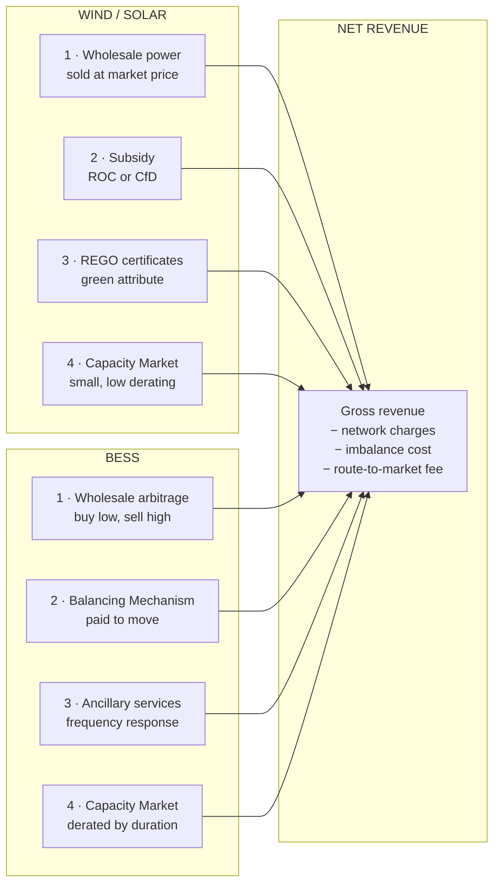
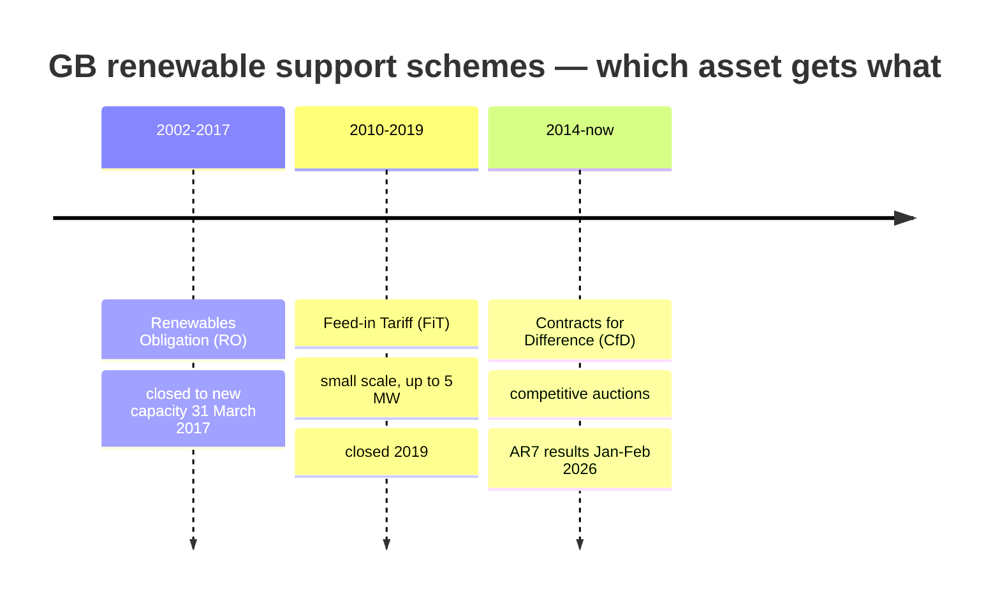
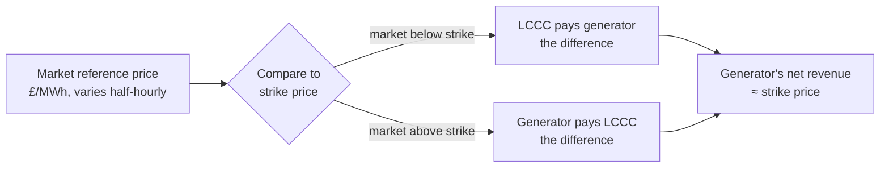
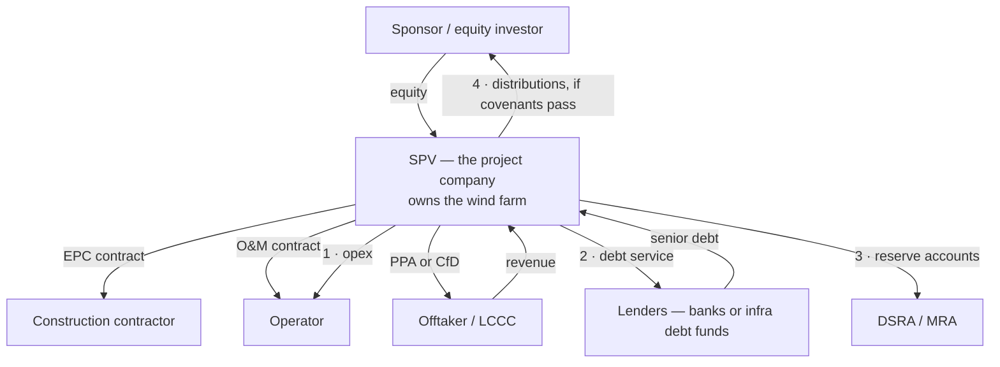

# Module D1 — Where the Money Comes From: Wind, Solar and BESS Revenue

> **Assumed knowledge: none.** Every acronym is spelled out in full the first time it
> appears, then explained in plain English before it is used. Every financial term is
> defined at the point of use. If a term appears that you do not recognise, it is also in
> [`../GLOSSARY.md`](../GLOSSARY.md).
>
> **BESS** = **B**attery **E**nergy **S**torage **S**ystem. A grid-connected battery.
> **PV** = **P**hoto**v**oltaic. Solar panels that convert light directly to electricity.
>
> **Estimated study time:** 14–18 hours.
> **Prerequisite:** Module A1 (units, capacity factor, LCOE).
> **Deliverable:** a revenue-stack model in Excel for one wind, one solar and one BESS asset.

---

## 0. The single idea this module exists to teach

**A renewable asset almost never earns "the power price".**

It earns a **stack** — several separate revenue lines, from separate counterparties, under
separate contracts, with separate risk profiles. Some are fixed for 20 years; some change
every half hour. When an engineer builds a revenue model by multiplying annual megawatt-hours
by an assumed price per megawatt-hour, they have not built a revenue model. They have built
one line of it, usually the most volatile line, and usually with the wrong price.

Here is the whole picture before we take it apart.

**Note the asymmetry immediately.** Wind and solar have one large contracted line (the
subsidy) and one volatile line (wholesale). BESS has **no contracted line at all** unless
someone gives it one. That single structural difference explains almost everything about how
the two asset classes are financed, valued and bought — and it is the thread running through
this entire module.

---

# PART 1 — THE REVENUE LINES, ONE BY ONE

## 1.1 Wholesale power — the base of every stack

### What it is

The **wholesale market** is where electricity is bought and sold in bulk, before it reaches
a consumer's bill. In Great Britain the main reference is the **day-ahead auction**: every
day at around 11:00, buyers and sellers submit bids for each half-hour of the following day,
and a single clearing price is set for each half-hour.

**Settlement period.** GB electricity is settled in **half-hourly blocks** — 48 per day,
17,520 per year. Every price, every volume, every payment is calculated per settlement
period. When you see "the power price was £123/MWh", that is an average of thousands of
individual half-hourly prices.

**£/MWh** = pounds per megawatt-hour. One megawatt-hour is one megawatt of power sustained
for one hour. It is the unit almost all electricity trading uses.

### The two benchmark indices

| Index | Full name | What it is |
|---|---|---|
| **N2EX** | Nord Pool's GB day-ahead auction | The most-referenced GB day-ahead price; most PPAs settle against it |
| **EPEX SPOT** | European Power Exchange, spot market | The other GB day-ahead auction and the main intraday platform |
| **MID** | **M**arket **I**ndex **D**ata | The Elexon-published price used in imbalance settlement. Provider code `APXMIDP` is the N2EX-derived index |

### The critical concept: capture price

**This is the most important idea in renewable revenue modelling, and the one most often
got wrong.**

A wind farm does not earn the average market price. It earns the **volume-weighted average
price across the half-hours in which it actually generated**. That number is its
**capture price**.

**Capture price = Σ(price in each half-hour × MWh generated in that half-hour) ÷ Σ(MWh generated)**

**Capture rate** = capture price ÷ the simple average (baseload) price, expressed as a
percentage. Below 100% means the asset earns less than the market average.

**Why it is below 100% for wind and solar.** Wind farms generate when it is windy — and so
does every other wind farm. High output means high supply, which pushes the price down.
Solar is worse: every solar farm in the country generates at the same time on the same
sunny afternoon. This self-inflicted price depression is called **cannibalisation**, and it
deepens as more of the same technology connects to the grid.

### Measured evidence — not theory

From Project 1 in this repository, using real Elexon settlement data for the 1,441 half-hour
periods between 26 July and 25 August 2026:

| Technology | Capture price | Capture rate | Reading |
|---|---:|---:|---|
| Baseload (simple average) | £123.00/MWh | 100.0% | The reference |
| **Wind** | £115.57/MWh | **94.0%** | Modest cannibalisation |
| **Solar** | £100.69/MWh | **81.9%** | Heavy cannibalisation |
| Nuclear | £126.94/MWh | 103.2% | Runs flat, so slightly above |
| Gas | £142.11/MWh | 115.5% | **Dispatchable — runs when prices are high** |

**[FACT]** Source: Elexon BMRS dataset MID (APXMIDP) and generation-by-fuel-type, retrieved
25 August 2026. Reproduce with `curriculum/projects/p1_gb_power_dashboard/`.

**How to read this table, because it contains three separate lessons:**

1. **Solar earns 18.1% less than the market average.** If you model a solar farm's revenue
   at baseload price, you overstate it by roughly 18% before considering anything else.
   On a £50m asset that error alone is worth millions.
2. **Gas earns 15.5% more than the market average**, for exactly the mirror-image reason:
   it can choose when to run, so it runs when prices are high. **Dispatchability is worth
   money, and the capture rate is where you can see it.**
3. **These are summer figures.** Solar's capture rate is worst in summer (long days, high
   output, low demand) and better in winter. Wind is the reverse. **Never take a
   capture rate from one month and apply it to a year.**

### Route to market — how a generator actually gets paid

A wind farm cannot simply "sell into the market". It is not a licensed electricity supplier
and cannot participate directly in settlement. It needs a **route to market** — a
counterparty who takes its power and handles the market interface.

**PPA** = **P**ower **P**urchase **A**greement. The contract under which a generator sells
its output. The main types:

| PPA type | How the price is set | Who takes the price risk |
|---|---|---|
| **Fixed-price PPA** | An agreed £/MWh for an agreed term | The offtaker (buyer) |
| **Floating / market-reflective PPA** | Market price minus a discount or fee | The generator |
| **CPPA** (**C**orporate **PPA**) | Negotiated directly with a corporate energy user | Depends on structure |
| **Sleeved PPA** | A corporate buys from the generator, but a licensed supplier "sleeves" it — handling settlement for a fee | Shared |
| **Synthetic / virtual PPA** | Purely financial: no physical power moves; the parties settle the difference against a reference price | Shared |
| **Baseload PPA** | The seller must deliver a flat, constant volume | **The generator** — it must buy power to fill gaps |

**The trap in a baseload PPA.** A wind farm does not produce a flat output. If it signs a
baseload PPA it must buy power on the market whenever it is not generating enough — at
whatever price prevails, which is typically *high* precisely when the wind is not blowing.
That is **shape risk**, and it has bankrupted renewable traders.

### The three risks hiding inside "route to market"

| Risk | Definition | Example |
|---|---|---|
| **Shape risk** | Your generation profile does not match the profile you have contracted to deliver | Wind farm on a baseload PPA |
| **Volume risk** | You produce more or less than forecast | A calm year; a P90 outcome |
| **Basis risk** | Your hedge settles against a different price than your physical exposure | Hedged on N2EX day-ahead, but settled at the imbalance price |
| **Imbalance risk** | The cost of the difference between what you told the system you would produce and what you actually produced | Forecast 40 MW, delivered 25 MW → buy the shortfall at the imbalance price |

**PPA discount.** Because the offtaker absorbs these risks, they charge for them. A
market-reflective PPA typically pays the generator the capture price **minus a discount**
covering imbalance, shape, credit and profit. **[OPINION]** The size of that discount is
one of the most commercially important numbers in a renewable model, and it is almost
never in the public domain — you learn it from deal experience, which is one concrete
reason transaction exposure is worth more than study.

---

## 1.2 Subsidy — the contracted line

Great Britain has run three main support schemes. **Which one an asset is on depends
entirely on when it was built**, and this is the first thing you check when looking at any
GB renewable asset.

### 1.2.1 The Renewables Obligation (RO) and ROCs

**RO** = **R**enewables **O**bligation. **ROC** = **R**enewables **O**bligation
**C**ertificate.

**What it is, mechanically.** Electricity suppliers (the companies that sell power to homes
and businesses) are legally obliged to source a set proportion of their electricity from
renewable sources. They prove compliance by presenting ROCs to the regulator, Ofgem.
Renewable generators are issued ROCs for the electricity they generate, and sell them to
suppliers. The generator therefore has **two** revenue lines: the power itself, and the
certificates.

**Banding.** Not all technologies receive one ROC per MWh. The number is "banded" by
technology and by the year the project was accredited. As examples: onshore wind commonly
receives **0.9 ROCs/MWh** and offshore wind **1.8 ROCs/MWh**
([FACT] — banding varies by accreditation vintage, so **always check the specific
accreditation certificate for the asset you are looking at**, never assume).

**How a ROC is priced — this is the bit that confuses people.** A ROC is not worth a fixed
amount. Its value has two components:

1. **The buy-out price.** A supplier that does not present enough ROCs must instead pay a
   per-certificate penalty into a fund. This sets a ceiling on what a ROC is worth: no
   supplier will pay more for a ROC than the cost of simply buying out.
   **For the obligation year 1 April 2026 to 31 March 2027 the buy-out price is £69.34 per
   ROC**, up from £67.06 in 2025/26
   ([FACT] — [Ofgem](https://www.ofgem.gov.uk/data/renewables-obligation-buy-out-price-and-mutualisation-threshold-and-ceilings-2026-2027)).
2. **The recycle value.** The money paid into the buy-out fund is redistributed back to the
   suppliers who *did* present ROCs, in proportion to how many they presented. This makes a
   ROC worth **more** than the buy-out price. The combined figure is the ROC's "notional
   worth". In 2022/23 Ofgem reported a notional worth of **£59.76 per ROC = £52.88 buy-out
   + £6.88 recycle** ([FACT]).

**A change you must know about.** From **1 April 2026** the annual uprating of the buy-out
price switched from **RPI** (**R**etail **P**rices **I**ndex) to **CPI** (**C**onsumer
**P**rices **I**ndex). CPI is typically lower than RPI, so **this permanently reduces the
long-run value of every ROC-accredited asset in Great Britain.** The 2026/27 figure of
£69.34 reflects CPI of 3.4% for calendar 2025
([FACT] — [DESNZ government response](https://www.gov.uk/government/consultations/renewables-obligation-ro-scheme-indexation-changes/outcome/renewables-obligation-ro-scheme-indexation-changes-government-response-html)).

**[CALC] Worked example — what ROCs are actually worth to an onshore wind farm**

A 40 MW onshore wind farm, 32% capacity factor, accredited at 0.9 ROCs/MWh:

- Annual generation = 40 MW × 8,760 h × 0.32 = **112,128 MWh**
- ROCs issued = 112,128 × 0.9 = **100,915 ROCs**
- At £69.34 buy-out plus, say, an assumed 10% recycle **[ASSUMPTION]** = £76.27/ROC
- **ROC revenue = 100,915 × £76.27 = £7,696,777/year**

Now compare with the power revenue at the measured wind capture price:

- Power revenue = 112,128 MWh × £115.57 = **£12,958,032/year**
- **ROC revenue is 37% of total revenue** (7.70m ÷ 20.65m)

**Why this matters commercially:** more than a third of this asset's revenue comes from a
scheme that is closed to new entrants and whose indexation has just been reduced. When the
RO ends for this asset, that revenue disappears entirely and the asset falls back to pure
merchant exposure. **The date the RO support ends is one of the first things to check in any
acquisition** — it is a cliff edge, not a gentle decline.

**Scheme status.** The RO **closed to all new generating capacity on 31 March 2017** (with
earlier closure for solar PV and onshore wind in many circumstances, and grace periods
extending it in others) ([FACT] — [Ofgem](https://www.ofgem.gov.uk/environmental-programmes/ro/about-ro/ro-closure)).
Existing accredited assets continue to receive ROCs for 20 years from accreditation, so
ROC-backed assets will be traded well into the 2030s. **You will encounter them constantly
in due diligence work.**

### 1.2.2 The Feed-in Tariff (FiT)

**FiT** = **F**eed-**i**n **T**ariff. Ran **April 2010 to 2019**, for installations up to
**5 MW** ([FACT]). It paid a **generation tariff** for every unit generated plus an
**export tariff** for units exported to the grid. Closed to new applicants in 2019.

**Relevance to you:** low, except that small hydro, small wind and rooftop solar portfolios
being traded today are often FiT-accredited, and FiT tariffs are generous and
index-linked. **Awareness level only** — but know the acronym and that it is closed.

### 1.2.3 Contracts for Difference (CfD) — the current scheme

**CfD** = **C**ontract for **D**ifference. This is how new large-scale renewables in Great
Britain are supported today, and it is the scheme you must understand properly.

**The counterparty.** **LCCC** = **L**ow **C**arbon **C**ontracts **C**ompany, a
government-owned company that is the counterparty to every CfD. The generator's contract is
with LCCC, not with the government directly.

**How it works — the two-way mechanism.** The generator is awarded a **strike price** in
£/MWh. A **reference price** is calculated from the market (day-ahead for intermittent
technologies).

- If **reference price < strike price**: LCCC pays the generator the difference.
- If **reference price > strike price**: **the generator pays LCCC back the difference.**

That second direction is what makes it a *contract for difference* rather than a subsidy.
The generator effectively receives the strike price regardless of the market — it has sold
its price risk.

**What the generator still bears.** The CfD removes *price* risk. It does **not** remove:
- **Volume risk** — a windless year still means fewer MWh, and CfD pays per MWh generated.
- **Curtailment risk** — if the grid tells you to turn down, you do not generate, so you do
  not get paid (arrangements vary by contract vintage).
- **Negative price risk** — CfD payments are suspended during sustained negative price
  periods in more recent contract terms.
- **The merchant tail** — see below.

### AR7 — the current round, and what changed

**AR** = **A**llocation **R**ound. AR7 is the seventh CfD auction. Results were announced
in January 2026 (offshore wind) and February 2026 (Pot 1). **[FACT] throughout:**

| Technology | Strike price (2024 prices) | Capacity awarded |
|---|---:|---:|
| Offshore wind (fixed-bottom) | **£91/MWh** | 8.4 GW (record) |
| Floating offshore wind | **£216.49/MWh** | Erebus, Pentland |
| Onshore wind | **£72/MWh** | 1.3 GW |
| Solar PV | **£65/MWh** | 4.9 GW |
| Tidal stream | — | 21 MW |

RWE alone secured 6.9 GW of offshore wind at **£91.20/MWh** across Norfolk Vanguard East and
West, two Dogger Bank South projects and Awel y Môr, alongside a long-term partnership with
KKR ([FACT] — [RWE](https://www.rwe.com/en/press/rwe-ag/2026-01-14-rwe-secures-contracts-for-difference-for-6-9-gigawatts-of-offshore-wind-capacity/)),
and 291 MW of Pot 1 capacity at **£65.23/MWh for solar and £72.24/MWh for onshore wind**
([FACT] — [SolarQuarter](https://solarquarter.com/2026/02/11/rwe-secures-291-mw-of-solar-and-onshore-wind-in-uks-ar7-auction-winning-cfds-at-65-23-mwh-for-solar-and-72-24-mwh-for-wind/)).
Pot 1 delivered a record 6.2 GW in total.
[Full results PDF](https://assets.publishing.service.gov.uk/media/6966861de8c04eb2919f773a/contracts-for-difference-allocation-round-7-results-.pdf).

**Three reforms in AR7 you must be able to explain:**

1. **Contract length extended from 15 to 20 years** for fixed-bottom offshore wind, floating
   offshore wind, onshore wind and solar ([FACT] —
   [Flint Global](https://flint-global.com/blog/the-most-important-cfd-round-in-years-what-do-the-major-reforms-mean/)).
   **Why this matters financially:** it shortens the *merchant tail* — the period after the
   CfD expires when the asset is exposed to raw market prices. A shorter merchant tail means
   more of the asset's life is contracted, which means lenders will lend more against it,
   which means the sponsor needs less equity, which means a lower strike price is acceptable.
   **This single change is the reason the auction cleared where it did.**
2. **Price base changed to 2024 prices** (AR6 used 2012 real prices). **This is a trap for
   the unwary.** A £91/MWh strike price in 2024 money is not comparable to a strike price
   quoted in 2012 money without inflating it. **Always ask "in which year's prices?"** before
   comparing any two strike prices. Strike prices are then indexed annually to CPI.
3. **CIB** = **C**lean **I**ndustry **B**onus. Extra revenue support for offshore wind
   applicants who invest in a more sustainable UK supply chain. Only tangible assets count —
   not skills programmes or research and development — and investment must fall between
   March 2024 and the project's CfD start date ([FACT] —
   [Pager Power](https://www.pagerpower.com/news/the-clean-industry-bonus-rewiring-britains-offshore-wind-auctions/)).

**ASP** = **A**dministrative **S**trike **P**rice: the maximum price the government will
accept in the auction — a ceiling, not a target. For AR7 solar the ASP was **£75/MWh**
(2024 prices) and the auction cleared at £65 — a 13% saving delivered by competition
([FACT]).

### The merchant tail — where valuations are won and lost

**Merchant** means "exposed to market prices with no contract". The **merchant tail** is the
portion of an asset's operating life after its subsidy ends.

A wind farm with a 30-year design life and a 20-year CfD has a **10-year merchant tail**.
During those ten years its revenue is whatever the market pays — which nobody can forecast
with confidence.

**Why this dominates valuation:** the merchant tail is simultaneously the **least certain**
and often a **large fraction of total value**. Two buyers looking at the same asset can
differ by 30% on price purely because they use different long-term power price forecasts and
different discount rates for the uncontracted period. **[OPINION]** If you can form and
defend an independent view on merchant tail value, you are doing the job of an investment
professional rather than a technical adviser. That is the whole transition, compressed into
one modelling assumption.

---

## 1.3 REGOs — the green certificate

**REGO** = **R**enewable **E**nergy **G**uarantees of **O**rigin.

**What it is.** One certificate issued per MWh of renewable generation, proving the
electricity came from a renewable source. Suppliers buy them to back "100% green tariff"
claims to consumers. It is a *separate, tradeable* product from the electricity itself —
the certificate and the electron are sold independently.

**What it is worth — and the volatility lesson [FACT]:**

| Period | Approximate REGO price |
|---|---|
| Early 2020 | ~£0.20/MWh |
| 2023 peak | £20–25/MWh |
| Summer 2026 | **£1–2/MWh** |

([Good Energy](https://www.goodenergy.co.uk/business/insights/rego-prices-renewable-energy/),
[TotalEnergies](https://business.totalenergies.uk/uk-rego-market-2025))

**The commercial lesson is the shape of that table, not the level.** REGO prices moved by a
factor of roughly 100 in three years and then collapsed. A revenue model built in 2023 that
assumed £20/MWh REGOs into perpetuity would be catastrophically wrong today.

**[CALC]** For our 40 MW wind farm at 112,128 MWh/year:
- At £1.50/MWh **[ASSUMPTION, current market]**: £168,192/year
- At £22/MWh (2023 level): £2,466,816/year

**How a lender treats it:** with deep suspicion. Because the price is volatile and the
market is thin, most project finance lenders give REGOs **little or no credit** when sizing
debt. Equity investors may value them; debt providers generally will not. **This is a good
first example of a general principle: contracted, predictable revenue supports debt;
volatile revenue supports only equity.**

**GoO** = **G**uarantee **o**f **O**rigin — the European equivalent of a REGO. Since Brexit,
GB REGOs are not automatically recognised in the EU, which is part of why the GB price
diverged.

---

## 1.4 The Capacity Market (CM)

**CM** = **C**apacity **M**arket. A scheme that pays generators and storage to **be
available** at times of system stress — not to generate. It is an insurance policy for the
system, paid for by consumers.

**How it works.** The government forecasts how much reliable capacity Great Britain needs
four years ahead (a **T-4** auction) and one year ahead (**T-1**). Providers bid the price
at which they will commit to being available. The auction clears at a single price in
**£/kW/year** — pounds per kilowatt of *derated* capacity per year.

**Derating factor — the concept that catches everyone out.** You are not paid on your
nameplate capacity. You are paid on your **derated** capacity, which reflects how likely
your asset is to actually deliver during a stress event. A gas plant derates lightly. A
1-hour battery derates heavily, because a stress event can last longer than an hour. A
4-hour battery derates much less. Wind and solar derate very heavily indeed.

**[CALC] Worked example**

50 MW battery, 1-hour duration, assumed derating factor 12% **[ASSUMPTION — real derating
factors are published annually by DESNZ and vary by duration; look them up, do not guess]**,
at the T-4 clearing price for delivery year 2029/30 of **£27.10/kW/year** ([FACT] —
[Modo Energy](https://modoenergy.com/research/en/gb-capacity-market-t4-2029-30-battery-energy-storage-march-2026)):

- Derated capacity = 50 MW × 12% = 6 MW = **6,000 kW**
- Revenue = 6,000 kW × £27.10 = **£162,600/year**

Now the same battery at 4-hour duration with an assumed 55% derating **[ASSUMPTION]**:
- Derated capacity = 50 × 55% = 27.5 MW = 27,500 kW
- Revenue = 27,500 × £27.10 = **£745,250/year**

**A 4.6× difference in capacity revenue from duration alone.** This is one of the main
commercial reasons the GB market has been building longer-duration batteries.

**Market context you should know [FACT]:** the T-4 auction for 2029/30 cleared at
**£27.10/kW/year, down roughly 55% year on year**, with 44 GW competing for a 39.4 GW target
— a 12% oversupply. Compare with **PJM in the United States, whose 2027/28 auction cleared
at the regulatory price cap of $333.44/MW-day and still fell 6,623 MW short** of its
reliability requirement ([FACT] —
[PJM](https://insidelines.pjm.com/pjm-auction-procures-134479-mw-of-generation-resources/)).

**Read those two facts together.** Two large developed power markets, same decade, opposite
signals. GB is telling you not to build capacity; PJM is telling you to build urgently. That
contrast is the single clearest illustration of why market structure, not technology,
determines returns.

---

## 1.5 The Balancing Mechanism (BM)

**BM** = **B**alancing **M**echanism. The market **NESO** (**N**ational **E**nergy
**S**ystem **O**perator, the body that runs the GB grid) uses in the final hour before real
time to keep supply and demand exactly matched.

**How it works.** Generators and storage submit **bid-offer pairs** for each settlement
period:
- An **offer** is a price at which you will *increase* output (or reduce demand).
- A **bid** is a price at which you will *decrease* output (or increase demand).

NESO accepts whichever bids and offers it needs. Acceptance is called a **BOA**
(**B**id-**O**ffer **A**cceptance).

**Why this matters for wind:** when the grid is congested, NESO pays wind farms to turn
*down* — a **bid** at a negative price, meaning the wind farm pays to stop, or more commonly
is paid to stop. This is **curtailment**, and it is a major feature of Scottish wind
economics.

**Why this matters for BESS:** the BM is now one of the largest battery revenue lines. A
battery can respond in seconds and can both absorb and inject power, making it ideally
suited to balancing.

**BM revenue in context [FACT]:** wholesale plus Balancing Mechanism together make up around
**60%** of the GB battery revenue stack over the twelve months to April 2026
([Modo Energy](https://modoenergy.com/research/en/how-does-battery-energy-storage-make-money)).

### Imbalance settlement — the cost of being wrong

Every party that generates or supplies electricity must tell the system in advance what it
expects to do. The difference between that notification and reality is **imbalance**, and it
is settled at the **imbalance price** (also called the **system price** or **cash-out
price**).

Great Britain uses a **single imbalance price**: both long and short positions settle at the
same price. That price can be extremely high or deeply negative.

**[CALC]** A 40 MW wind farm notifies 30 MW for a settlement period but delivers 18 MW.
- Shortfall = 12 MW × 0.5 h = **6 MWh short**
- If the imbalance price is £250/MWh, the cost is 6 × 250 = **£1,500** for one half-hour
- Repeated across a badly forecast day, this becomes material

This is precisely the risk an offtaker absorbs in exchange for the **PPA discount** discussed
in §1.1. **You now understand what that discount is buying.**

---

## 1.6 Ancillary services — mainly a BESS story

**Ancillary services** are the products NESO buys to keep the system stable second by
second: keeping frequency at 50 Hz, maintaining voltage, holding reserve in case a plant
trips.

**Hz** = hertz, cycles per second. GB grid frequency must stay within **50 Hz ± 1%**
under NESO's licence obligations.

### The current suite of frequency response services [FACT]

| Acronym | Full name | Response time | Delivery duration |
|---|---|---|---|
| **DC** | **D**ynamic **C**ontainment | 0.5 seconds | 15 minutes |
| **DM** | **D**ynamic **M**oderation | 0.5 seconds | 15 minutes |
| **DR** | **D**ynamic **R**egulation | 2 seconds | 60 minutes |

Source: [NESO Dynamic Services](https://www.neso.energy/industry-information/balancing-services/frequency-response-services/dynamic-services-dcdmdr).
From January 2026 these are activated directly within the **OBP** (**O**ptimised
**B**alancing **P**latform).

### Reserve services [FACT]

| Acronym | Full name | Note |
|---|---|---|
| **FFR** | **F**irm **F**requency **R**esponse | The legacy service, being phased out |
| **QR** | **Q**uick **R**eserve | Released Q4 2025; replacing FFR during 2026 |
| **PQR / NQR** | **P**ositive / **N**egative **Q**uick **R**eserve | Increase generation / reduce generation |
| **BR** | **B**alancing **R**eserve | Availability payment for holding headroom |
| **SR** | **S**low **R**eserve | Longer-notice reserve |

Assets contracted into BR, QR or SR receive an **availability payment** for withholding
capacity from other markets — giving NESO guaranteed **headroom** (ability to increase) or
**footroom** (ability to decrease).

### The single most important trend in BESS revenue

**Ancillary services now contribute around 33% of GB battery revenue on a gross basis, down
from 87% across 2020–2022** ([FACT] — [Modo Energy](https://modoenergy.com/benchmarks/methodology/asset/gb)).

**Why this happened, and why it matters to an investor.** Frequency response markets are
small and **saturate quickly**. Early batteries earned extraordinary returns because there
were few of them and NESO needed the service badly. As the fleet grew, the requirement was
met, prices collapsed, and revenue migrated to wholesale and the BM.

**The investment lesson generalises far beyond batteries:** *any* revenue stream backed by a
fixed-volume requirement will be competed away as capacity enters. A business case built on
a saturating market has a shelf life. Ask of any revenue line: **how big is the total
requirement, and how much capacity is chasing it?**

---

## 1.7 Putting the stack together

**[CALC] Full revenue stack — 50 MW / 2-hour BESS, illustrative**

The GB benchmark: a 2-hour battery averaged **£73,145/MW/year** across the full stack over
the twelve months to April 2026 ([FACT] — Modo Energy), with monthly figures swinging from
**£41k/MW/yr (February 2026)** to **£70k/MW/yr (March 2026)** — a 71% range inside one
quarter ([FACT]).

| Revenue line | £/MW/yr **[ASSUMPTION, indicative split]** | Contracted? | Debt-supportable? |
|---|---:|---|---|
| Wholesale arbitrage | ~26,000 | No | Weakly |
| Balancing Mechanism | ~18,000 | No | Weakly |
| Ancillary services | ~24,000 | Short-term only | Weakly |
| Capacity Market | ~5,000 | **Yes, 1–15 yr agreement** | **Yes** |
| **Total** | **~73,000** | | |

**Now the point of the whole table.** Only about **£5,000 of £73,000 — 7% — is contracted.**
Everything else can halve in a quarter, and demonstrably has.

**This is why merchant BESS is hard to finance with debt**, and why **tolling agreements**
exist. A **toll** is a contract where a counterparty (usually a utility or trading house)
pays a fixed fee for the exclusive right to operate the battery and take all its market
revenue. The battery owner gives up upside and receives a predictable payment.

| | Merchant BESS | Tolled BESS |
|---|---|---|
| Expected revenue | Higher | Lower |
| Revenue volatility | Very high | Near zero |
| Debt available | Low (lenders size to a severe downside) | **Much higher** |
| Equity required | High | Lower |
| Equity return | Higher if things go well | Lower but far more certain |

**[OPINION]** Understanding that a *lower-revenue* contract can produce a *higher* equity
return — because it unlocks cheaper leverage — is the moment engineering intuition gives way
to financial intuition. It is counter-intuitive and it is the core of infrastructure
investing. Sit with it until it feels obvious.

---

# PART 2 — THE COSTS

## 2.1 CAPEX — capital expenditure

**CAPEX** = **CAP**ital **EX**penditure. The upfront cost of building the asset. Usually
quoted in **£/MW** (pounds per megawatt of capacity) or, for batteries, **£/MWh** (pounds
per megawatt-hour of storage).

### What sits inside a wind farm CAPEX

| Component | Typical share **[ESTIMATE]** | Notes |
|---|---:|---|
| Turbines (supply) | 55–70% | The **TSA** (**T**urbine **S**upply **A**greement) |
| **BoP** — **B**alance **o**f **P**lant | 15–25% | Civils, foundations, roads, cabling |
| Grid connection | 5–15% | Substation, transmission works |
| Development costs | 3–8% | Land, planning, surveys, legal |
| Contingency | 5–10% | The number lenders check first |

**EPC** = **E**ngineering, **P**rocurement and **C**onstruction. A contract where one
contractor takes responsibility for delivering the whole plant, usually for a fixed price by
a fixed date. A **full-wrap EPC** transfers most construction risk to the contractor.

**Why lenders love an EPC wrap:** cost and schedule overruns during construction are the
main way infrastructure projects fail. If a single creditworthy contractor is liable for
them, the lender's risk falls sharply. **Multi-contract** structures (where the sponsor
manages several contractors) are cheaper but riskier, and they attract less debt.

**LDs** = **L**iquidated **D**amages. Pre-agreed compensation the contractor pays for late
delivery or underperformance. **Read the LD cap** — it is usually limited to a percentage of
contract value, and above that cap the risk falls back to the owner.

### Cost benchmarks — with a health warning

**[FACT, but interpret carefully]** AR7 cleared at £72/MWh for onshore wind and £65/MWh for
solar in 2024 prices. Published international CAPEX ranges for onshore wind sit around
**$1,150–1,800/kW** with levelised costs of **$26–54/MWh**
([Energy Solutions Intelligence, 2026](https://energy-solutions.co/articles/sub/onshore-wind-farm-economics-2026)) —
note these are **global** figures in **dollars**, and UK costs differ.

**For UK-specific figures use the primary source:** DESNZ (**D**epartment for **E**nergy
**S**ecurity and **N**et **Z**ero) publishes *Renewable Energy Generation Cost and Technical
Assumptions* and *Electricity Generation Costs*. **[FACT]** A July 2025 update covering
onshore wind and solar PV exists
([DESNZ](https://assets.publishing.service.gov.uk/media/68ba91f411b4ded2da19fe92/onshore-wind-and-solar-pv-cost-electricity-report-update-2024.pdf)).
**I have not quoted specific £/MW figures from it because I have not verified the current
numbers directly — download it and extract them yourself.** That is deliberate: the habit of
refusing to quote a cost benchmark you have not personally checked is exactly the discipline
that makes a technical adviser trustworthy.

## 2.2 OPEX — operating expenditure

**OPEX** = **OP**erating **EX**penditure. Annual running costs, usually **£/MW/year**.

| Component | What it is |
|---|---|
| **O&M** (**O**perations & **M**aintenance) | The service contract for the turbines or panels |
| Land rent | Payments to landowners, often indexed or revenue-linked |
| Business rates | Local property tax |
| Insurance | Property damage, business interruption, liability |
| Asset management | Commercial and financial administration of the SPV |
| Grid and metering | Connection charges, metering services |
| **Network charges** | TNUoS, BSUoS, DUoS — see §2.3 |
| Balancing / route to market | The PPA discount or trading fee |

**Availability warranty.** The O&M contractor typically guarantees the asset will be
*available* to operate for a percentage of the time — commonly 97%+ for modern wind. **This
is not a guarantee of production.** The wind not blowing is not the contractor's problem.
**Never confuse a 97% availability warranty with a 97% capacity factor**; they are entirely
different quantities, as Module A1 sets out.

## 2.3 Network charges — the costs people forget

These are the charges for using the electricity networks. **They are large, they are rising,
and engineers routinely omit them from revenue models.**

### TNUoS — Transmission Network Use of System

**TNUoS** = **T**ransmission **N**etwork **U**se **o**f **S**ystem. The charge for using the
high-voltage transmission network — the pylons and the supergrid.

**The commercially critical feature: TNUoS generation charges are locational.** A generator
in northern Scotland — far from demand, exporting south down a congested network — pays a
**high** TNUoS charge. A generator in southern England pays a **low** charge, and in some
zones may even be *paid*. This can amount to a very substantial annual cost difference for
two otherwise identical wind farms.

**[FACT, 2026/27]** The average generation tariff is **£13.03/kW** for 2026/27. Total TNUoS
revenue collected is forecast to rise from **£4.3 billion in 2025/26 to £7 billion in
2026/27**, with average demand charges rising over 60%, from £18.9/MWh to £31/MWh
([NESO final tariffs](https://www.neso.energy/document/376336/download),
[Drax](https://energy.drax.com/intelligence/final-tnuos-charges-almost-identical-to-draft-tariffs/)).

**[CALC]** For a 40 MW wind farm at the average generation tariff:
40,000 kW × £13.03/kW = **£521,200/year**. Against the ~£20.7m revenue calculated earlier
that is ~2.5% of revenue — but in a high-charge Scottish zone it can be multiples of the
average, and **it is charged on capacity, not output, so it does not fall in a low-wind
year.** A fixed cost against a variable revenue is exactly the combination that breaks
downside cases.

**Zonal pricing was rejected, but location still costs money.** DESNZ's REMA (**R**eview of
**E**lectricity **M**arket **A**rrangements) Summer Update of 10 July 2025 confirmed GB keeps
a single national wholesale price ([FACT] —
[Norton Rose Fulbright](https://www.nortonrosefulbright.com/en/knowledge/publications/4399413b/rema-summer-update-no-to-zonal-pricing-yes-to-reformed-national-pricing)).
So locational value is now expressed through **TNUoS, curtailment and constraint costs**
rather than through the energy price. **Location still drives value — it is just harder to
see, which means it is more often mispriced.** For someone with geospatial and grid skills,
that is an opportunity.

### BSUoS — Balancing Services Use of System

**BSUoS** = **B**alancing **S**ervices **U**se **o**f **S**ystem. Recovers the cost NESO
incurs balancing the system — including the constraint payments made to curtailed wind farms.

**[FACT, 2026/27]** NESO published final BSUoS charges on 29 December 2025:
**£13.74/MWh** for Fixed Tariff 7 (April–September 2026) and **£12.49/MWh** for Fixed Tariff
8 (October 2026–March 2027)
([Drax](https://energy.drax.com/intelligence/initial-2026-27-bsuos-forecasts-published/)).

BSUoS moved to a **fixed, six-monthly tariff set in advance** rather than a volatile
half-hourly charge — a significant improvement for anyone trying to forecast costs.
**[VERIFY]** BSUoS liability was reformed to fall on demand rather than being split with
generation; confirm the current treatment for the specific asset you are modelling before
relying on it, as this materially changes a generator's cost line.

### DUoS — Distribution Use of System

**DUoS** = **D**istribution **U**se **o**f **S**ystem. The equivalent charge for the
lower-voltage local networks operated by **DNOs** (**D**istribution **N**etwork
**O**perators). Applies to assets connected at distribution rather than transmission level —
which includes most solar farms and many batteries.

### Embedded benefits and the Targeted Charging Review

**Embedded generator** = one connected to the distribution network rather than transmission.
Historically these enjoyed **embedded benefits**: they helped their supplier avoid
transmission charges, and the supplier shared the saving.

**Triad.** The three half-hour settlement periods of highest GB demand between November and
February, separated by at least ten days. Transmission demand charges were historically based
on demand during these periods, so generating during a Triad was extremely valuable.

**What happened.** Ofgem ran the **TCR** (**T**argeted **C**harging **R**eview) and issued
its final decision on **21 November 2019**. Residual network charges moved to **fixed
charges** for all users, liability for the Transmission Generation Residual was removed from
generators, and embedded benefits relating to balancing charges were changed. Triad avoidance
payments had already been cut substantially from April 2018 ([FACT] —
[Ofgem TCR decision](https://www.ofgem.gov.uk/decision/targeted-charging-review-decision-and-impact-assessment),
[Gowling WLG](https://gowlingwlg.com/en/insights-resources/articles/2020/ofgem-s-targeted-charging-review-decision)).

**Why you need to know this history.** Assets built before 2018–2020 were financed on
business cases that included Triad income which **no longer exists**. When you diligence an
older distributed asset, check whether its original model assumed embedded benefits — if so,
its actual performance will have undershot its base case, and you should expect to find
refinancing or covenant history as a result. **This is the kind of observation that makes a
technical adviser useful to an investor.**

---

# PART 3 — HOW THE DEAL IS FINANCED

## 3.1 The SPV — the box the project lives in

**SPV** = **S**pecial **P**urpose **V**ehicle. A company created for the sole purpose of
owning and operating one project (or one portfolio). Also called a **ProjectCo**.

**Why it exists.** If the project fails, the lenders can take the SPV and its assets — but
they **cannot** pursue the parent company's other assets. That is **non-recourse** finance.
**Limited-recourse** means there is some, carefully defined, recourse to the sponsor —
typically during construction only.

**Sponsor** = the equity owner or developer standing behind the project.

**Note the numbered order on the arrows out of the SPV.** That order is the **cash
waterfall**, and it is legally binding — see §3.4.

## 3.2 Debt sizing — the most valuable calculation in this module

**Gearing** (or **leverage**) = the proportion of total funding provided by debt. A project
that is 70% debt and 30% equity is "70% geared".

**Why leverage matters.** Debt is cheaper than equity — a lender might want 6%, an equity
investor 10–12%. Replacing expensive equity with cheap debt raises the return on the
remaining equity. But debt must be repaid on a fixed schedule whether or not the wind blows,
so more leverage means more risk of default.

### The key measure: DSCR

**DSCR** = **D**ebt **S**ervice **C**over **R**atio.

**DSCR = CFADS ÷ Debt Service**

- **CFADS** = **C**ash **F**low **A**vailable for **D**ebt **S**ervice. Revenue, minus
  operating costs, minus tax, minus movements in working capital, minus maintenance capital
  expenditure. **It is NOT EBITDA.**
- **Debt service** = principal repayment + interest for the period.

**EBITDA** = **E**arnings **B**efore **I**nterest, **T**ax, **D**epreciation and
**A**mortisation. A common measure of operating profit. **Using EBITDA where CFADS is
required is one of the most common and most serious modelling errors an engineer makes**,
because it ignores tax and cash reinvestment.

**[CALC]** CFADS £8.5m, debt service £6.8m → DSCR = 8.5 ÷ 6.8 = **1.25×**. There is £1.7m of
headroom before the ratio hits 1.00× and the project cannot pay its debt — equivalent to a
20% fall in cash flow.

**Typical minimum DSCR covenants [ESTIMATE — verify per deal]:**

| Asset type | Typical minimum DSCR |
|---|---|
| CfD-contracted wind or solar | 1.20–1.30× |
| Merchant-exposed wind or solar | 1.40–1.60× |
| Tolled BESS | 1.30–1.45× |
| Merchant BESS | 1.60×+, if financeable at all |

**Read that table as a price list for risk.** The more volatile the revenue, the more cover
the lender demands, the less debt the project can carry, the more equity is required, the
lower the equity return. **This is the mechanism by which contract structure determines
value.**

### Debt sculpting

For a project with lumpy cash flows, a flat repayment schedule is inefficient — you would
have to size debt for the worst year. **Sculpting** solves this by deriving the repayment
schedule *from* the cash flow so that DSCR is constant:

**Debt service in period t = CFADS in period t ÷ target DSCR**

**[CALC]** CFADS £8.5m, target DSCR 1.30× → allowable debt service = 8.5 ÷ 1.30 = **£6.538m
per year**. Over 15 years at a 6% interest rate, the annuity factor is
(1 − 1.06⁻¹⁵) ÷ 0.06 = 9.712, so:

**Maximum debt = £6.538m × 9.712 ≈ £63.5m**

**Why this is the highest-value calculation in the programme:** it determines leverage;
leverage determines the equity cheque; the equity cheque determines the return. Debt sizing
is where value is created or destroyed in infrastructure — **not** in the energy yield. An
engineer who can sculpt debt is a different professional from one who cannot.

### The two other cover ratios

- **LLCR** = **L**oan **L**ife **C**over **R**atio = present value of CFADS over the
  remaining loan life ÷ debt outstanding. Measures whether the *whole loan* is covered, not
  just this period.
- **PLCR** = **P**roject **L**ife **C**over **R**atio = the same, but over the whole project
  life including the period after the loan matures (the **tail**). Always higher than LLCR.

**Tail.** Lenders like the loan to mature well before the asset stops producing, leaving a
buffer. A "2-year tail" means the debt is repaid two years before the expected end of life.

### The P90 rule — where your existing skill becomes financial

Lenders do **not** size debt on P50 energy. They size it on a downside case, typically
**P90** — the annual production level that will be exceeded 90% of the time.

**P90 = P50 × (1 − 1.2816 × σ)**, where σ (sigma) is the combined uncertainty as a fraction
of P50, and 1.2816 is the standard normal value for a 90% one-sided confidence level.

**[CALC]** P50 = 112,128 MWh, combined uncertainty 12%:
P90 = 112,128 × (1 − 1.2816 × 0.12) = 112,128 × 0.84621 = **94,882 MWh** — a 15.4% haircut.

**The commercial consequence, which is the point:** every percentage point by which you
reduce measurement uncertainty increases debt capacity by roughly 1.28%. **Your energy yield
uncertainty analysis is directly, arithmetically, a debt-sizing input.** This is the single
clearest bridge between what you already do and what a project finance professional does —
and it is worth saying out loud in an interview.

**A subtlety that catches people out:** P90 for a *single year* and P90 for a *ten-year
average* are different numbers, because inter-annual variability averages out over time.
Lenders test debt service against the one-year P90 and overall repayment against the
ten-year. Know which one you are being asked for.

## 3.3 Debt instruments and terms

| Term | Full name / meaning |
|---|---|
| **Senior debt** | First in line for repayment; lowest risk; lowest interest rate |
| **Mezzanine / junior debt** | Repaid after senior; higher rate |
| **Construction facility** | Debt drawn during building, converted to term debt at completion |
| **Term debt** | Long-term amortising loan during operations |
| **Amortisation** | Gradual repayment of principal over the loan life |
| **Bullet repayment** | Principal repaid in one lump at maturity |
| **Tenor** | The length of the loan |
| **Margin** | The lender's spread over the reference rate, in **bps** (**b**asis **p**oint**s**; 1 bp = 0.01%) |
| **SONIA** | **S**terling **O**vernight **I**ndex **A**verage — the GB reference interest rate |
| **IDC** | **I**nterest **D**uring **C**onstruction — interest accrued before the asset earns anything, usually capitalised into the loan |
| **Interest rate swap** | A hedge converting a floating rate to a fixed rate; lenders usually require most of the debt to be hedged |
| **Refinancing** | Replacing existing debt with new debt, usually on better terms once construction risk has gone |

**Refinancing is a major value driver.** Once a project is built and operating, its risk
drops sharply. Refinancing at that point releases cash to equity and can add several
percentage points to the equity **IRR** (**I**nternal **R**ate of **R**eturn) without any
change to the physical asset. **[OPINION]** Sponsors who plan the refinancing at financial
close, rather than treating it as an afterthought, materially outperform.

## 3.4 The cash waterfall

Project revenue is paid into a controlled account and released in a strict legal order. This
is the **cash waterfall** (or **payment cascade**). Each level is paid in full before the
next receives anything.

| Order | Payment |
|---:|---|
| 1 | Operating costs and taxes |
| 2 | Senior debt **interest** |
| 3 | Senior debt **principal** |
| 4 | **DSRA** (**D**ebt **S**ervice **R**eserve **A**ccount) top-up |
| 5 | **MRA** (**M**aintenance **R**eserve **A**ccount) top-up |
| 6 | Junior/mezzanine debt |
| 7 | **Distributions to equity** — but only if the distribution tests pass |

**DSRA.** A reserve holding typically six months of debt service, so a bad quarter does not
cause an immediate default.

**Distribution lock-up.** Equity is only paid if DSCR exceeds a **lock-up level** — set
*above* the default level. For example, default at 1.00× but lock-up at 1.10×: between those
two, the project is not in default but **cash is trapped and equity receives nothing**.

**[OPINION]** The lock-up level, not the default level, is the covenant that actually
governs equity returns in a stressed case. Junior modellers watch the default covenant.
Experienced ones watch the lock-up. Knowing the difference is a genuine marker of competence.

---

# PART 4 — VALUATION AND TRANSACTIONS

## 4.1 The core return measures

| Measure | Full name | Definition | What it misses |
|---|---|---|---|
| **NPV** | **N**et **P**resent **V**alue | Sum of future cash flows discounted to today, minus the initial investment | Says nothing about scale relative to risk |
| **IRR** | **I**nternal **R**ate of **R**eturn | The discount rate at which NPV = 0 | Assumes reinvestment at the IRR; can be misleading |
| **MOIC** | **M**ultiple **o**n **I**nvested **C**apital | Total cash returned ÷ cash invested | Ignores time entirely |
| **Payback** | — | Years until cumulative cash flow turns positive | Ignores everything after payback |
| **Yield** | — | Annual cash distribution ÷ equity invested | Ignores capital growth |

**Project IRR vs equity IRR — a distinction you must never blur.**
- **Project IRR** (or unlevered IRR) is calculated on the project's cash flows *before*
  financing. It measures the quality of the asset.
- **Equity IRR** (levered IRR) is calculated on the equity investor's cash flows *after*
  debt. It measures the quality of the asset **plus the financing structure**.

Equity IRR is normally higher, because debt is cheaper than equity. That difference is
**leverage working**. It also amplifies losses if things go badly.

**[ESTIMATE] Indicative target returns, GB renewables — verify per deal and per vintage:**

| Stage | Typical equity IRR target |
|---|---|
| Operating, fully contracted | 6–8% |
| Operating, part merchant | 8–11% |
| Construction-ready (post-consent, post-grid) | 10–14% |
| Development-stage | 15–25%+ |

**The pattern is the lesson:** you are paid for absorbing risk, and the risks that pay most
are planning, grid and construction — precisely the risks your existing technical work
assesses.

## 4.2 WACC — the discount rate

**WACC** = **W**eighted **A**verage **C**ost of **C**apital. The blended cost of the money
funding the project.

**WACC = (E/V × Re) + (D/V × Rd × (1 − t))**

Where E = equity value, D = debt value, V = E + D, Re = cost of equity, Rd = cost of debt,
t = tax rate. The **(1 − t)** term reflects that interest is tax-deductible, making debt
cheaper still.

**[CALC]** 70% debt at 6%, 30% equity at 11%, 25% tax rate:
WACC = (0.30 × 11%) + (0.70 × 6% × 0.75) = 3.30% + 3.15% = **6.45%**

**Why WACC dominates infrastructure valuation.** These are long-duration, bond-like cash
flows, so their value is unusually sensitive to the discount rate.

**[CALC]** A level £10m/year for 25 years:
- At 6.0%: annuity factor 12.783 → **£127.8m**
- At 8.0%: annuity factor 10.675 → **£106.7m**

**A 200 basis point rate move destroys 16.5% of gross asset value** before anything changes
about the wind, the panels or the market. And the effect compounds: higher rates also tighten
DSCR-based debt sizing, so less debt is available, so the equity cheque rises, so bid prices
fall further. **This is why interest rates reprice renewable assets faster than energy-market
news does.**

## 4.3 Enterprise value and equity value

- **EV** = **E**nterprise **V**alue = the value of the whole business, regardless of how it
  is financed.
- **Equity value** = EV − net debt. What the shareholders' stake is worth.
- **Net debt** = gross debt − cash, plus debt-like items (pension deficits, decommissioning
  provisions, deferred consideration).

**Where deals go wrong:** arguing about EV and then discovering the parties disagree about
what counts as a debt-like item. Decommissioning provisions in particular are frequently
contested in renewable transactions.

## 4.4 The transaction mechanics

| Term | Meaning |
|---|---|
| **SPA** | **S**ale and **P**urchase **A**greement — the contract selling the asset or shares |
| **Locked box** | Price fixed at a historic balance-sheet date; the buyer gets economic benefit from that date |
| **Completion accounts** | Price adjusted after closing based on actual cash and working capital |
| **Reps and warranties** | Statements of fact by the seller; if untrue, the buyer may claim |
| **Indemnity** | A promise to compensate for a specific identified risk |
| **W&I insurance** | **W**arranty **a**nd **I**ndemnity insurance — a policy covering warranty breaches, allowing a clean exit for the seller |
| **CP** | **C**ondition **P**recedent — something that must happen before completion |
| **Earn-out** | Deferred payment contingent on future performance |
| **Data room** | The secure repository of documents buyers review |
| **VDD** | **V**endor **D**ue **D**iligence — reports the seller commissions to present to all bidders |
| **IC** | **I**nvestment **C**ommittee — the body that approves an investment |
| **NBO / IOI** | **N**on-**B**inding **O**ffer / **I**ndication **o**f **I**nterest |
| **Exclusivity** | A period in which the seller negotiates with one bidder only |

### The due diligence workstreams

| Workstream | Abbreviation | What it examines | **Who does it** |
|---|---|---|---|
| Technical | **TDD** | Will the asset physically perform? | **Engineers — this is you** |
| Lender's technical | **LTA** (**L**ender's **T**echnical **A**dviser) | Same question, but for the banks | **Engineers — this is you** |
| Commercial | **CDD** | Is the market view sound? | Strategy consultants |
| Financial | **FDD** | Are the accounts and the model right? | Accountants |
| Legal | **LDD** | Are the contracts and title sound? | Lawyers |
| Tax | — | What is the tax exposure? | Tax advisers |
| Insurance | — | Is cover adequate? | Brokers |

**This table is the map of your entry route.** You already produce two of these seven
workstreams. The LTA report is read directly by the credit committee that approves the debt.
Being in that room — even as the technical adviser — is how you learn what lenders actually
care about, which is the knowledge that makes the move to the investment side possible.

---

## 5. Practical exercises

### Excel — build `D1_revenue_stack.xlsx`

Three tabs, one per technology, plus shared inputs.

**Wind tab.** Inputs: capacity, P50 generation, degradation, availability, curtailment %.
Revenue: capture price (use 94.0% of your power curve, from Project 1) × volume; ROC revenue
(ROCs/MWh × buy-out + recycle); REGO revenue; less TNUoS (£/kW × capacity), less PPA discount.
Model both an RO case and a CfD case and compare.

**Solar tab.** Same structure but with an 81.9% capture rate and a CfD at £65/MWh (2024
prices, indexed to CPI).

**BESS tab.** Four revenue lines per §1.7. Then build the toll comparison: same asset, two
contract structures, and show the difference in supportable debt at a 1.35× vs 1.60× DSCR.

**Checks to include:** capture rate between 0 and 150%; revenue lines all positive;
TNUoS charged on capacity not output; the CfD difference payment reverses sign correctly when
the market price exceeds the strike price.

### Python — extend Project 1

Add to `gb_power.py`:
1. A `roc_revenue(mwh, roc_banding, buyout, recycle_pct)` function.
2. A `cfd_revenue(prices, volumes, strike)` function that correctly handles the **two-way**
   payment — including the case where the generator pays money back.
3. A `revenue_stack(...)` function returning a dictionary of all lines, so you can chart the
   stack.

### The decision case

> You are the lender's technical adviser on a 45 MW operating onshore wind farm in
> Lanarkshire. The information memorandum states: *"P50 production 126 GWh, RO-accredited at
> 0.9 ROCs/MWh with 9 years of support remaining, availability 97.2%, 25-year design life
> with 16 years elapsed."* The buyer's model applies a flat £85/MWh merchant price after the
> RO ends and assumes 126 GWh every year.

Before reading on, answer: (1) implied capacity factor and is it plausible? (2) name five
things wrong with the revenue assumptions. (3) what single missing document would most change
your view? (4) what do you recommend?

Model answer

**(1)** 126,000 ÷ (45 × 8,760) = **31.96%** — plausible for a good Lanarkshire site, at the
upper end. Challenge the wind data vintage and the MCP (**M**easure-**C**orrelate-**P**redict)
reference station.

**(2)** Five errors:
- **No degradation.** Wind output declines roughly 0.2–0.5%/year; nine flat years overstates
  cumulative production.
- **Flat merchant price ignores capture rate.** Wind captured 94.0% of baseload in the
  measured period, and Scottish wind typically fares worse than the GB average. Applying
  £85 baseload to wind volume overstates revenue.
- **No curtailment.** Lanarkshire sits behind constrained boundaries. With zonal pricing
  rejected, constraint costs and curtailment are the mechanism by which location bites.
- **P50 used for debt sizing.** A lender will size to P90 — here roughly 15% lower.
- **The ROC cliff is not modelled as a cliff.** In year 9 roughly a third of revenue vanishes
  overnight. And the **RPI-to-CPI indexation change from 1 April 2026 permanently reduces**
  the ROC value in the remaining years — check whether the model was built before that change.
- Also: **remaining life**. 16 of 25 years elapsed, but the model runs 9 more years of RO
  plus a merchant tail — does the asset physically last, and has life extension been
  assessed? What is the decommissioning provision?

**(3)** **The historical half-hourly generation and settlement data.** From it you derive the
*actual achieved capture price* and observed curtailment, rather than assuming them. Second
best: the connection agreement and any active network management or intertrip conditions.

**(4)** Re-run with a capture-rate curve rather than a flat price; apply degradation; model
curtailment explicitly; rebuild debt on P90; model the ROC end date as a step change; confirm
the CPI indexation is reflected. Expect a valuation materially below the seller's case. Do not
sign the technical section until the half-hourly data is in the data room.

**What an experienced practitioner notices immediately:** the merchant tail plus the ROC cliff
mean that **the least reliable assumption in the model drives most of the value**. That is the
signature of a badly structured model, and it is the first thing to say in the report.

---

## 6. Competence check

You have understood this module when you can, without notes:

1. Explain what a ROC is, how its price is set, and why the RPI-to-CPI change matters.
2. Explain the two-way CfD mechanism, including the direction of payment when prices are high.
3. State why solar's capture rate is lower than wind's, and quantify both from real data.
4. Explain why a tolled battery can support more debt than a merchant one despite earning less.
5. Compute a DSCR, and sculpt a debt profile from a CFADS stream and a target ratio.
6. Explain why P90 rather than P50 is used for debt sizing, and what a 1% uncertainty
   reduction is worth.
7. Name the seven due diligence workstreams and say which two you already produce.

**Next module: D2 — Building the Model**, which takes these revenue lines and constructs a
full project finance model from a blank workbook.

**Complete glossary of every acronym and financial term:** [`../GLOSSARY.md`](../GLOSSARY.md)
