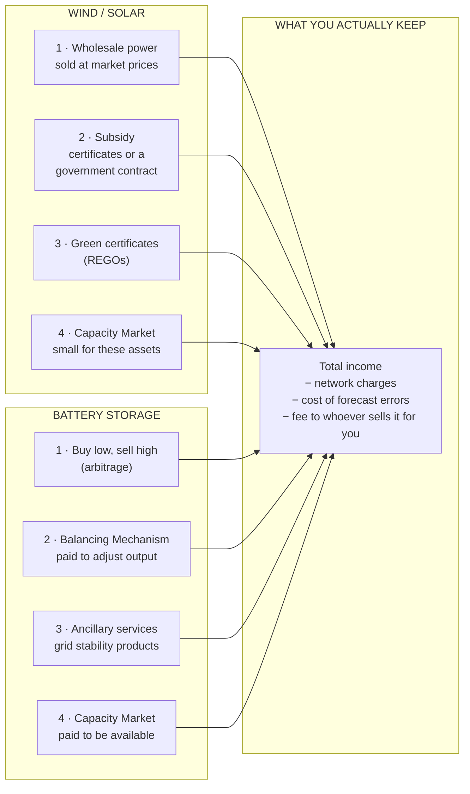
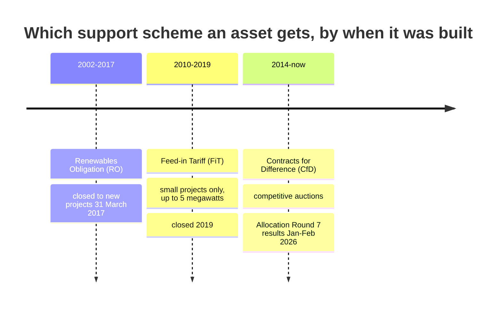
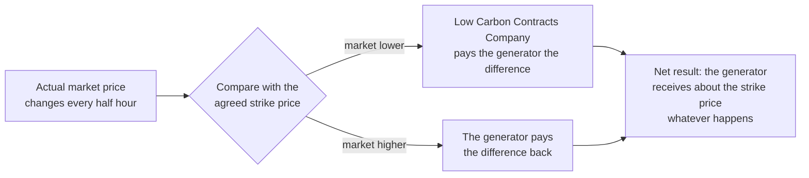
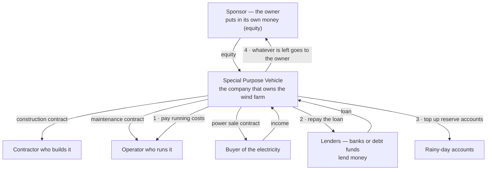

# Module D1 — Where the Money Comes From: Wind, Solar and Battery Storage

> **How this module is written.**
> Every abbreviation is written out in full the first time it appears **in each section** —
> not just once at the top of the page. You should never have to scroll back or open another
> file to remember what something stands for.
>
> Every financial phrase is explained in plain English **where it is used**. Phrases like
> "supports more debt", "sizing the debt" or "the equity cheque" are industry shorthand, not
> ordinary English, and they are explained rather than assumed.
>
> **Estimated study time:** 16–20 hours.
> **Prerequisite:** Module A1 (units, capacity factor, cost per unit of energy).
> **Deliverable:** a revenue model in Excel for one wind, one solar and one battery asset.

---

# PART 0 — THE MONEY VOCABULARY

**Read this part first.** It contains no energy content at all. It defines the financial
words that the rest of the module uses constantly. If you skip it, later sections will use
phrases that sound like plain English but are not.

## 0.1 What a project looks like as a set of numbers

A wind farm, a solar farm or a battery is, financially, a very simple thing:

1. You spend a large amount of money **once**, at the start, to build it.
2. It then produces a **stream of money** every year for 20–35 years.
3. You want the stream to be worth more than the initial spend.

That is the whole business. Everything else is detail about how certain the stream is, who
supplied the initial money, and in what order they get paid back.

## 0.2 Money words, in order of how confusing they are

**Revenue** — the money that comes *in*. Also called turnover or income. If you sell
100,000 megawatt-hours of electricity at £120 each, your revenue is £12,000,000.

**Cost** — the money that goes *out*.

**Profit** — revenue minus cost, as measured by accountants. **Profit is an opinion.** It
includes non-cash items (see *depreciation* below) and can be positive in a year when your
bank balance falls.

**Cash flow** — the money that actually moved in or out of the bank account in a period.
**Cash is a fact.** In this industry cash flow matters more than profit, because you repay a
loan with cash, not with profit.

**Depreciation** — an accounting entry that spreads the cost of building something across the
years it is used, rather than charging it all in year one. It is a *bookkeeping* charge: no
money moves. This is the main reason profit and cash flow differ.

**CAPEX** — short for **cap**ital **ex**penditure. The money spent building or buying the
asset. A one-off, upfront cost. Quoted per unit of size: "£1.3 million per megawatt".

**OPEX** — short for **op**erating **ex**penditure. The money spent every year keeping the
asset running — maintenance, land rent, insurance, business rates. Quoted as "£45,000 per
megawatt per year".

## 0.3 The two kinds of money that build a project

This distinction underpins everything in Parts 3 and 4. There are exactly two ways to fund
building something.

### Debt — borrowed money

A bank (or a fund that lends money) gives you cash now, and you contract to pay it back on a
fixed schedule, plus interest.

- The schedule is **fixed**. You owe the same amount whether the wind blew or not.
- The lender is paid **before** the owners get anything.
- Because it is paid first and its return is capped at the agreed interest rate, lending is
  relatively low risk — so lenders accept a relatively low return. **Debt is cheap money.**
- If you cannot pay, the lender can take the project away from you. That is **default**.

### Equity — the owners' own money

The investor puts in cash and, in exchange, owns the project.

- There is no schedule. Equity gets whatever cash is left after everyone else is paid.
- If the project does badly, equity gets nothing and may lose everything.
- Because it is paid last and can lose everything, equity demands a much higher return.
  **Equity is expensive money.**

### Putting it together

A £100 million project might be funded with £70 million of debt and £30 million of equity.
That mix is what people mean by:

**Gearing** (or **leverage**) — the proportion of the total funded by borrowing. £70m debt out
of £100m total is "70% geared". Both words mean the same thing; British practitioners tend to
say gearing, Americans leverage.

**The equity cheque** — industry shorthand for *the amount of their own money the investor
has to put in*. In the example above, the equity cheque is £30 million. When someone says "it
shrinks the equity cheque", they mean the investor has to find less of their own cash.

## 0.4 What "supports debt" actually means

This is the phrase I used carelessly, so here it is properly.

When someone says a project **"supports £63 million of debt"**, they mean:

> Given how much cash this project is expected to generate each year, and given how cautious
> the lender is, **£63 million is the largest loan a bank would be willing to advance against
> it.**

The lender is not looking at how big the project is, or how much it cost. The lender is
looking at one thing: **is there enough cash coming in each year to comfortably cover the
repayments?** If the answer is yes for a £63 million loan but no for a £70 million loan, then
the project "supports £63 million".

Related phrases, all meaning roughly the same thing:

| Phrase | Plain English |
|---|---|
| "supports £63m of debt" | a bank would lend up to £63m against it |
| "debt capacity" | the maximum a bank would lend |
| "sizing the debt" | working out that maximum |
| "**bankable**" | reliable enough that a bank will lend against it |
| "**underwrite**" | a lender formally accepting the risk of lending |
| "raising debt" | going out and arranging the loan |
| "**haircut**" | deliberately reducing a number for safety before relying on it |

### Why supporting more debt is a good thing

Not obvious, and central to the whole module.

Debt is cheap money and equity is expensive money. If a project can be funded with more of
the cheap money and less of the expensive money, the owner needs to put in less of their own
cash — for **the same physical asset earning the same income**.

**[CALC] Worked example, deliberately simple**

A project costs £100 million and pays £12 million a year to whoever owns it, after all
running costs and loan repayments have been handled.

*Case A — 50% debt.* Investor puts in £50 million of their own money.
Suppose after debt repayments £6 million a year is left for the owner.
Return on their money = 6 ÷ 50 = **12% a year**.

*Case B — 70% debt.* Investor puts in only £30 million of their own money.
More borrowing means more interest, so suppose only £4.5 million a year is left for the owner.
Return on their money = 4.5 ÷ 30 = **15% a year**.

**The owner receives less cash in Case B (£4.5m instead of £6m) but earns a higher return,
because they tied up far less of their own money.** That is what leverage does, and it is why
"supports more debt" is a compliment.

**The catch, stated honestly:** leverage magnifies losses in exactly the same way. If income
falls, the loan repayments do not. In Case B a bad year wipes out the owner's cash far faster
than in Case A. **Leverage is not free money; it is a trade of safety for return.**

## 0.5 What "return" means

**Return** is what an investor earns, expressed as a percentage of the money they put in, per
year. A 10% return means £10 a year on every £100 invested.

**IRR** — short for **I**nternal **R**ate of **R**eturn. The single percentage that summarises
a whole stream of cash flows over many years. Formally it is the discount rate at which the
investment breaks even; informally, **it is the annual percentage return the investment earns,
accounting for the timing of every payment**.

Two versions, and confusing them is a common and serious error:

- **Project IRR** (also called *unlevered* IRR — "unlevered" means "before borrowing"). The
  return on the project's cash flows before any loan. **Measures the quality of the asset.**
- **Equity IRR** (also called *levered* IRR — "levered" means "after borrowing"). The return on
  the owner's own money after the loan has been repaid. **Measures the asset plus the
  financing.**

In §0.4, 12% and 15% were both equity IRRs. The project IRR was the same in both cases,
because the wind farm did not change.

**Discounting and present value.** £100 next year is worth less than £100 today, because you
could invest today's £100. **Discounting** converts future money into today's money.
**Present value** is the result.

**NPV** — **N**et **P**resent **V**alue. Add up all future cash flows in today's money and
subtract what you spend. Positive means the investment creates value.

**Discount rate** — the percentage used to shrink future money. A high discount rate means you
are treating future money as much less valuable, which is what you do when it is risky or when
interest rates are high.

## 0.6 Contracted versus merchant — the most important distinction in this module

**Contracted** revenue means **someone has signed a contract promising to pay you a known
amount.** You know roughly what you will receive.

**Merchant** revenue means **you sell at whatever the market happens to pay**, with nobody
promising anything. It might be more than expected. It might be a lot less.

**Why this matters more than the amount.** A lender does not much care how *large* your
expected income is. A lender cares how *reliable* it is, because the loan repayments are
fixed. Contracted income can be lent against; merchant income largely cannot.

**This one idea explains almost every commercial structure in the rest of this module.**

## 0.7 A few more words used constantly

| Word | Plain English |
|---|---|
| **Counterparty** | The other party to a contract. Your counterparty in a power sale is whoever is buying |
| **Offtaker** | The party who buys — literally, who "takes off" — your electricity |
| **Sponsor** | The company developing and owning the project; the one standing behind it |
| **Exposure** | Being unprotected against something. "Price exposure" means your income moves when the price moves |
| **Hedge** | Any arrangement that removes exposure, usually by fixing a price in advance |
| **Upside / downside** | Things turning out better / worse than expected |
| **Downside case** | A deliberately pessimistic version of the forecast, used to test whether the project survives |
| **Covenant** | A promise written into a loan agreement. Break it and the lender gains rights over you |
| **Tenor** | How long a loan lasts |
| **Amortising** | A loan repaid gradually over its life, rather than in one lump at the end |
| **Refinancing** | Replacing an existing loan with a new, usually cheaper one |
| **Due diligence** | Investigating something thoroughly before buying it |

---

# PART 1 — THE REVENUE LINES

## 1.0 The one idea this part exists to teach

**A renewable asset almost never earns "the power price".**

It earns a **stack** — several separate revenue lines, from different payers, under different
contracts, with different levels of certainty. Some are fixed for twenty years; some change
every half hour.

"The stack" is just industry shorthand for *the full list of a project's income sources added
together*. When someone says "the revenue stack", they mean the whole picture rather than
one line of it.

**Notice the asymmetry.** Wind and solar have one large **contracted** line (the subsidy — a
contract someone signed) and one volatile **merchant** line (selling at market prices). A
battery has **no contracted line at all**, unless someone deliberately gives it one.

That single structural difference explains nearly everything about how the two are financed
and valued, and it is the thread running through this whole module.

---

## 1.1 Selling the electricity itself

*Abbreviations used in this section, written out: MWh (megawatt-hour), PPA (Power Purchase
Agreement), CPPA (Corporate Power Purchase Agreement), MID (Market Index Data), N2EX (the
Nord Pool GB day-ahead exchange), EPEX (European Power Exchange).*

### How electricity actually gets sold

The **wholesale market** is where electricity is bought and sold in bulk, before it reaches
anyone's bill. The main reference point in Great Britain is the **day-ahead auction**: each
day at around 11:00, buyers and sellers bid for each half-hour of tomorrow, and a single
clearing price is set for each half-hour.

**Settlement period.** Great Britain settles electricity in **half-hour blocks** — 48 a day,
17,520 a year. Every price and every payment is calculated per half-hour. When you read "the
price was £123 per megawatt-hour", that is an average of thousands of individual half-hourly
prices.

**Price benchmarks you will see quoted:**

| Name | Written out | What it is |
|---|---|---|
| **N2EX** | Nord Pool's GB day-ahead exchange | The most-referenced GB day-ahead price. Most sale contracts settle against it |
| **EPEX SPOT** | European Power Exchange, spot market | The other GB day-ahead auction, and the main platform for trading within the day |
| **MID** | Market Index Data | The published price used when calculating penalties for forecast errors. The code `APXMIDP` is the N2EX-derived version |

### Capture price — the concept most often got wrong

**A wind farm does not earn the average market price.** It earns the average price **weighted
by how much it produced in each half-hour**. That figure is its **capture price**.

**Capture price = (price in each half-hour × megawatt-hours produced in that half-hour), all
added up, then divided by total megawatt-hours produced**

**Capture rate** = capture price ÷ the plain average market price, as a percentage. Below 100%
means the asset earns less than the market average.

**Why it is below 100% for wind and solar.** Wind farms generate when it is windy — and so
does every other wind farm in the country. Lots of supply arriving at once pushes the price
down. Solar is worse, because every solar farm produces on the same sunny afternoon. This
self-inflicted price depression is called **cannibalisation**: the technology eats its own
price. It gets worse as more of the same technology connects.

### Measured evidence, not theory

From the working code in this repository, using real settlement data for the 1,441 half-hour
periods between 26 July and 25 August 2026:

| Technology | Capture price | Capture rate | What it tells you |
|---|---:|---:|---|
| Plain market average ("baseload") | £123.00/MWh | 100.0% | The reference point |
| **Wind** | £115.57/MWh | **94.0%** | Modest cannibalisation |
| **Solar** | £100.69/MWh | **81.9%** | Heavy cannibalisation |
| Nuclear | £126.94/MWh | 103.2% | Runs flat, so slightly above average |
| Gas | £142.11/MWh | 115.5% | **Can choose when to run, so runs when prices are high** |

**[FACT]** Source: Elexon Balancing Mechanism Reporting Service, dataset MID, retrieved
25 August 2026. Reproduce with `curriculum/projects/p1_gb_power_dashboard/`.

**Three separate lessons in that table:**

1. **Solar earns 18.1% less than the market average.** Model a solar farm at the average price
   and you overstate its income by roughly 18% before considering anything else. On a
   £50 million asset that single error is worth millions.
2. **Gas earns 15.5% more than average**, for the mirror-image reason — it can choose its
   hours. **Being able to choose when you run is worth money, and the capture rate is where
   you can see it.**
3. **These are summer figures.** Solar's capture rate is worst in summer and better in winter;
   wind is the reverse. **Never take one month's capture rate and apply it to a year.**

### How a generator actually gets paid: "route to market"

A wind farm cannot simply "sell into the market". It is not a licensed electricity supplier
and cannot take part in the settlement process directly. It needs a **route to market** —
industry shorthand for *the commercial arrangement by which someone else sells your power for
you and handles the paperwork*.

**PPA — Power Purchase Agreement.** The contract under which a generator sells its output.
The main types:

| Type | Written out | How the price works | Who carries the price risk |
|---|---|---|---|
| **Fixed-price PPA** | Power Purchase Agreement | An agreed price per megawatt-hour for an agreed number of years | The buyer |
| **Floating PPA** | — | Market price minus a fee | The generator |
| **CPPA** | Corporate Power Purchase Agreement | Negotiated directly with a large company that uses electricity | Depends on structure |
| **Sleeved PPA** | — | A company buys from the generator while a licensed supplier handles settlement for a fee ("sleeving" it through) | Shared |
| **Synthetic PPA** | Also called a *virtual* PPA | Purely financial — no electricity physically moves; the two parties just settle the difference against a reference price | Shared |
| **Baseload PPA** | — | The seller must deliver a **flat, constant** volume every hour | **The generator** |

**The trap inside a baseload PPA.** A wind farm does not produce a flat output. If it has
promised a flat volume, it must **buy** electricity on the market whenever it is not
generating enough — typically at high prices, because prices are high exactly when the wind is
not blowing. That mismatch is called **shape risk**, and it has bankrupted renewable traders.

### The four risks hiding inside "route to market"

| Risk | What it means in plain English |
|---|---|
| **Shape risk** | Your output pattern does not match the pattern you promised to deliver |
| **Volume risk** | You produce more or less energy than forecast |
| **Basis risk** | Your protective arrangement is priced against one thing but your actual income depends on another, so they do not cancel out |
| **Imbalance risk** | The cost of being wrong about what you told the grid you would produce |

**PPA discount.** Because the buyer absorbs those risks, they charge for them. A
market-linked Power Purchase Agreement typically pays the generator the capture price **minus
a discount**. **[OPINION]** The size of that discount is one of the most commercially
important numbers in the sector and is almost never public — you learn it from doing deals,
which is a concrete reason transaction experience is worth more than study.

---

## 1.2 Subsidy — the contracted line

*Abbreviations used in this section, written out: RO (Renewables Obligation), ROC (Renewables
Obligation Certificate), FiT (Feed-in Tariff), CfD (Contract for Difference), LCCC (Low
Carbon Contracts Company), AR (Allocation Round), ASP (Administrative Strike Price), CIB
(Clean Industry Bonus), RPI (Retail Prices Index), CPI (Consumer Prices Index), DESNZ
(Department for Energy Security and Net Zero), MWh (megawatt-hour), GW (gigawatt).*

Great Britain has run three main support schemes. **Which one an asset receives depends
entirely on when it was built** — and that is the first thing to check about any British
renewable asset.

### 1.2.1 The Renewables Obligation and its certificates

**RO — Renewables Obligation.** **ROC — Renewables Obligation Certificate.**

**How it works.** Electricity suppliers — the companies that sell power to homes and
businesses — are legally required to source a set proportion of their electricity from
renewable sources. They prove they have done so by handing certificates to the regulator.
Renewable generators are *issued* those certificates for the electricity they generate, and
sell them to suppliers who need them. So the generator has **two** income lines: the
electricity, and the certificates.

**Banding.** Not every technology receives one certificate per megawatt-hour. The number is
"banded" by technology and by the year the project was registered. Examples: onshore wind
commonly receives **0.9 certificates per megawatt-hour**, offshore wind **1.8**. **[FACT] —
banding varies by registration year, so always check the specific asset's registration
paperwork rather than assuming.**

**How a certificate is priced.** A Renewables Obligation Certificate is not worth a fixed
amount. Its value has two parts:

1. **The buy-out price.** A supplier that does not hand over enough certificates must instead
   pay a penalty per missing certificate into a central fund. That caps what a certificate is
   worth — no supplier pays more for a certificate than the cost of simply paying the penalty.
   **For the year 1 April 2026 to 31 March 2027 the buy-out price is £69.34 per
   certificate**, up from £67.06 the year before ([FACT] —
   [Ofgem](https://www.ofgem.gov.uk/data/renewables-obligation-buy-out-price-and-mutualisation-threshold-and-ceilings-2026-2027)).
2. **The recycle value.** The penalty money in that central fund is then **redistributed back**
   to the suppliers who *did* hand over certificates, in proportion to how many they handed
   over. That makes a certificate worth **more** than the buy-out price. In 2022/23 the total
   was **£59.76 per certificate = £52.88 buy-out + £6.88 recycle** ([FACT]).

**A change with real financial consequences.** From **1 April 2026** the annual increase in
the buy-out price switched from being linked to **RPI (Retail Prices Index)** to **CPI
(Consumer Prices Index)**. CPI is normally the lower of the two inflation measures, so
**this permanently reduces the future value of every Renewables Obligation-backed asset in
Great Britain.** The 2026/27 figure of £69.34 reflects CPI inflation of 3.4% for calendar
2025 ([FACT] — [DESNZ, Department for Energy Security and Net Zero](https://www.gov.uk/government/consultations/renewables-obligation-ro-scheme-indexation-changes/outcome/renewables-obligation-ro-scheme-indexation-changes-government-response-html)).

**[CALC] What the certificates are actually worth to a wind farm**

A 40 megawatt onshore wind farm, running at a 32% capacity factor, registered at 0.9
certificates per megawatt-hour:

- Annual generation = 40 × 8,760 hours × 0.32 = **112,128 megawatt-hours**
- Certificates issued = 112,128 × 0.9 = **100,915 certificates**
- At £69.34 buy-out plus an assumed 10% recycle **[ASSUMPTION]** = £76.27 each
- **Certificate income = 100,915 × £76.27 = £7,696,777 a year**

Against the electricity income at the measured wind capture price:

- Electricity income = 112,128 × £115.57 = **£12,958,032 a year**
- **The certificates are 37% of total income**

**Why that matters:** more than a third of this asset's income comes from a scheme that is
closed to new entrants and whose inflation link has just been reduced. When the Renewables
Obligation support ends for this asset, **that income stops completely** — it does not taper.
**The end date is one of the first things to check in any purchase**, because it is a cliff
edge in the cash flows.

**Scheme status.** The Renewables Obligation **closed to all new capacity on 31 March 2017**,
with earlier closure for solar and onshore wind in many cases and extensions ("grace periods")
in others ([FACT] — [Ofgem](https://www.ofgem.gov.uk/environmental-programmes/ro/about-ro/ro-closure)).
Existing registered assets keep receiving certificates for 20 years from registration, so
these assets will be bought and sold well into the 2030s. **You will meet them constantly in
due diligence work.**

### 1.2.2 The Feed-in Tariff

**FiT — Feed-in Tariff.** Ran **April 2010 to 2019**, for installations up to **5 megawatts**
([FACT]). Paid a **generation tariff** for every unit produced plus an **export tariff** for
units sent to the grid. Closed to new applicants in 2019.

**Relevance to you: low**, except that small hydro and rooftop solar portfolios being traded
today are often on it, and the tariffs are generous and inflation-linked. Awareness only.

### 1.2.3 Contracts for Difference — the current scheme

**CfD — Contract for Difference.** This is how new large-scale renewables in Great Britain are
supported today.

**Who pays.** **LCCC — Low Carbon Contracts Company**, a government-owned company that is the
counterparty (the other party) to every Contract for Difference. The generator's contract is
with that company, not with government directly.

**How it works.** The generator is awarded a **strike price** in pounds per megawatt-hour. A
**reference price** is calculated from the actual market.

- If the **market price is below the strike price**, the Low Carbon Contracts Company **pays
  the generator the difference**.
- If the **market price is above the strike price**, **the generator pays the money back**.

That second direction is what makes it a *contract for difference* rather than a subsidy. The
generator ends up receiving roughly the strike price whatever the market does — it has sold
away its price risk.

**What the generator still carries.** A Contract for Difference removes *price* risk. It does
**not** remove:
- **Volume risk** — a still year means fewer megawatt-hours, and payment is per megawatt-hour.
- **Curtailment risk** — if the grid instructs you to turn down, you do not generate, so you
  are not paid.
- **Negative price risk** — payments are suspended during sustained periods of negative prices
  under more recent contract terms.
- **The merchant tail** — see below.

### Allocation Round 7, and what changed

**AR — Allocation Round.** Allocation Round 7 is the seventh auction. Results were announced
January 2026 (offshore wind) and February 2026 (onshore wind and solar). **[FACT] throughout:**

| Technology | Strike price (in 2024 money) | Capacity awarded |
|---|---:|---:|
| Offshore wind, fixed to the seabed | **£91/MWh** | 8.4 gigawatts (a record) |
| Floating offshore wind | **£216.49/MWh** | Erebus, Pentland |
| Onshore wind | **£72/MWh** | 1.3 gigawatts |
| Solar | **£65/MWh** | 4.9 gigawatts |

RWE alone secured 6.9 gigawatts of offshore wind at **£91.20/MWh**, alongside a long-term
partnership with the investment firm KKR ([FACT] —
[RWE](https://www.rwe.com/en/press/rwe-ag/2026-01-14-rwe-secures-contracts-for-difference-for-6-9-gigawatts-of-offshore-wind-capacity/)),
and 291 megawatts of onshore capacity at **£65.23/MWh for solar and £72.24/MWh for onshore
wind** ([FACT] — [SolarQuarter](https://solarquarter.com/2026/02/11/rwe-secures-291-mw-of-solar-and-onshore-wind-in-uks-ar7-auction-winning-cfds-at-65-23-mwh-for-solar-and-72-24-mwh-for-wind/)).
[Full results](https://assets.publishing.service.gov.uk/media/6966861de8c04eb2919f773a/contracts-for-difference-allocation-round-7-results-.pdf).

**Three reforms you must be able to explain:**

1. **Contracts extended from 15 to 20 years** for offshore wind, floating offshore wind,
   onshore wind and solar ([FACT] —
   [Flint Global](https://flint-global.com/blog/the-most-important-cfd-round-in-years-what-do-the-major-reforms-mean/)).

   **Why this reduced prices — follow the chain carefully, because it is the whole logic of
   the auction.** A longer contract means fewer years at the end of the asset's life exposed
   to unpredictable market prices. Fewer unpredictable years means the income is more reliable
   overall. More reliable income means **a bank will lend more against the project** (see
   §0.4). More borrowing means the developer needs less of their own expensive money. Needing
   less of their own money means they can accept a **lower** guaranteed price and still earn
   their target return — so they bid lower. **This single change is why the auction cleared
   where it did.**

2. **Prices now quoted in 2024 money** (the previous round used 2012 money). **This is a
   trap.** £91 in 2024 money is not comparable with a price quoted in 2012 money unless you
   adjust for inflation first. **Always ask "in which year's money?" before comparing two
   strike prices.** Prices are then increased each year in line with CPI (Consumer Prices
   Index) inflation.

3. **CIB — Clean Industry Bonus.** Extra support for offshore wind developers who invest in a
   more sustainable British supply chain. Only physical assets count — not training or
   research — and the investment must fall between March 2024 and the contract start date
   ([FACT] — [Pager Power](https://www.pagerpower.com/news/the-clean-industry-bonus-rewiring-britains-offshore-wind-auctions/)).

**ASP — Administrative Strike Price.** The maximum price government will accept in the
auction: a ceiling, not a target. For solar in Allocation Round 7 the ceiling was **£75/MWh**
and the auction cleared at £65 — competition delivered a 13% saving ([FACT]).

### The merchant tail — where valuations are won and lost

**Merchant** means selling at market prices with no contract protecting you (see §0.6). The
**merchant tail** is the part of an asset's operating life **after** its subsidy contract ends.

A wind farm with a 30-year life and a 20-year contract has a **10-year merchant tail**. During
those ten years its income is whatever the market pays — which nobody can forecast confidently.

**Why this dominates valuation.** The merchant tail is simultaneously the **least certain**
part of the forecast and often a **large share of total value**. Two serious buyers can differ
by 30% on what an asset is worth purely because they hold different long-term views on power
prices, and because they apply different discount rates (see §0.5) to those uncertain years.

**[OPINION]** If you can form and defend your own view on merchant tail value, you are doing
the job of an investment professional rather than a technical adviser. That is the whole
career transition, compressed into one assumption in a spreadsheet.

---

## 1.3 Green certificates

*Abbreviations used in this section, written out: REGO (Renewable Energy Guarantees of
Origin), GoO (Guarantee of Origin), MWh (megawatt-hour).*

**REGO — Renewable Energy Guarantees of Origin.**

**What it is.** One certificate issued for each megawatt-hour of renewable generation, proving
the electricity came from a renewable source. Suppliers buy them so they can advertise "100%
green" tariffs. It is a **separate, tradeable product from the electricity** — the certificate
and the electricity are sold independently, to different buyers if you like.

**What it is worth [FACT]:**

| Period | Approximate price |
|---|---|
| Early 2020 | ~£0.20 per megawatt-hour |
| 2023 peak | £20–25 per megawatt-hour |
| Summer 2026 | **£1–2 per megawatt-hour** |

([Good Energy](https://www.goodenergy.co.uk/business/insights/rego-prices-renewable-energy/))

**The lesson is the shape of that table, not the level.** The price moved roughly a
hundredfold in three years and then collapsed. An income forecast built in 2023 assuming
£20 per megawatt-hour forever would be catastrophically wrong today.

**[CALC]** For the 40 megawatt wind farm producing 112,128 megawatt-hours a year:
- At £1.50 **[ASSUMPTION, current market]**: **£168,192 a year**
- At £22 (the 2023 level): **£2,466,816 a year**

**How a lender treats it: with deep suspicion.** Because the price is so volatile, most
lenders give these certificates **little or no credit when deciding how much to lend** — in
other words, they leave the income out of the calculation almost entirely. Equity investors
(the owners) may value it; lenders generally will not.

**This is the first clear example of the general rule:** predictable income lets you borrow;
volatile income does not, and only benefits the owners.

**GoO — Guarantee of Origin** is the European equivalent. Since Brexit, British certificates
are not automatically recognised in the European Union, which is part of why the British price
diverged.

---

## 1.4 The Capacity Market

*Abbreviations used in this section, written out: CM (Capacity Market), T-4 and T-1 (auctions
held four years and one year before delivery), kW (kilowatt), MW (megawatt), DESNZ
(Department for Energy Security and Net Zero), PJM (PJM Interconnection, the largest United
States regional grid operator).*

**CM — Capacity Market.** A scheme that pays generators and batteries **to be available** at
times when the system is under stress — **not** to generate. It is essentially an insurance
policy for the country, paid for through consumers' bills.

**How it works.** Government forecasts how much reliable capacity Britain needs four years
ahead (the **T-4** auction) and one year ahead (**T-1**). Providers bid the price at which
they will commit to being available. The auction clears at one price for everyone, quoted in
**pounds per kilowatt of derated capacity per year**.

**Derating factor — the concept that catches everyone out.** You are not paid on your
nameplate size. You are paid on your **derated** size, which reflects how likely you are to
actually deliver during a stress event. A gas plant is derated only slightly. A one-hour
battery is derated heavily, because a stress event can easily last longer than an hour. A
four-hour battery is derated much less. Wind and solar are derated very heavily indeed.

**[CALC]**

A 50 megawatt battery with **one hour** of storage, assumed derating factor 12%
**[ASSUMPTION — real factors are published annually by DESNZ (Department for Energy Security
and Net Zero) and vary by duration; look them up rather than guessing]**, at the clearing
price of **£27.10 per kilowatt per year** for delivery year 2029/30 ([FACT] —
[Modo Energy](https://modoenergy.com/research/en/gb-capacity-market-t4-2029-30-battery-energy-storage-march-2026)):

- Derated size = 50 × 12% = 6 megawatts = **6,000 kilowatts**
- Income = 6,000 × £27.10 = **£162,600 a year**

The same battery with **four hours** of storage, assumed derating 55% **[ASSUMPTION]**:
- Derated size = 50 × 55% = 27.5 megawatts = 27,500 kilowatts
- Income = 27,500 × £27.10 = **£745,250 a year**

**A 4.6× difference in this income line from storage duration alone** — which is one of the
main commercial reasons Britain has been building longer-duration batteries.

**Market context worth knowing [FACT]:** the four-year-ahead auction for 2029/30 cleared at
**£27.10 per kilowatt per year, roughly 55% below the previous year**, with 44 gigawatts
competing for a 39.4 gigawatt target — a 12% oversupply. Compare that with **PJM
Interconnection in the United States, whose equivalent auction for 2027/28 cleared at the
regulatory maximum of $333.44 per megawatt per day and still fell 6,623 megawatts short** of
what it needed ([FACT] —
[PJM](https://insidelines.pjm.com/pjm-auction-procures-134479-mw-of-generation-resources/)).

**Read those two facts together.** Two large developed electricity markets, same decade,
completely opposite signals. Britain is saying "we do not need more capacity"; PJM is saying
"we urgently do". That contrast is the clearest illustration in this module of why **market
structure, not technology, determines returns.**

---

## 1.5 The Balancing Mechanism and the cost of forecast errors

*Abbreviations used in this section, written out: BM (Balancing Mechanism), NESO (National
Energy System Operator), BOA (Bid-Offer Acceptance), MW (megawatt), MWh (megawatt-hour).*

**BM — Balancing Mechanism.** The market that **NESO (National Energy System Operator**, the
organisation that runs the British grid**)** uses in the final hour before real time to keep
supply and demand exactly matched.

**How it works.** Generators and batteries submit prices for each half-hour:
- An **offer** is a price at which you will *increase* output.
- A **bid** is a price at which you will *decrease* output.

NESO accepts whichever it needs. An acceptance is called a **BOA — Bid-Offer Acceptance**.

**Why it matters for wind:** when the grid is congested, NESO pays wind farms to turn *down*.
That is **curtailment**, and it is a major feature of Scottish wind economics.

**Why it matters for batteries:** a battery responds in seconds and can both absorb and inject
power, which makes it ideal for balancing. Wholesale trading and the Balancing Mechanism
together make up around **60%** of British battery income over the twelve months to April 2026
([FACT] — [Modo Energy](https://modoenergy.com/research/en/how-does-battery-energy-storage-make-money)).

### Imbalance — paying for being wrong

Everyone who generates or supplies electricity must tell the system in advance what they
expect to do. The gap between that and reality is **imbalance**, and it is settled at the
**imbalance price** (also called the system price or cash-out price). Britain uses a **single**
price for being over and under.

**[CALC]** A 40 megawatt wind farm tells the system it will produce 30 megawatts for a
half-hour but delivers 18 megawatts.
- Shortfall = 12 megawatts × 0.5 hours = **6 megawatt-hours short**
- At an imbalance price of £250 per megawatt-hour, that costs 6 × 250 = **£1,500** for one
  half-hour
- Repeated across a badly forecast day, it becomes material money

This is exactly the risk the buyer absorbs in exchange for the **PPA discount** in §1.1. **You
now know what that discount is paying for.**

---

## 1.6 Ancillary services — mainly a battery story

*Abbreviations used in this section, written out: DC (Dynamic Containment), DM (Dynamic
Moderation), DR (Dynamic Regulation), FFR (Firm Frequency Response), QR (Quick Reserve), BR
(Balancing Reserve), SR (Slow Reserve), OBP (Optimised Balancing Platform), NESO (National
Energy System Operator), Hz (hertz, meaning cycles per second).*

**Ancillary services** are the products the grid operator buys to keep the system stable
second by second — holding frequency at 50 hertz, maintaining voltage, keeping spare capacity
in case a power station trips off.

British grid frequency must stay within **50 hertz plus or minus 1%** under NESO's licence.

### The frequency response products [FACT]

| Short name | Written out | Must respond within | Must keep going for |
|---|---|---|---|
| **DC** | Dynamic Containment | 0.5 seconds | 15 minutes |
| **DM** | Dynamic Moderation | 0.5 seconds | 15 minutes |
| **DR** | Dynamic Regulation | 2 seconds | 60 minutes |

Source: [NESO](https://www.neso.energy/industry-information/balancing-services/frequency-response-services/dynamic-services-dcdmdr).
From January 2026 these are activated through the **OBP — Optimised Balancing Platform**.

### The reserve products [FACT]

| Short name | Written out | Note |
|---|---|---|
| **FFR** | Firm Frequency Response | The old service, being retired during 2026 |
| **QR** | Quick Reserve | Its replacement, launched late 2025 |
| **BR** | Balancing Reserve | Pays you to hold capacity back from other markets |
| **SR** | Slow Reserve | Longer-notice reserve |

Assets contracted into these receive an **availability payment** — money simply for being
ready, whether or not they are called on.

### The single most important trend in battery income

**Ancillary services now provide about 33% of British battery income, down from 87% across
2020–2022** ([FACT] — [Modo Energy](https://modoenergy.com/benchmarks/methodology/asset/gb)).

**Why, and why it generalises.** Frequency response markets are small and **saturate
quickly**. Early batteries earned extraordinary money because there were few of them and the
grid badly needed the service. As the fleet grew, the requirement was met, prices collapsed,
and income shifted to wholesale trading and the Balancing Mechanism.

**The investment lesson goes far beyond batteries:** *any* income stream backed by a
**fixed-size requirement** will be competed away as more capacity arrives. Always ask of any
income line: **how big is the total requirement, and how much capacity is chasing it?**

---

## 1.7 Putting the stack together — and the point of the whole module

*Abbreviations used in this section, written out: BM (Balancing Mechanism), CM (Capacity
Market), MW (megawatt), DSCR (Debt Service Cover Ratio — explained in Part 3).*

**[CALC] Full income stack for a 50 megawatt, 2-hour battery**

The British benchmark: a 2-hour battery averaged **£73,145 per megawatt per year** across all
income lines over the twelve months to April 2026 ([FACT] — Modo Energy), with monthly figures
swinging from **£41,000 (February 2026)** to **£70,000 (March 2026)** — a 71% range inside a
single quarter ([FACT]).

| Income line | £ per MW per year **[ASSUMPTION, indicative split]** | Contracted? | Can you borrow against it? |
|---|---:|---|---|
| Buying low and selling high (wholesale) | ~26,000 | No | Barely |
| Balancing Mechanism | ~18,000 | No | Barely |
| Ancillary services | ~24,000 | Short-term only | Barely |
| Capacity Market | ~5,000 | **Yes — a multi-year agreement** | **Yes** |
| **Total** | **~73,000** | | |

**Now the point.** Only about **£5,000 out of £73,000 — roughly 7% — is contracted.**
Everything else can halve in a quarter, and demonstrably has.

**This is why a merchant battery is hard to borrow against**, and why **tolling agreements**
exist.

**Tolling agreement** — a contract where a counterparty (usually a large utility or trading
company) pays the battery owner **a fixed annual fee** in exchange for the exclusive right to
operate the battery and keep all the market income it earns. The owner gives up the upside and
receives a predictable payment instead. The word comes from a toll road: you pay a fixed fee
to use someone else's asset.

| | Merchant battery | Tolled battery |
|---|---|---|
| Expected income | Higher | Lower |
| How volatile that income is | Very | Almost none |
| **How much a bank will lend** | **Low** | **Much higher** |
| Owner's own cash required | High | Lower |
| Owner's return | Higher if all goes well | Lower but far more certain |

**[OPINION]** The idea that a contract paying you *less money* can produce a *higher return*
for the owner — because it lets you borrow more cheaply, so you tie up less of your own cash
(§0.4) — is the moment engineering intuition gives way to financial intuition. It is genuinely
counter-intuitive. Sit with it until it feels obvious, because it is the core of
infrastructure investing.

**You can see this happen numerically** in the companion tool
(`curriculum/revenue-stack-explorer.html`): switching from merchant to tolled reduces annual
income by about £260,000 but increases the amount a bank will lend from about £3.3 million to
about £7.9 million.

---

# PART 2 — THE COSTS

## 2.1 Capital expenditure — the cost of building it

*Abbreviations used in this section, written out: CAPEX (capital expenditure), EPC
(Engineering, Procurement and Construction), BoP (Balance of Plant), TSA (Turbine Supply
Agreement), LDs (Liquidated Damages), MW (megawatt), DESNZ (Department for Energy Security
and Net Zero).*

**CAPEX — capital expenditure.** The one-off, upfront cost of building the asset. Quoted per
megawatt of size, or for batteries per megawatt-hour of storage.

### What sits inside a wind farm's build cost

| Component | Typical share **[ESTIMATE]** | Note |
|---|---:|---|
| Turbines themselves | 55–70% | Bought under a **TSA — Turbine Supply Agreement** |
| **BoP — Balance of Plant** | 15–25% | Everything except the turbines: groundworks, foundations, roads, cabling |
| Grid connection | 5–15% | Substation and transmission works |
| Development costs | 3–8% | Land agreements, planning, surveys, legal fees |
| Contingency | 5–10% | Money set aside for surprises. **The first number a lender checks** |

**EPC — Engineering, Procurement and Construction.** A contract where a single contractor
takes responsibility for delivering the whole plant, usually for a fixed price by a fixed
date. A **full-wrap EPC** means that contractor carries essentially all the construction risk.

**Why lenders like a full wrap.** Cost overruns and delays during construction are the main
way infrastructure projects fail. If one financially solid contractor is legally liable for
them, the lender's risk falls sharply — so the lender will **lend more** (§0.4). Splitting the
work across several contractors is cheaper upfront but riskier, and attracts less borrowing.

**LDs — Liquidated Damages.** Compensation agreed in advance that the contractor must pay if
they deliver late or the plant underperforms. **Always check the cap** — liability is usually
limited to a percentage of the contract value, and beyond that cap the risk falls back onto
the owner.

### Cost benchmarks — with a deliberate health warning

**[FACT]** Allocation Round 7 cleared at £72 per megawatt-hour for onshore wind and £65 for
solar, in 2024 money. Published international build-cost ranges for onshore wind sit around
**$1,150–1,800 per kilowatt** ([Energy Solutions Intelligence, 2026](https://energy-solutions.co/articles/sub/onshore-wind-farm-economics-2026)) —
but note those are **global** figures in **US dollars**, and British costs differ.

**For British figures use the primary source:** DESNZ (Department for Energy Security and Net
Zero) publishes *Renewable Energy Generation Cost and Technical Assumptions*, updated July
2025 ([link](https://assets.publishing.service.gov.uk/media/68ba91f411b4ded2da19fe92/onshore-wind-and-solar-pv-cost-electricity-report-update-2024.pdf)).

**I have deliberately not quoted specific per-megawatt figures from it, because I have not
personally verified the current numbers.** Download it and extract them yourself. That refusal
is the point: the habit of never quoting a cost benchmark you have not checked is exactly what
makes a technical adviser trustworthy to an investor.

## 2.2 Operating expenditure — the cost of running it

*Abbreviations used in this section, written out: OPEX (operating expenditure), O&M
(Operations and Maintenance), MW (megawatt).*

**OPEX — operating expenditure.** The annual running cost, usually quoted per megawatt per
year.

| Component | What it is |
|---|---|
| **O&M — Operations and Maintenance** | The service contract for the turbines or panels |
| Land rent | Payments to landowners, often inflation-linked or income-linked |
| Business rates | Local property tax |
| Insurance | Damage, business interruption, liability |
| Asset management | Running the company that owns the project |
| Grid and metering | Connection charges, metering services |
| **Network charges** | See §2.3 — frequently forgotten |
| Route to market fee | The discount taken by whoever sells your power (§1.1) |

**Availability warranty.** The maintenance contractor typically guarantees the asset will be
*capable of operating* for a percentage of the time — commonly 97% or better for modern wind.
**This is not a guarantee of how much electricity you will produce.** The wind failing to blow
is not the contractor's problem. **Never confuse a 97% availability warranty with a 97%
capacity factor** — they are completely different quantities.

## 2.3 Network charges — the costs engineers forget

*Abbreviations used in this section, written out: TNUoS (Transmission Network Use of System),
BSUoS (Balancing Services Use of System), DUoS (Distribution Use of System), TCR (Targeted
Charging Review), NESO (National Energy System Operator), DNO (Distribution Network Operator),
REMA (Review of Electricity Market Arrangements), kW (kilowatt), MWh (megawatt-hour).*

These are charges for using the electricity networks. **They are large, they are rising fast,
and they are routinely left out of engineers' income models.**

### TNUoS — Transmission Network Use of System

The charge for using the high-voltage network: the pylons and the supergrid.

**The commercially critical feature: for generators, this charge depends on where you are.**
A generator in northern Scotland — far from demand, pushing power south down a congested
network — pays a **high** charge. A generator in southern England pays a **low** one, and in
some places is actually paid. Two otherwise identical wind farms can face very different
annual costs purely because of location.

**[FACT, 2026/27]** The average generation charge is **£13.03 per kilowatt**. Total money
collected through this charge is forecast to rise from **£4.3 billion in 2025/26 to £7 billion
in 2026/27** ([NESO](https://www.neso.energy/document/376336/download),
[Drax](https://energy.drax.com/intelligence/final-tnuos-charges-almost-identical-to-draft-tariffs/)).

**[CALC]** For a 40 megawatt wind farm at the average rate:
40,000 kilowatts × £13.03 = **£521,200 a year**. Against the roughly £20.7 million of income
calculated in §1.2 that is about 2.5% — but in an expensive Scottish zone it can be several
times the average, and **it is charged on your capacity, not your output, so it does not fall
in a low-wind year.** A fixed cost sitting against a variable income is precisely the
combination that breaks a pessimistic scenario.

**Location still costs money even though zonal pricing was rejected.** The government's
**REMA — Review of Electricity Market Arrangements** update of 10 July 2025 confirmed Britain
keeps a single national electricity price rather than different prices in different regions
([FACT] — [Norton Rose Fulbright](https://www.nortonrosefulbright.com/en/knowledge/publications/4399413b/rema-summer-update-no-to-zonal-pricing-yes-to-reformed-national-pricing)).
So the cost of a bad location now shows up through **network charges, curtailment and
constraint costs** instead of through the electricity price. **Location still drives value —
it is just harder to see, which means it is more often mispriced.** For someone with your
geospatial and grid background, that is an opportunity.

### BSUoS — Balancing Services Use of System

Recovers what NESO spends balancing the system, including the payments it makes to curtailed
wind farms.

**[FACT, 2026/27]** Final charges published 29 December 2025: **£13.74 per megawatt-hour** for
April–September 2026 and **£12.49** for October 2026–March 2027
([Drax](https://energy.drax.com/intelligence/initial-2026-27-bsuos-forecasts-published/)).
The charge is now set as a **fixed six-monthly rate in advance** rather than varying half-hour
by half-hour, which makes it far easier to forecast.

**[VERIFY]** Liability for this charge was reformed so that it falls on demand rather than
being split with generators. Confirm the current treatment for the specific asset you are
modelling, because it materially changes a generator's cost line.

### DUoS — Distribution Use of System

The equivalent charge for the lower-voltage local networks run by **DNOs — Distribution
Network Operators**. It applies to assets connected at local rather than transmission level,
which includes most solar farms and many batteries.

### Embedded benefits and the Targeted Charging Review — a history lesson with money in it

**Embedded generator** — one connected to the local distribution network rather than the
high-voltage transmission network.

Historically these enjoyed **embedded benefits**: they helped their supplier avoid
transmission charges, and the supplier shared the saving with them.

**Triad.** The three half-hours of highest national demand between November and February, at
least ten days apart. Transmission demand charges used to be based on how much you were using
during those three half-hours — so *generating* during them was extremely valuable.

**What happened.** Ofgem ran the **TCR — Targeted Charging Review** and issued its decision on
**21 November 2019**. Residual network charges moved to fixed charges for all users, generators
stopped being liable for one of them, and embedded benefits were substantially cut. Triad
avoidance payments had already been reduced sharply from April 2018 ([FACT] —
[Ofgem](https://www.ofgem.gov.uk/decision/targeted-charging-review-decision-and-impact-assessment)).

**Why you need this history.** Assets built before roughly 2018–2020 were financed on business
plans that **included income which no longer exists**. When you investigate an older
distribution-connected asset, check whether its original plan assumed embedded benefits. If it
did, the asset will have underperformed its original case, and you should expect to find a
history of refinancing or broken loan conditions. **Spotting that is exactly the kind of
observation that makes a technical adviser valuable to an investor.**

---

# PART 3 — HOW THE PROJECT IS FUNDED

## 3.1 The company that owns the project

*Abbreviations used in this section, written out: SPV (Special Purpose Vehicle), EPC
(Engineering, Procurement and Construction), O&M (Operations and Maintenance), PPA (Power
Purchase Agreement), CfD (Contract for Difference), DSRA (Debt Service Reserve Account), MRA
(Maintenance Reserve Account).*

**SPV — Special Purpose Vehicle.** A company created for the single purpose of owning and
running one project. Also called a **ProjectCo**. It exists so that the project's finances are
completely separate from everything else its owners do.

**Why that separation matters.** If the project fails, the lenders can take the Special
Purpose Vehicle and the wind farm inside it — but they **cannot** come after the parent
company's other assets. That arrangement is called **non-recourse** lending: the lender has no
"recourse" (no legal claim) beyond the project itself. **Limited-recourse** means there is
some carefully defined claim on the parent, usually only during construction.

**Sponsor** — the company that develops and owns the project and stands behind it.

**The numbers on the outgoing arrows are the order of payment**, and that order is legally
binding. See §3.4.

## 3.2 Working out how much a bank will lend

*Abbreviations used in this section, written out: CFADS (Cash Flow Available for Debt
Service), DSCR (Debt Service Cover Ratio), LLCR (Loan Life Cover Ratio), PLCR (Project Life
Cover Ratio), EBITDA (Earnings Before Interest, Tax, Depreciation and Amortisation), MWh
(megawatt-hour).*

This section contains the single most valuable calculation in the whole programme.

### First, the cash the lender actually looks at

**CFADS — Cash Flow Available for Debt Service.** Read the name literally: *the cash the
project has available to pay its loan with*. It is:

**Income − running costs − tax − changes in working capital − money that must be spent on
major maintenance**

**It is NOT the same as EBITDA** — **E**arnings **B**efore **I**nterest, **T**ax,
**D**epreciation and **A**mortisation, a common accounting measure of operating profit. EBITDA
ignores tax and ignores cash that must be reinvested in the asset. **Using EBITDA where CFADS
is required is one of the most common and most serious errors engineers make when they first
build a project model**, and it always flatters the answer.

### The ratio everything turns on

**DSCR — Debt Service Cover Ratio.**

**DSCR = CFADS ÷ debt service**

where **debt service** means the loan repayment plus interest due in that period.

**In plain English: how many times over can this project afford its loan repayments?**

- A DSCR of 1.00 means the project generates exactly enough cash to pay the loan and not a
  penny more. Any bad luck and it defaults.
- A DSCR of 1.30 means it generates 30% more cash than it needs. There is a cushion.

**[CALC]** Cash available £8.5 million, loan repayments £6.8 million.
DSCR = 8.5 ÷ 6.8 = **1.25**. Read as "one-point-two-five times covered". There is £1.7 million
of cushion — the project could lose 20% of its cash and still just about pay.

**Typical minimum ratios lenders insist on [ESTIMATE — verify on every deal]:**

| Asset type | Typical minimum DSCR |
|---|---|
| Wind or solar with a government contract | 1.20–1.30 |
| Wind or solar selling at market prices | 1.40–1.60 |
| Battery with a tolling agreement | 1.30–1.45 |
| Battery selling purely at market prices | 1.60 or more, if a bank will lend at all |

**Read that table as a price list for risk.** The less reliable the income, the bigger the
cushion the lender demands. A bigger cushion means the same cash can only support a smaller
loan. A smaller loan means the owner must put in more of their own expensive money. **That is
the mechanism by which contract structure determines the owner's return** — the point made
in §0.4 and §1.7, now with the machinery visible.

### Debt sculpting — shaping the repayments to fit the cash

If a project's cash flow varies year to year, a flat repayment schedule is inefficient: you
would have to size the whole loan around the worst year. **Sculpting** means shaping the
repayment schedule so it follows the cash, keeping the cover ratio constant:

**Repayment in any year = that year's CFADS ÷ the target DSCR**

**[CALC] Working out the maximum loan**

Cash available £8.5 million a year, target cover ratio 1.30:
- Affordable annual repayment = 8.5 ÷ 1.30 = **£6.538 million a year**

Now convert that annual stream into a lump sum today. Over 15 years at 6% interest, the
**annuity factor** — the multiplier that converts "£1 a year for n years" into "how much you
could borrow today" — is (1 − 1.06⁻¹⁵) ÷ 0.06 = **9.712**.

- **Maximum loan = £6.538 million × 9.712 ≈ £63.5 million**

**That is what "the project supports £63.5 million of debt" means** (§0.4). It is the largest
loan whose repayments this project's cash can cover with the required cushion.

**Why this is the highest-value calculation in the programme:** it sets how much you can
borrow; how much you can borrow sets how much of your own money you must put in; how much of
your own money you put in sets your return. **Value in infrastructure is created or destroyed
in the debt sizing, not in the energy yield.** An engineer who can do this is a different
professional from one who cannot.

### The two other cover ratios

- **LLCR — Loan Life Cover Ratio.** The present value of all future cash over the remaining
  life of the loan, divided by the amount still owed. Asks: *is the whole loan covered?*
  rather than just this year's payment.
- **PLCR — Project Life Cover Ratio.** The same, but over the entire life of the project,
  including the years after the loan is repaid. Always a higher number than LLCR.

**Tail** — the gap between the loan being fully repaid and the asset reaching the end of its
life. Lenders want a buffer here. A "two-year tail" means the loan finishes two years before
the wind farm is expected to stop.

### The P90 rule — where your existing skill becomes financial

*P50 and P90 are production levels: the amount of energy that will be exceeded 50% of the
time and 90% of the time respectively.*

**Lenders do not size loans on P50 production.** They size on a pessimistic case, usually
**P90** — the output level you would beat in nine years out of ten.

**P90 = P50 × (1 − 1.2816 × σ)**, where σ (sigma) is the combined uncertainty expressed as a
fraction of P50, and 1.2816 is the statistical constant for a 90% one-sided confidence level.

**[CALC]** P50 = 112,128 megawatt-hours, combined uncertainty 12%:
P90 = 112,128 × (1 − 1.2816 × 0.12) = 112,128 × 0.84621 = **94,882 megawatt-hours** — a 15.4%
reduction.

**The commercial consequence, which is the point of this whole section:** every percentage
point by which you reduce measurement uncertainty increases how much the project can borrow by
roughly 1.28%. **Your energy yield uncertainty analysis is, arithmetically, a debt-sizing
input.** This is the clearest single bridge between the work you already do and the work a
project finance professional does — and it is worth saying out loud in an interview.

**A subtlety that catches people out:** P90 for a *single year* and P90 for a *ten-year
average* are different numbers, because good and bad years partly cancel out over time.
Lenders test the annual repayment against the one-year P90, and overall repayment against the
ten-year figure. Know which one you are being asked for.

## 3.3 Loan terminology

| Term | Written out / plain English |
|---|---|
| **Senior debt** | The loan that gets repaid first. Lowest risk, so lowest interest rate |
| **Mezzanine** or **junior debt** | A loan repaid only after the senior loan. Higher risk, higher rate |
| **Construction facility** | The loan drawn while building, converted to a long-term loan once complete |
| **Term debt** | The long-term loan during operation |
| **Amortising** | Repaid gradually over the loan's life |
| **Bullet repayment** | The whole principal repaid in one lump at the end |
| **Tenor** | How many years the loan runs for |
| **Margin** | The lender's profit, added on top of a reference interest rate, quoted in **basis points** (one basis point = 0.01%; 100 basis points = 1%) |
| **SONIA** | **S**terling **O**vernight **I**ndex **A**verage — the standard British reference interest rate |
| **IDC** | **I**nterest **D**uring **C**onstruction — interest that builds up before the asset earns anything. Usually added to the loan rather than paid in cash |
| **Interest rate swap** | An arrangement converting a variable interest rate into a fixed one. Lenders normally insist most of the loan is fixed this way |
| **Refinancing** | Replacing the loan with a new, cheaper one |

**Why refinancing matters so much.** Once a project is built and running, its risk drops
sharply — construction, the most dangerous phase, is behind it. Replacing the original loan
with a cheaper one at that point releases cash to the owner and can add several percentage
points to the owner's return **without any physical change to the asset**. **[OPINION]**
Sponsors who plan the refinancing from day one materially outperform those who treat it as an
afterthought.

## 3.4 The cash waterfall — who gets paid in what order

*Abbreviations used in this section, written out: DSRA (Debt Service Reserve Account), MRA
(Maintenance Reserve Account), DSCR (Debt Service Cover Ratio).*

Project income is paid into a controlled bank account and released in a strict legal order,
called the **cash waterfall** — the image is water filling one level completely before
spilling into the next.

| Order | Payment |
|---:|---|
| 1 | Running costs and tax |
| 2 | Loan **interest** |
| 3 | Loan **principal** (the borrowed amount itself) |
| 4 | Top up the **DSRA — Debt Service Reserve Account** |
| 5 | Top up the **MRA — Maintenance Reserve Account** |
| 6 | Junior lenders |
| 7 | **The owner** — but only if the tests below are passed |

**DSRA — Debt Service Reserve Account.** A rainy-day fund, typically holding six months of
loan repayments, so one bad quarter does not immediately cause default.

**MRA — Maintenance Reserve Account.** The same idea for future major maintenance.

**Distribution lock-up — the one people miss.** The owner is only paid if the cover ratio
(§3.2) is above a **lock-up level**, which is set *higher* than the default level. For example,
default at 1.00 but lock-up at 1.10. If the ratio falls between those two numbers, the project
is **not** in default — but **cash is trapped inside the company and the owner receives
nothing.**

**[OPINION]** In a bad scenario, it is the lock-up level, not the default level, that actually
governs whether an owner sees any money. Junior modellers watch the default covenant.
Experienced ones watch the lock-up. Knowing the difference is a real marker of competence.

---

# PART 4 — WHAT IT IS WORTH, AND HOW IT IS BOUGHT AND SOLD

## 4.1 Measuring the return

*Abbreviations used in this section, written out: NPV (Net Present Value), IRR (Internal Rate
of Return), MOIC (Multiple on Invested Capital), WACC (Weighted Average Cost of Capital).*

| Measure | Written out | What it is | What it misses |
|---|---|---|---|
| **NPV** | Net Present Value | All future cash converted into today's money, minus what you spend | Says nothing about size relative to risk |
| **IRR** | Internal Rate of Return | The annual percentage return, accounting for timing | Assumes you can reinvest at the same rate |
| **MOIC** | Multiple on Invested Capital | Total cash you get back ÷ cash you put in. "2.0×" means you doubled your money | **Ignores time entirely** — 2× over 3 years and over 30 years look identical |
| **Payback** | — | How many years until you have your money back | Ignores everything afterwards |
| **Yield** | — | Annual cash paid out ÷ money invested | Ignores any growth in value |

**Project return versus owner's return — never blur these** (introduced in §0.5):
- **Project IRR** (unlevered — *before* borrowing): the quality of the asset itself.
- **Equity IRR** (levered — *after* borrowing): the quality of the asset **plus** the financing.

The owner's return is normally higher, because cheap borrowed money replaced expensive own
money. That gap is leverage working. It also amplifies losses when things go badly.

**[ESTIMATE] Indicative target returns for British renewables — verify on every deal:**

| Stage of the project | Typical target return to the owner |
|---|---|
| Built, running, fully contracted | 6–8% a year |
| Built, running, partly selling at market prices | 8–11% |
| Consented and ready to build | 10–14% |
| Still in development | 15–25%+ |

**The pattern is the lesson:** you are paid for absorbing risk, and the risks that pay best are
planning, grid connection and construction — **precisely the risks your existing technical
work assesses.**

## 4.2 The discount rate

**WACC — Weighted Average Cost of Capital.** The blended cost of all the money funding the
project, weighting cheap debt and expensive equity by how much of each there is.

**WACC = (share that is equity × cost of equity) + (share that is debt × cost of debt ×
(1 − tax rate))**

The **(1 − tax rate)** part reflects that loan interest is tax-deductible, which makes
borrowing cheaper still in practice.

**[CALC]** 70% debt at 6%, 30% equity at 11%, tax at 25%:
WACC = (0.30 × 11%) + (0.70 × 6% × 0.75) = 3.30% + 3.15% = **6.45%**

**Why the discount rate dominates infrastructure valuation.** These are long, steady,
bond-like cash flows, so their value is unusually sensitive to what rate you discount at.

**[CALC]** A steady £10 million a year for 25 years:
- Discounted at 6.0%: annuity factor 12.783 → worth **£127.8 million**
- Discounted at 8.0%: annuity factor 10.675 → worth **£106.7 million**

**A two-percentage-point rise in rates destroys 16.5% of the value** before anything changes
about the wind, the panels or the electricity market. And it compounds: higher rates also
tighten the debt sizing in §3.2, so less can be borrowed, so the owner must put in more of
their own money, so the price they can afford to pay falls further.

**This is why interest rate moves reprice renewable assets faster than energy news does.**

## 4.3 What the business is worth versus what your shares are worth

*Abbreviations used in this section, written out: EV (Enterprise Value).*

- **EV — Enterprise Value.** What the whole business is worth, regardless of how it was funded.
- **Equity value.** Enterprise Value **minus net debt**. What the shareholders' stake is worth.
- **Net debt.** Total borrowings minus cash, plus **debt-like items** — other obligations
  treated as if they were debt, such as pension deficits, decommissioning provisions and
  deferred payments.

**Where deals go wrong:** the parties agree on the enterprise value, then discover they
disagree about what counts as a debt-like item. **Decommissioning provisions are frequently
contested in renewable transactions**, because they can be large and the assumptions behind
them are arguable.

## 4.4 How a sale actually happens

*Abbreviations used in this section, written out: SPA (Sale and Purchase Agreement), W&I
(Warranty and Indemnity), CP (Condition Precedent), IC (Investment Committee), VDD (Vendor Due
Diligence), NBO (Non-Binding Offer), IOI (Indication of Interest), TDD (Technical Due
Diligence), LTA (Lender's Technical Adviser), CDD (Commercial Due Diligence), FDD (Financial
Due Diligence), LDD (Legal Due Diligence).*

| Term | Written out | Plain English |
|---|---|---|
| **SPA** | Sale and Purchase Agreement | The contract that actually sells the asset |
| **Locked box** | — | The price is fixed as at a past accounts date; the buyer gets the benefit of everything the business earned since |
| **Completion accounts** | — | The opposite: the price is adjusted after the sale based on actual cash and working capital |
| **Reps and warranties** | Representations and warranties | Statements of fact the seller makes. If untrue, the buyer can claim compensation |
| **Indemnity** | — | A specific promise to cover a specific identified risk |
| **W&I insurance** | Warranty and Indemnity insurance | A policy covering breaches of those statements, so the seller can walk away cleanly |
| **CP** | Condition Precedent | Something that must happen before the sale can complete |
| **Earn-out** | — | Part of the price paid later, only if the asset performs |
| **Data room** | — | The secure online folder of documents buyers are allowed to review |
| **VDD** | Vendor Due Diligence | Reports the *seller* commissions and shows to every bidder |
| **IOI / NBO** | Indication of Interest / Non-Binding Offer | An early price indication that does not commit you |
| **Exclusivity** | — | A period where the seller talks to only one bidder |
| **IC** | Investment Committee | The group inside an investor that approves or rejects the deal |

### The due diligence workstreams — and your route in

**Due diligence** means investigating something thoroughly before buying it. It is split into
workstreams, each done by a different kind of specialist:

| Workstream | Written out | The question it answers | Who does it |
|---|---|---|---|
| **TDD** | Technical Due Diligence | Will the asset physically perform? | **Engineers — this is you** |
| **LTA** | Lender's Technical Adviser | The same question, but answered *for the banks* | **Engineers — this is you** |
| **CDD** | Commercial Due Diligence | Is the view of the market sound? | Strategy consultants |
| **FDD** | Financial Due Diligence | Are the accounts and the model right? | Accountants |
| **LDD** | Legal Due Diligence | Are the contracts and land rights sound? | Lawyers |
| Tax | — | What tax will be payable? | Tax advisers |
| Insurance | — | Is the cover adequate? | Insurance brokers |

**This table is the map of your entry route into investment work.** You already produce two of
these seven workstreams. The Lender's Technical Adviser report goes directly to the committee
that approves the loan. Being in that room — even as the engineer — is how you learn what
lenders actually care about, and that knowledge is what makes moving to the investment side
possible.

---

# PART 5 — PRACTICAL WORK

## 5.1 Excel exercise — build `D1_revenue_stack.xlsx`

Three tabs, one per technology, plus a shared inputs tab.

**Wind tab.** Inputs: size, P50 production, degradation, availability, curtailment
percentage. Income: capture price (use 94.0% of your assumed market price) × volume;
certificate income (certificates per megawatt-hour × buy-out price × (1 + recycle
percentage)); green certificate income; less network charges (per kilowatt × size); less the
route-to-market discount. Build both a Renewables Obligation version and a Contract for
Difference version and compare them.

**Solar tab.** The same structure with an 81.9% capture rate and a Contract for Difference at
£65 per megawatt-hour in 2024 money, increased for inflation.

**Battery tab.** The four income lines from §1.7. Then build the tolling comparison: the same
battery under two contract structures, showing how much each can borrow at a 1.35 versus a
1.60 cover ratio.

**Checks to build in:** capture rate between 0 and 150%; every income line positive; network
charges calculated on capacity not output; the Contract for Difference payment correctly
**reversing direction** when the market price exceeds the strike price.

## 5.2 Python exercise — extend the existing dashboard

Add to `curriculum/projects/p1_gb_power_dashboard/gb_power.py`:

1. `roc_revenue(mwh, certificates_per_mwh, buyout_price, recycle_pct)`
2. `cfd_revenue(prices, volumes, strike)` — handling the **two-way** payment properly,
   including the case where the generator pays money back
3. `revenue_stack(...)` returning a dictionary of all income lines, so the stack can be charted

## 5.3 Decision case — you are the lender's technical adviser

> You are advising the banks on a 45 megawatt operating onshore wind farm in Lanarkshire. The
> sales document states: *"P50 production 126 gigawatt-hours, registered under the Renewables
> Obligation at 0.9 certificates per megawatt-hour with 9 years of support remaining,
> availability 97.2%, 25-year design life with 16 years elapsed."* The buyer's model applies a
> flat £85 per megawatt-hour market price after the support ends and assumes 126 gigawatt-hours
> every single year.

Answer before reading on: (1) What is the implied capacity factor, and is it plausible?
(2) Name five things wrong with the income assumptions. (3) What single missing document would
most change your view? (4) What do you recommend?

Model answer — open only after attempting

**(1)** 126,000 ÷ (45 × 8,760) = **31.96%**. Plausible for a good Lanarkshire site, towards
the upper end — so challenge the age of the wind data and the reference station used.

**(2)** Five problems:
- **No degradation.** Wind farms lose roughly 0.2–0.5% of output a year. Nine flat years
  overstates cumulative production.
- **A flat price ignores capture rate.** Wind captured 94.0% of the market average in the
  measured period, and Scottish wind typically does worse than the national figure. Applying
  £85 to wind volume overstates income.
- **No curtailment.** Lanarkshire sits behind congested network boundaries. With zonal pricing
  rejected, curtailment and constraint costs are how a poor location bites (§2.3).
- **P50 used for the loan.** A lender will size on P90 — here roughly 15% lower (§3.2).
- **The certificate income is not modelled as a cliff.** In year nine, roughly a third of
  income vanishes overnight. And the **switch from RPI to CPI indexation on 1 April 2026
  permanently reduces** the certificate value in the remaining years — check whether the model
  was built before that change.
- Also: 16 of 25 design years have elapsed but the model runs 9 more years plus a market-priced
  tail. Does the asset physically last that long? Has life extension been assessed? What
  decommissioning provision is held?

**(3)** **The historical half-hourly generation and settlement data.** From it you can derive
the *actual achieved capture price* and *observed curtailment*, rather than assuming either.
Second best: the grid connection agreement and any active network management conditions.

**(4)** Rerun with a capture-rate curve instead of a flat price; apply degradation; model
curtailment explicitly; rebuild the loan on P90; model the certificate end date as a step
change; confirm the CPI indexation is reflected. Expect a valuation materially below the
seller's. Do not sign off the technical section until the half-hourly data is in the data room.

**What an experienced practitioner spots immediately:** the market-priced tail plus the
certificate cliff mean **the least reliable assumption in the model drives most of the value**.
That is the signature of a badly structured model, and it should be the first line of your
report.

---

## 6. Have you understood it?

You have understood this module when you can, without notes:

1. Explain what a Renewables Obligation Certificate is, how its price is set from the buy-out
   price plus the recycle value, and why the switch from RPI to CPI indexation matters.
2. Explain the two-way Contract for Difference mechanism — **including which direction the
   money flows when market prices are high.**
3. Say why solar's capture rate is lower than wind's, and quote both from real data.
4. Explain, in plain English, what it means for a project to "support more debt", and why a
   tolled battery supports more than a merchant one despite earning less.
5. Calculate a Debt Service Cover Ratio, and work out a maximum loan from a cash flow, a target
   ratio, an interest rate and a term.
6. Explain why lenders use P90 rather than P50, and what a one-percentage-point reduction in
   uncertainty is worth in borrowing capacity.
7. Name the seven due diligence workstreams and say which two you already produce.

**Interactive companion:** `curriculum/revenue-stack-explorer.html` — build each stack and
watch the borrowing capacity change.

**Next module: D2 — Building the Model**, which takes these income lines and constructs a
complete project finance model from an empty spreadsheet.
